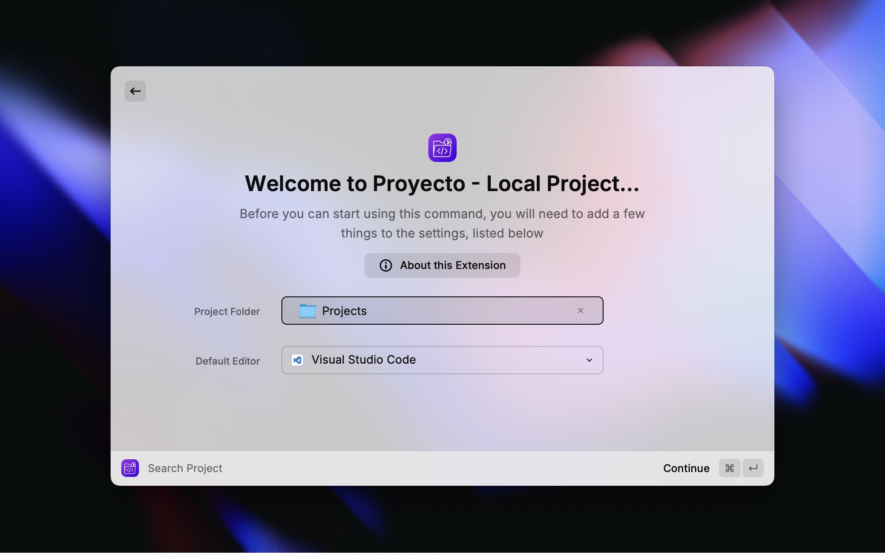
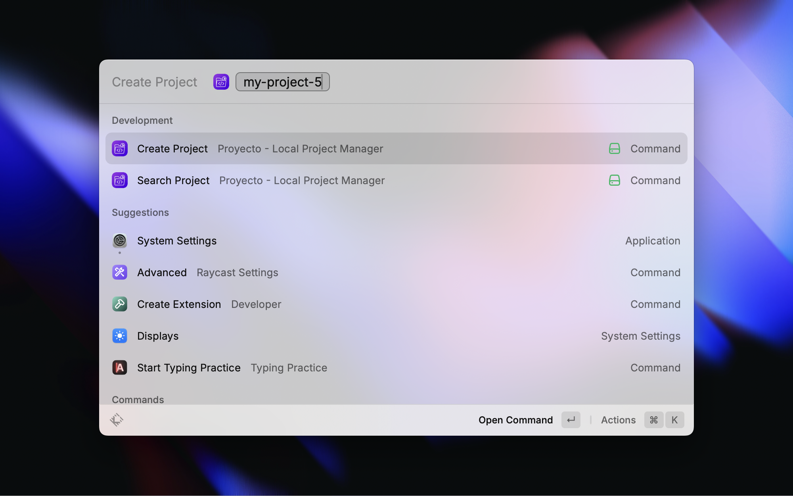
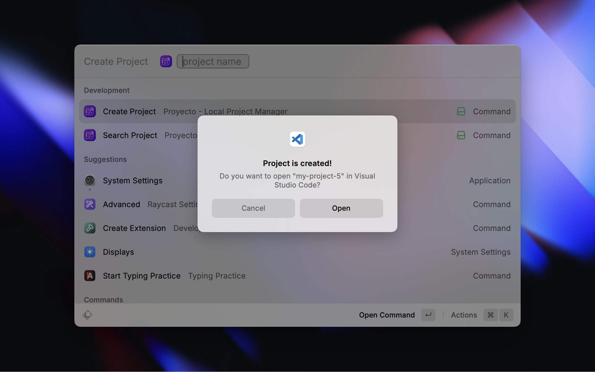
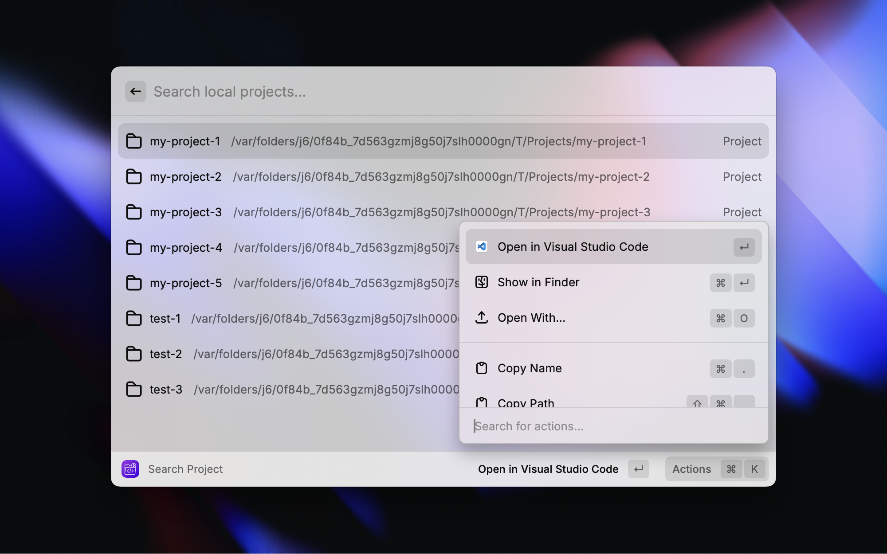

# Proyecto

Proyecto is a lightweight tool designed for efficient management of local projects.

* All projects are centralized in a single designated folder, with the tool ensuring no interference with project contents.
* Quickly **create** a new empty project with Git initialization.
* **Search** for existing projects to **open** them in the default editor or **delete** them (moved to trash).

## Install

## Usage

### Configuring the Project Folder and Default Editor

### Creating a Project

### Searching for a project

#### All local project in a list

#### Opening a project in the default editor

#### Deleting an existing project

## Contributing

Contributions are welcome! If you have ideas, bug fixes, or improvements, please
Open an issue or submit a pull request on the
[GitHub repository](https://github.com/GloryWong/proyecto-raycast).

## License

This project is licensed under the MIT License. See the [LICENSE](LICENSE) file for more
details.
