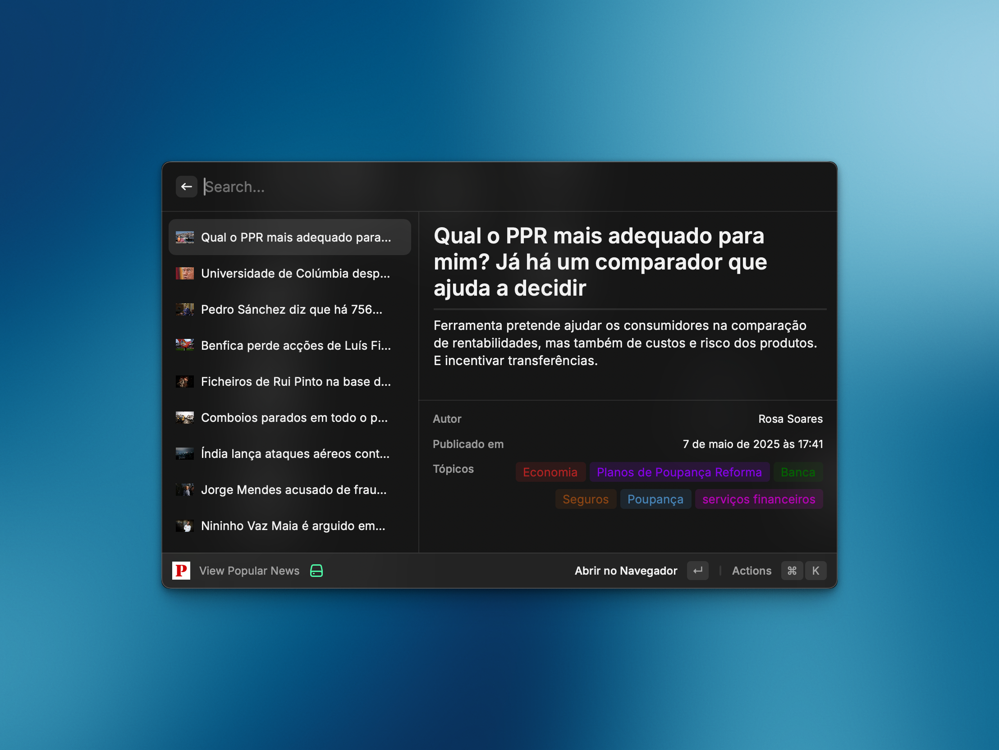

# 📰 Raycast Público


<!--  -->

Stay informed with the latest headlines from [Público](https://www.publico.pt/) — without ever opening your browser.

**Raycast Público** is a simple and efficient Raycast extension that brings Portuguese news directly to your command bar. Browse the day’s most important stories, check the latest updates, or search for any article — all from within Raycast.

No distractions. No tabs. Just news that matters, right where you work.



## 📥 Installation

<!-- ### Option 1: Raycast Store (Recommended)

- [ ] Install directly from the [Raycast Store](https://www.raycast.com/caasols/publico)

### Option 2: Manual Installation -->

```bash
git clone https://github.com/caasols/raycast-publico
cd raycast-publico
npm install && npm run dev
```

## 🎯 Usage

Here's how to make the most of the Raycast Publico extension:

- **View Popular News**: Shows featured and most popular articles from Público
- **View Latest News**: Shows the most recent news articles
- **Search News**: Allows searching through Público's articles

## ⭐ Support

If you find this extension helpful, consider:

- Starring the [GitHub repository](https://github.com/caasols/raycast-publico-extension)
- Sharing it with others who might find it useful
- Contributing to the project's development

Your support helps keep this project active and improving!
