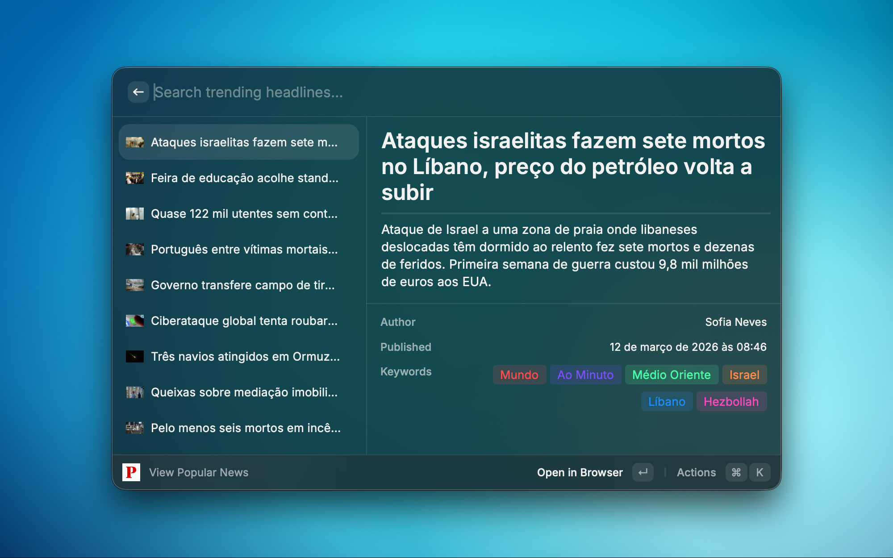

# Público for Raycast


Browse the latest articles, jump straight into a section, search by topic, and read them from [Público](https://www.publico.pt/) directly from your command bar.



Público is a Portuguese daily newspaper. This extension talks to Público's public JSON API (`https://www.publico.pt/api`) and needs no account, key, or binary installed: the two feed commands, the 34 section commands, and search all read the same set of open list endpoints. Each article's summary, author, date, and topics are shown inside Raycast, and Enter opens the full article on publico.pt.

## Features

- Browse the latest articles and the ones Público is currently featuring
- Jump straight to any of 34 Público sections, each as its own root command
- Search by topic, person, place, or team, and get the articles filed under it
- See each article's summary, author, publication date, and topic tags without leaving the list
- Copy an article's URL or title, or open it in your browser, without leaving the list
- Search in either language: section names are English, and typing `desporto` or `saúde` still finds Sports and Health

## Commands

| Command               | Description                                                                                        |
| --------------------- | -------------------------------------------------------------------------------------------------- |
| `Browse Latest News`  | The latest articles from Público, newest first                                                     |
| `Browse Popular News` | The articles Público is currently featuring                                                        |
| `Browse Topic`        | Browse by topic, person, place, or team, for example `Benfica`, `Trump`, `inteligência artificial`  |
| `Browse <Section>`    | 34 commands, one for each Público section, listed below                                            |

Every list behaves the same way. Select an article to see its summary, author, publication date, and topics in the detail pane, then use one of these actions:

| Action            | Shortcut       | What it does                                     |
| ----------------- | -------------- | ------------------------------------------------ |
| `Open in Browser` | `Enter`        | Opens the article on publico.pt                  |
| `Copy URL`        | `Cmd C`        | Copies the article link                          |
| `Copy Title`      | `Cmd Shift C`  | Copies the article title                         |
| `Refresh`         | `Cmd R`        | Refetches the current feed                       |

### Sections

Each section is its own root command, named `Browse <Section>`, so you can bind Politics or Sports to an alias or a hotkey and skip the extension menu entirely.

| Group                | Sections                                                                |
| -------------------- | ----------------------------------------------------------------------- |
| News and politics    | Politics, Parliament, World, Europe, Brazil, Economy, Society, Local, Lisbon, Porto |
| Knowledge and health | Science, Technology, Education, Health, Media                           |
| Environment          | Environment, Azul, Ecosfera                                             |
| Culture and life     | Culture, Ípsilon, Opinion, Sports, People, Ímpar, P3                    |
| Travel and living    | Fugas, Travel, Food, Home, Cars                                         |
| Multimedia           | Multimedia, Videos, Podcasts, Photo Gallery                             |

Six keep their Portuguese names because they are Público mastheads rather than generic sections: `P3` (youth), `Ípsilon` (culture), `Fugas` (travel), `Azul` (oceans), `Ecosfera` (climate), and `Ímpar` (lifestyle). Each is still findable in English, since typing `travel`, `culture`, or `climate` surfaces them.

The list lives in `src/sections.json`. To add or remove one, edit that file and run `npm run generate:sections`, which rewrites both the command components and the `commands` block in `package.json`.

## Preferences

Nothing is required to start using the extension. There is a single optional preference.

| Preference     | Value                                                                  |
| -------------- | ---------------------------------------------------------------------- |
| `Max Articles` | How many articles a list shows at most: `10`, `25` (default), or `50`. |

## How search works

`Browse Topic` matches Público's own topics rather than doing free-text search. Your query is slugified (lowercase, accents stripped, spaces turned into hyphens, so `Donald Trump` becomes `donald-trump`) and requested as a Público topic feed. If nothing matches, the query is retried with Portuguese stopwords removed, so `guerra na Ucrânia` also tries `guerra-ucrania`.

That covers most of what people search for: in a 12-query sample, 9 returned results. Named entities work well; descriptive phrases such as `preço da habitação` have no matching topic. When nothing matches, the command offers to run the same query against Público's own full-text search in your browser.

The extension cannot perform that full-text search itself. Público's search pages are protected by an AWS WAF challenge that requires a browser to solve, and every open JSON endpoint ignores its query parameter.

## Requirements and limits

The extension is read-only and anonymous. It sends no credentials, has no telemetry, and contacts no host other than `publico.pt`.

- Público's list endpoints return about 10 articles each and ignore paging parameters, so `Max Articles` is an upper bound rather than a target. Setting it to 50 will not produce more than the API serves.
- `Browse Topic` matches Público topics, not arbitrary text. See the section above.
- Full article text is not available. Público's API returns only a summary of about 150 characters, and the public article page is protected against non-browser requests, so the extension shows the summary and opens the browser for the rest.

## Getting Started

### Raycast Store

Install directly from the [Raycast Store](https://www.raycast.com/caasols/publico).

### Manual

```bash
git clone https://github.com/caasols/raycast-publico.git
cd raycast-publico
npm install && npm run dev
```

### Development

Other useful scripts:

```bash
npm test                     # 111 unit tests
npm run test:coverage        # the same, with a coverage report
npm run test:watch           # the same, in watch mode
npm run lint
npm run build
```

Two maintainer scripts keep the extension in sync with Público's API:

```bash
npm run discover             # probe the API and write a local endpoint report under docs/
npm run generate:sections    # regenerate the section commands from src/sections.json
```

Run `npm run discover` first when a section stops returning articles or you want to add a new one: it reports which slugs work and how many items each returns, so you can confirm a slug before wiring a command to it.

## Contributing

Issues and pull requests are welcome. Please open a discussion if you plan to work on a larger change so we can align on the approach.

## Support

If this extension saves you time:

- Star the [GitHub repository](https://github.com/caasols/raycast-publico)
- Share it with coworkers who live in their command bar
- Report bugs or enhancements via GitHub issues

## License

Released under the [MIT License](./LICENSE).
