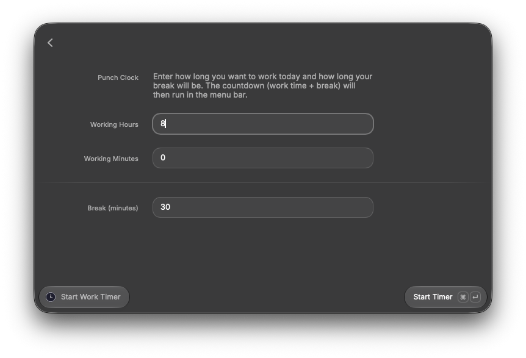
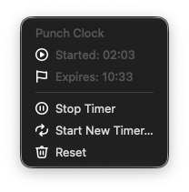
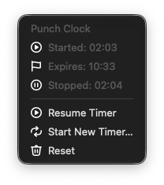

# Punch Clock

[](https://raycast.com/FL0R1AN/punch-clock)
[](https://github.com/FL0R1AN84/punch-clock)
[](LICENSE)

**Punch Clock** helps you track your working hours for the day directly from the macOS menu bar.

## Features

- ⏱️ Enter your total working time and break length for the day.
- 📊 Live countdown of your remaining working time (work + break) right in the macOS menu bar.
- 🕒 See the exact **Started** and expected **Expires** time from a dropdown.
- ⏸️ **Stop**/ **Resume** the timer at any time and see when it was **Stopped**.
- 🔁 **Start New Timer** or **Reset** to begin a fresh countdown.
- 💾 State is persisted with Raycast's `LocalStorage`, so it survives Raycast restarts.

## Installation

### From the Raycast Store

Search for **Punch Clock** in the [Raycast Store](https://raycast.com/store) and install it, or use this direct link
once it's published:
[raycast.com/FL0R1AN/punch-clock](https://raycast.com/FL0R1AN/punch-clock).

### From source

```bash
git clone https://github.com/FL0R1AN84/punch-clock.git
cd punch-clock
npm install
npm run dev
```

`npm run dev` opens Raycast in development mode with both commands available.

## How it works

1. Run **Start Work Timer** and enter your total working time (hours + minutes)
   and your break length.

   

2. A countdown (working time + break) starts immediately and is shown live in the menu bar via the **Work Timer**
   menu-bar command.
3. Click the menu bar item to see the **Started** time and the expected **Expires** time.

   

4. **Stop**/ **Resume** the timer at any time — the dropdown then also shows the **Stopped** time, and the menu bar icon
   switches to a paused state.

   

5. **Start New Timer** or **Reset** to begin again.

Timer state is persisted with Raycast's `LocalStorage`, so it survives Raycast restarts.

## Screenshots

|                         Start Work Timer                          |                              Running                              |                                  Paused                                   |
|:-----------------------------------------------------------------:|:-----------------------------------------------------------------:|:-------------------------------------------------------------------------:|
|  |  |  |

## Development

```bash
npm install
npm run dev
```

This opens Raycast in development mode and enables both commands:

- `Start Work Timer` (`src/start-timer.tsx`) — a form to configure and start the timer.
- `Work Timer` (`src/menu-bar.tsx`) — the live menu bar countdown.

Other useful scripts:

```bash
npm run build      # build the extension
npm run lint       # lint the extension
npm run fix-lint   # lint and auto-fix
```

## License

[MIT](LICENSE) © FL0R1AN

