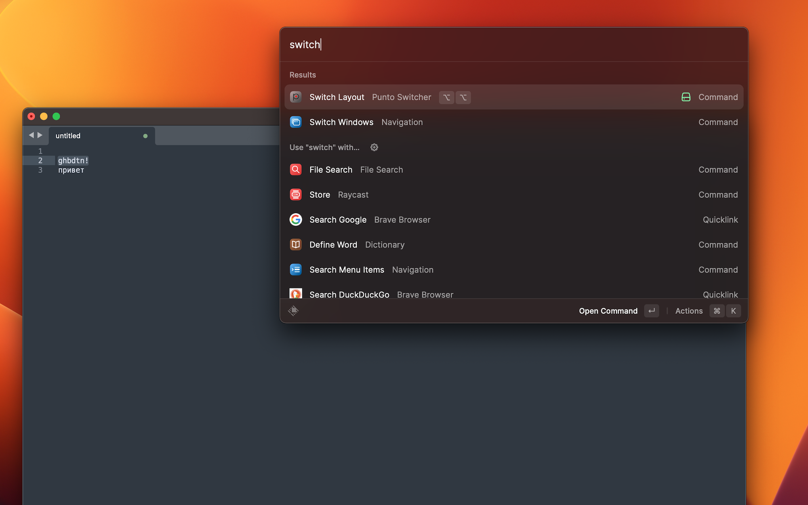

# Punto Switcher for Raycast

Changes the layout of selected text to the opposite one and additionally changes the keyboard layout to a target one using MacOS built-in capabilities.

Supported keyboard layouts:
- Latin (English or any else)
- Cyrillic (Russian/Ukranian)

Limitations:
- If the cursor was at the end of the line, the `getSelectedText` function will return the whole line instead of selection and the switched layout text will appear right after the cursor
- If a required layout is not selectable in the dropdown, you can request it by raising an [issues](https://github.com/raycast/extensions/issues) to Punto extension

Recommended Hotkey: Option+Option (To apply, just hit the Option button 2 times)

The project was inspired by [PuntoSwitcher by Yandex](https://yandex.ru/soft/punto/)
