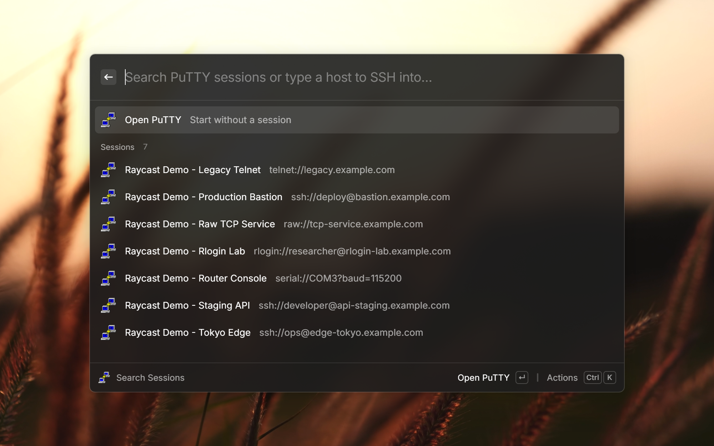

# PuTTY Sessions

Search and launch your saved [PuTTY](https://www.chiark.greenend.org.uk/~sgtatham/putty/) sessions straight from Raycast on Windows.

> [!NOTE]
> This extension is a Raycast port of **[Flow.Launcher.Plugin.Putty](https://github.com/jjw24/Flow.Launcher.Plugin.Putty)** by **[@jjw24](https://github.com/jjw24)**, which is itself a Flow Launcher port of the original **Wox** PuTTY plugin by **[Konstantin Zaitcev (@kosz78)](https://github.com/kosz78)**. All of the core ideas — reading sessions from `HKCU\Software\SimonTatham\PuTTY\Sessions`, the `protocol://user@host` labels, and the `-load` / `-ssh` launch behavior — come from their work. Go give the originals a ⭐. See [Credits](#credits) below.

## Features

- **Search Sessions** — lists all of your saved PuTTY sessions and filters by name as you type.
- Each session shows its connection string (`ssh://user@host`, `telnet://host`, `serial://COM3?baud=9600`, …) as a subtitle.
- Selecting a session launches PuTTY with `putty.exe -load "<session>"`.
- **Direct connection** — type any hostname that isn't a saved session and get an entry to SSH straight into it (`putty.exe -ssh <host>`), just like the original plugin.
- Optional **Open PuTTY** entry to start the app without a session.
- Optional **Start maximized** to open sessions in a maximized window.

## Configuration

By default the extension **auto-detects** the PuTTY executable, looking in this order (top to bottom):

1. Directories on your `PATH`
2. Scoop (`~/scoop/apps/putty/current/putty.exe`, including a global Scoop install)
3. The Windows registry — in order: the `App Paths\putty.exe` entry, then the MSI's `Installer\Folders` record (this is where the **official PuTTY installer** actually stores its `C:\Program Files\PuTTY\` folder), then an Inno-style uninstall entry
4. The PuTTY **Start Menu** shortcut (the Programs tree is scanned so it works regardless of the folder name, e.g. `PuTTY (64-bit)`)

You only need to set the executable path manually if PuTTY lives somewhere else. A configured path always overrides auto-detection.

Open the command preferences to adjust:

| Preference                   | Description                                                                                   |
| ---------------------------- | --------------------------------------------------------------------------------------------- |
| **PuTTY Executable**         | Optional. Path to `putty.exe`. Leave empty to auto-detect. A configured path always wins.     |
| **Open PuTTY entry**         | When enabled, always show an entry that opens PuTTY without a session.                        |
| **Start sessions maximized** | When enabled, sessions launch in a maximized window (`Start-Process -WindowStyle Maximized`). |

### Where sessions come from

Sessions are read from the current user's registry at `HKEY_CURRENT_USER\Software\SimonTatham\PuTTY\Sessions`. Each subkey is a saved session; its name is URL-decoded into the session identifier, and `Protocol`, `HostName`, and `UserName` build the subtitle. Serial sessions are shown as `<line>?baud=<speed>`.

## Requirements

- Windows
- PuTTY installed (or `putty.exe` reachable on your `PATH`)

## Credits

Full credit and a heartfelt thank-you to:

- **[Konstantin Zaitcev (@kosz78)](https://github.com/kosz78)** — author of the original **Wox** PuTTY plugin that started it all.
- **[@jjw24](https://github.com/jjw24)** — author of **[Flow.Launcher.Plugin.Putty](https://github.com/jjw24/Flow.Launcher.Plugin.Putty)**, the [Flow Launcher](https://www.flowlauncher.com/) port this extension is based on.

This Raycast extension is a faithful port of their plugin — the registry session discovery, the `protocol://user@host` labels, and the PuTTY `-load` / `-ssh` launch behavior are all their design. If this extension is useful to you, please head over to the original projects and give them a ⭐.

- Original Flow Launcher plugin: https://github.com/jjw24/Flow.Launcher.Plugin.Putty
- License: MIT (same as the original)

PuTTY itself is a free SSH/Telnet client by Simon Tatham and contributors — https://www.chiark.greenend.org.uk/~sgtatham/putty/.
