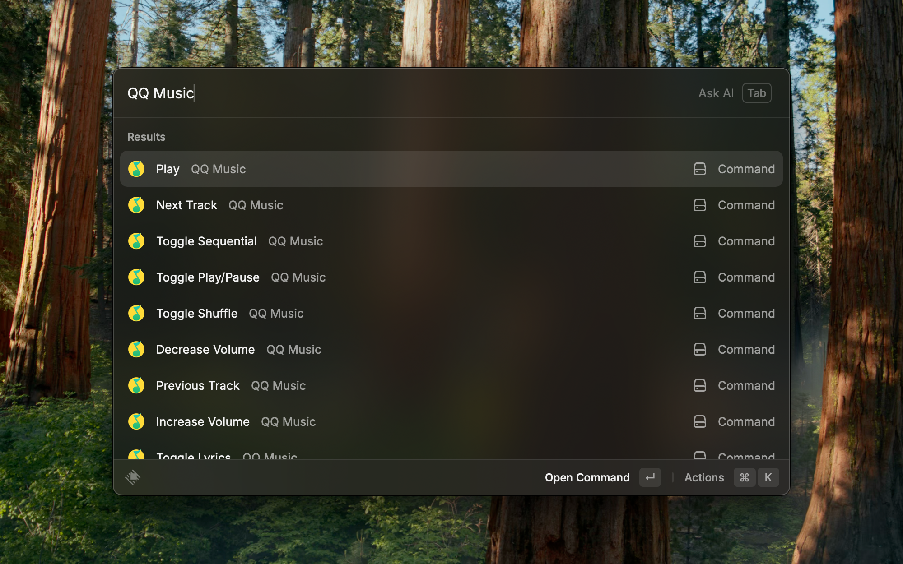

# QQ Music Controls

Control the [QQ Music](https://y.qq.com/) macOS app from Raycast.

## Features

Controls:

- play
- pause
- next track
- previous track
- volume up
- volume down
- like currently playing track
- toggle lyrics display
- play modes:
  - shuffle
  - sequential
  - repeat

## Screenshot

