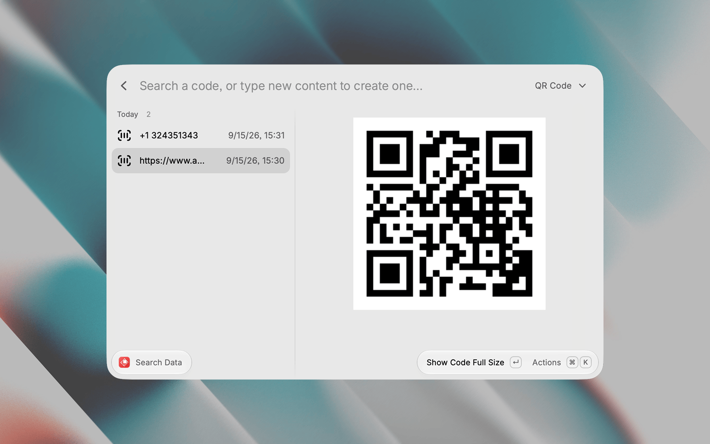

# QR Code Sharing

Keep the things you share often — an email address, a phone number, a Wi-Fi password, a link — and turn any of them into a QR code or a barcode in two keystrokes.



## Commands

### Search Data

One screen for everything. Type to search what you have saved; the code of the highlighted entry is drawn next to the list, so moving the selection is all it takes to show someone a code.

Typing content that isn't saved yet offers a **Create** row: the code is already on screen, and `↵` saves it. The **Type** dropdown in the search bar picks the symbology for new entries and remembers your choice.

Entries are grouped by the day they were created, with pinned ones kept at the top.

| Shortcut | Action |
| --- | --- |
| `↵` | Show the code full size (or save, on the Create row) |
| `⌃E` | Edit the content and type — the code redraws as you type |
| `⌃P` | Pin or unpin an entry |
| `⌃X` | Delete an entry, `↵` confirms |
| `⌘⇧C` | Copy the code as an image |
| `⌘O` | Reveal the CSV file in Finder |

### Export Data

Pick a folder and save a dated copy of the CSV — a backup you can keep, or put back later to restore everything.

## Code types

**Most common:** QR Code, Data Matrix, Aztec, PDF417.
**Barcodes:** Code 128, EAN-13, UPC-A, Code 39, ITF.

Content that a symbology cannot hold is refused with the encoder's own explanation, so an entry is never saved as something unscannable.

## Where the data lives

A single CSV file in the extension's support folder, with one row per entry:

```csv
creation date,content,type,pinned
2026-09-15T14:20:00.000Z,hello@mail.com,qr,true
```

It is plain text on purpose: edit it by hand, keep it in version control, or restore it from a backup. Missing columns are tolerated — an unknown type reads as a QR code, a missing pin as unpinned.

## Preferences

**Code Size** — how large codes are drawn. Medium fills the default Raycast window; pick Large if your window is taller, Small if a code is ever clipped.
