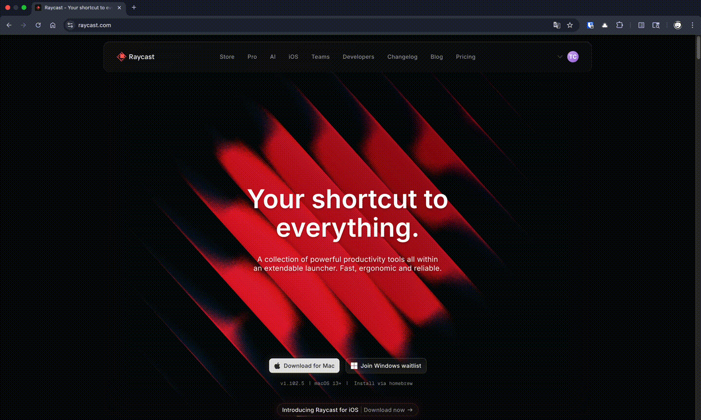
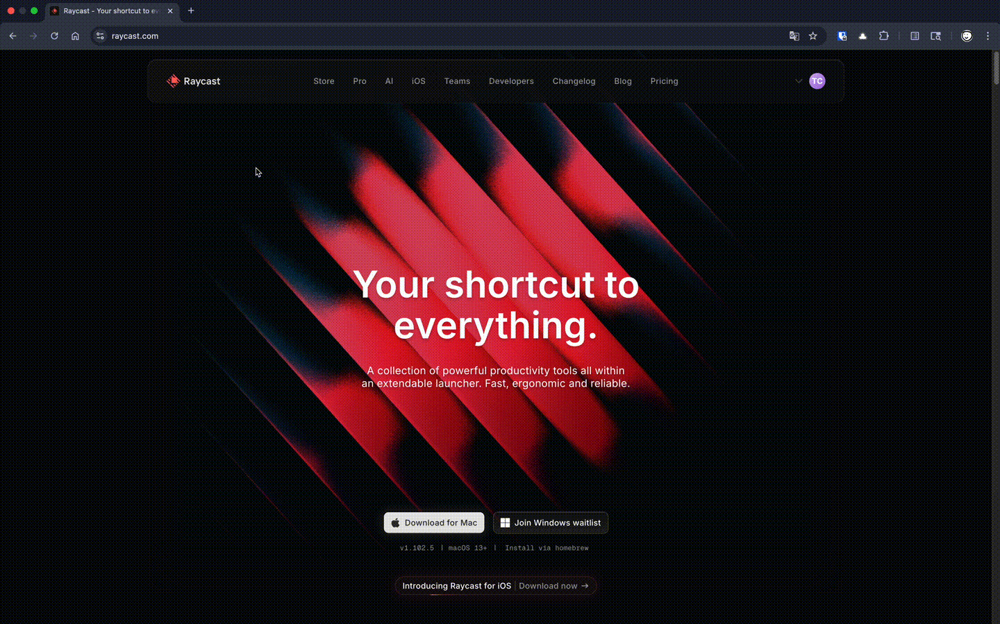
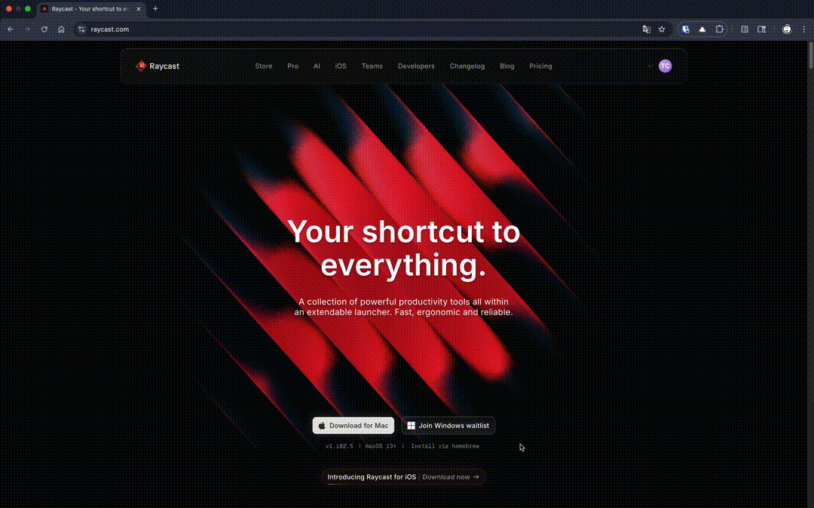

# 🚀 Query AI for Raycast

Instantly send prompts to your favorite AI services directly from Raycast—no API keys needed\! This extension opens a new browser tab (or desktop app) with your prompt pre-filled, leveraging your existing accounts.

More examples from Claude, Grok, Perplexity, and Bing Copilot

### Claude

### Grok

### Perplexity

### Bing Copilot

-----

## ✨ Why Query AI?

Tired of juggling API keys and extra costs to chat in raycast? `Query AI` streamlines your workflow by sending prompts to the AI subscriptions you already have.

  - ✅ **Use Your Existing Accounts**: Why pay for API access if you already have a ChatGPT, Claude, or Perplexity account? This extension seamlessly uses your active web sessions.
  - 🔑 **Zero API Keys Required**: Forget the hassle of generating, securing, and paying for API keys. It just works, out of the box.
  - 🔒 **Privacy-Focused**: Your prompts are sent directly to the official AI websites. No middleman, no weird tokens, no data logging.
  - ⚡ **Blazing Fast**: Go from thought to prompt in seconds. Let's make querying AI really, *really* fast.

> **Note**: If you have an official desktop app installed (like ChatGPT for macOS), the app might decide to handle it instead of a new browser tab. You can change that in ChatGPT app.

## 🏁 Getting Started

1.  Open the command in Raycast (we recommend setting a handy alias like `qai`).
2.  (Optional) Choose your desired AI service from the dropdown menu.
3.  Type your prompt and hit `Enter`.
4.  Voila\! ✨ A new browser tab or the desktop app opens with your chat ready to go.

## 🧠 Supported AI Services

Query the AI that's best for the job. We support all the major players:

  - 🤖 **ChatGPT**
  - 🧠 **Claude**
  - 🌀 **Grok**
  - ❓ **Perplexity**
  - 🌐 **Bing Copilot**

## ⚙️ Configuration

Make your workflow even faster by setting a default AI service\!

Head to the extension's preferences in Raycast to set your **Default Service**. This service will be used automatically whenever you don't explicitly choose one in the command arguments.