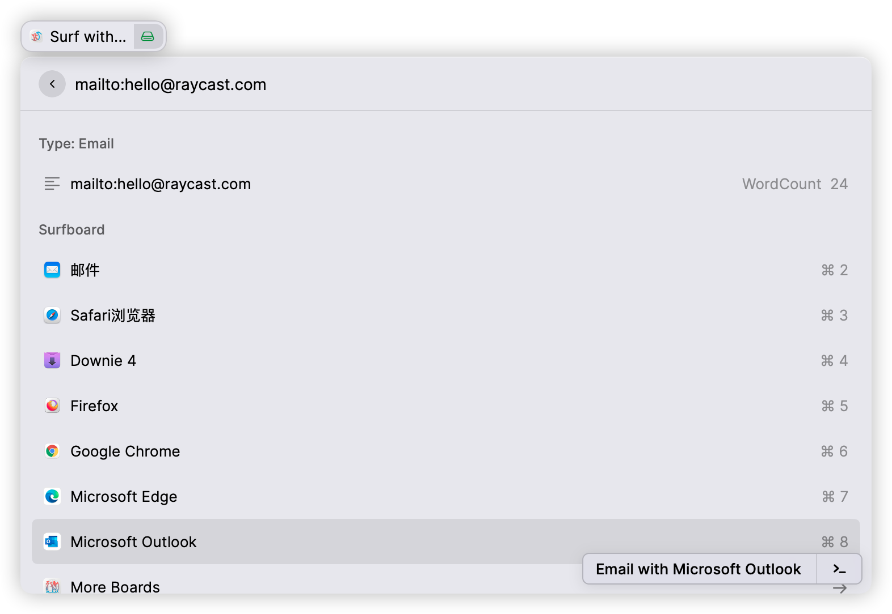

## Description

This extension is for users who Surf frequently between browsers or mailbox applications, choose your board and surf fast!

**Main features:**

1. Specify a browser to open a ***URL*** or ***Text*** that is selected or on the clipboard.
2. Specify the mailbox application to open ***mailto:*** link (in the form of "mailto:hello@raycast.com") that is selected or on the clipboard.
3. Support search bar input:
   Enter ***URL*** or ***Text*** to search or open web page quickly.
   Enter the shortcut phrase ***mailto:***  followed by email address to enter the edit email page.
4. Recommend to set shortcut keys for this extension in order to Quick Quick Surf.

**Preference:**
*Surf Engine* - the default search engine for searching text.
*Sort by* - Surfboard sorting method.

**Known issues:**
If the added application is uninstalled, you will not be able to remove it directly. Please press "cmd" + "enter" on the "More Boards" page to remove all the apps and then add them again.

## Screencast

First, "More Boards"，add application you want to use.

Quick search ***Text*** that is selected, on the clipboard or from input using a specified browser

Quick open ***URL*** that is selected, on the clipboard or from input using a specified browser

Quick open ***"mailto"*** link that is selected, on the clipboard or from input using a specified browser

## Checklist

- [x] I read the [extension guidelines](https://developers.raycast.com/basics/prepare-an-extension-for-store)
- [x] I read the [documentation about publishing](https://developers.raycast.com/basics/publish-an-extension)
- [x] I ran `npm run build` and [tested this distribution build in Raycast](https://developers.raycast.com/basics/prepare-an-extension-for-store#metadata-and-configuration)
- [x] I checked that files in the `assets` folder are used by the extension itself
- [x] I checked that assets used by the `README` are placed in the `media` folder