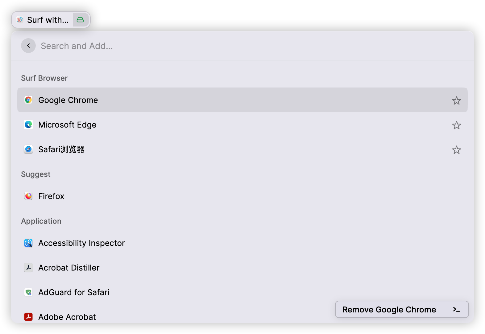
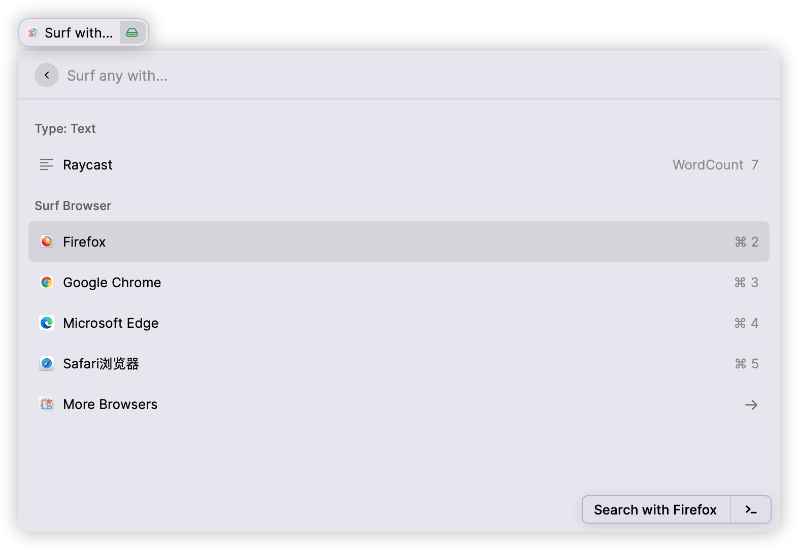
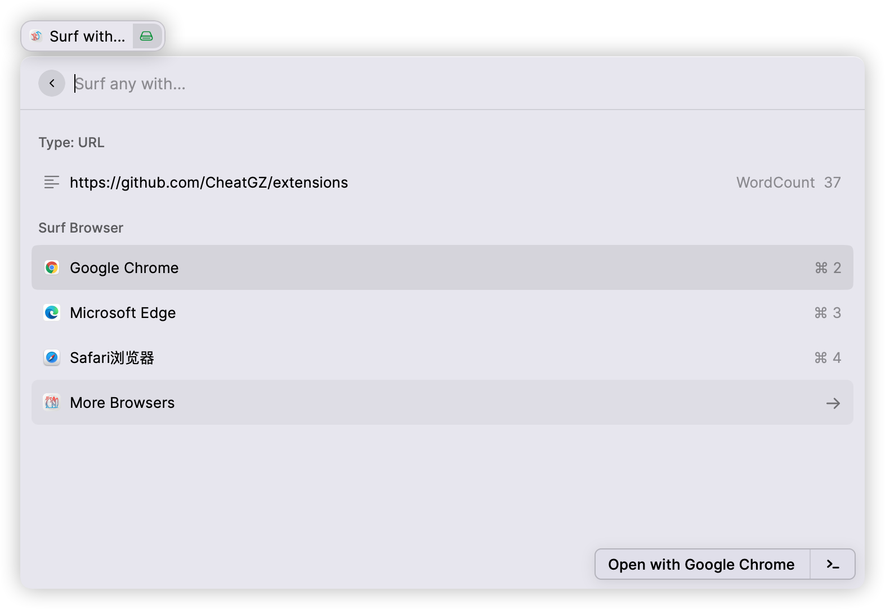
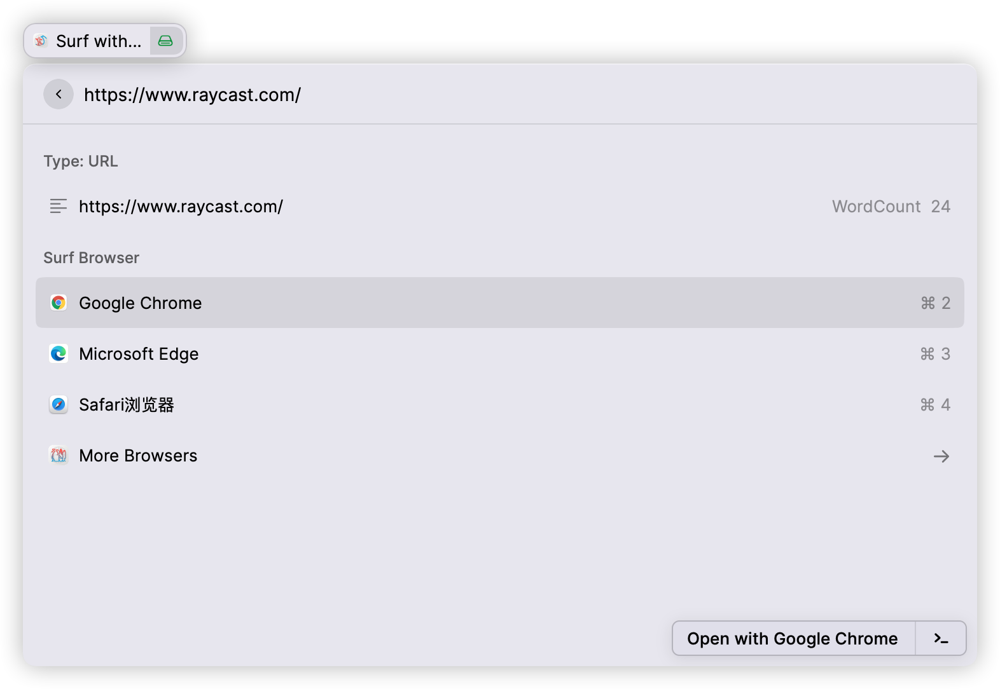

# Surf with Specific Browser

Specify the browser to open URL, search text from the selected text or clipboard.

Even if nothing is fetched automatically, enter something and specify the browser to search quickly.

Before all this, please get the browsers you can use.
## ScreenCast
1. First, "Get browser"

2. "Get browser": add or remove Browser

3. Quick search text from selected text or clipboard using a specified browser

4. Quickly open URL from selected text or clipboard using a specified browser

4. Quick search or open by entering text or URL

