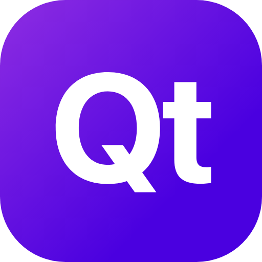

<div align="center">



# ✍️ Quick Text


**Rewrite, fix, and transform text instantly using local AI — no prompts, no copy-paste, no context switching.**

[Quick Start](#-quick-start) · [Features](#-features) · [Tech Stack](#️-tech-stack) · [Roadmap](#️-roadmap)

<!-- Add a demo GIF here: assets/demo.gif (select text → shortcut → pick action → done) -->

</div>

---

## 💡 Concept

> Improving text with AI shouldn't mean leaving what you're doing.

The usual flow is: select text → copy → open an AI chat → paste → write a prompt → wait → copy the result → go back → paste. Too many steps for something that should feel instant.

**Quick Text collapses that into three:** select any text, trigger a Raycast shortcut, pick an action. Everything runs locally through [Ollama](https://ollama.ai/), so your text is processed fast, stays private, and never leaves your machine.

## ✨ Features

| Feature | Description |
| --- | --- |
| ✅ **Fix Grammar** | Correct spelling and grammar mistakes |
| 🔁 **Paraphrase** | Rewrite text with different wording |
| 🎚️ **Change Tone** | Adjust tone — formal, casual, professional, etc. |
| 📝 **Summarize** | Condense longer text into a concise summary |
| 🌐 **Translate** | Translate text into another language |
| 🧠 **Model Selector** | Switch between any Ollama model you've pulled |
| 📋 **Copy & Paste Actions** | Copy the result or paste it straight back |

All processing happens locally via Ollama — your text never leaves your computer.

## 🚀 Quick Start

> [!NOTE]
> Requires [Raycast](https://raycast.com/) and [Ollama](https://ollama.ai/) running locally with at least one model pulled.

```bash
# 1. Pull a model (any Ollama model works)
ollama pull granite4:350m

# 2. Install dependencies and start the extension in Raycast
git clone https://github.com/Carloss616/quick-text.git
cd quick-text
npm install
npm run dev
```

Then select any text, open Raycast, run **Quick Text**, and pick an action.

<details>
<summary>⚙️ Preferences & advanced</summary>

| Preference | Description | Default |
| --- | --- | --- |
| **Ollama Server URL** | URL of your local Ollama instance | `http://localhost:11434` |

Other scripts:

```bash
npm run build      # ray build -e dist
npm run lint       # ray lint
npm run typecheck  # tsc --noEmit
npm run publish    # publish to the Raycast Store
```

</details>

## 🏗️ Tech Stack

| Layer | Technology |
| --- | --- |
| Platform | [Raycast API](https://developers.raycast.com/) `^1.104` |
| Language | TypeScript 6 |
| UI | React 19 |
| Local AI | [Ollama](https://ollama.ai/) via `ollama` `^0.6` |
| Tooling | npm · ESLint · Prettier |

<details>
<summary>📁 Project structure</summary>

```
src/
├── commands/
│   └── quick-text-command/
│       ├── components/
│       │   ├── no-model-item.tsx
│       │   ├── text-action-item.tsx
│       │   └── text-actions.ts       # the transform actions (fix, paraphrase, …)
│       ├── index.ts
│       └── quick-text-command.tsx    # main command view
├── components/
│   ├── copy-and-paste-actions.tsx
│   ├── model-selector-dropdown.tsx
│   ├── model-setup-actions.tsx
│   └── text-processor-detail.tsx
├── hooks/
│   ├── use-ollama.ts                 # Ollama client + processing
│   └── use-selected-text.ts          # reads current selection
├── utils/
│   ├── ollama-setup.ts               # model discovery / setup helpers
│   └── size.ts
└── quick-text.tsx                    # entry point
```

</details>

## 🗺️ Roadmap

- [x] Fix grammar, paraphrase, summarize, translate, change tone
- [x] Local processing via Ollama
- [x] Model selector for available models
- [x] Copy & paste actions
- [ ] Publish to the Raycast Store
- [ ] Custom user-defined actions
- [ ] Streaming output

## 🤝 Contributing

1. Fork the repo
2. Create a branch — `feature/your-idea`
3. Open a pull request

## 📄 License

MIT — see [`LICENSE`](LICENSE).

Built by [Carlos Espinoza](https://github.com/Carloss616).
