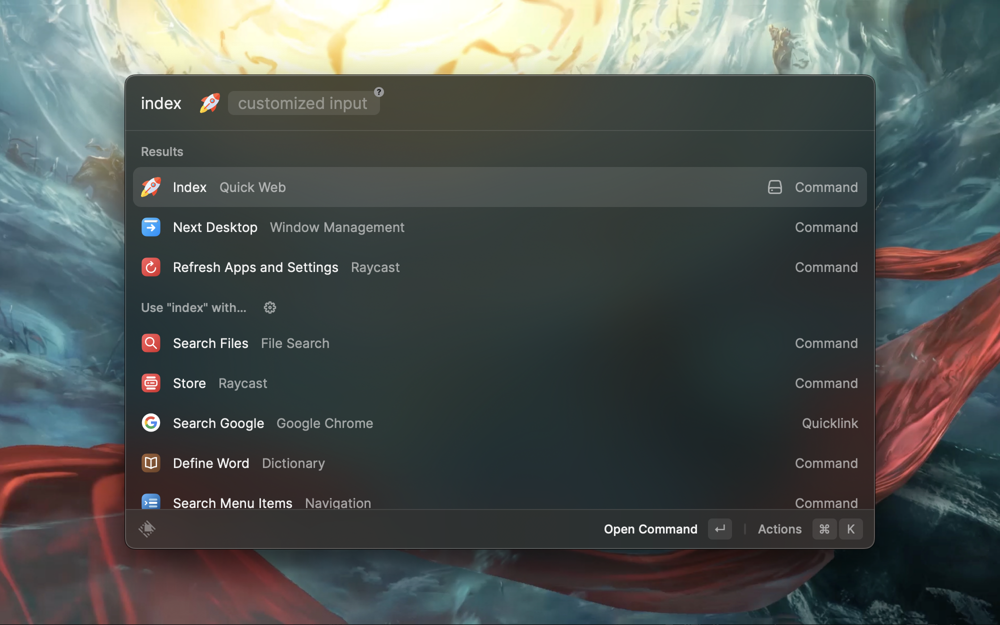
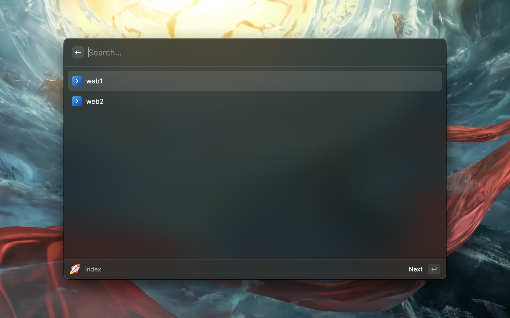
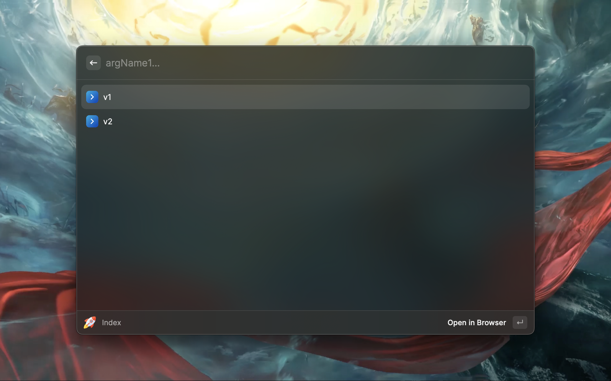
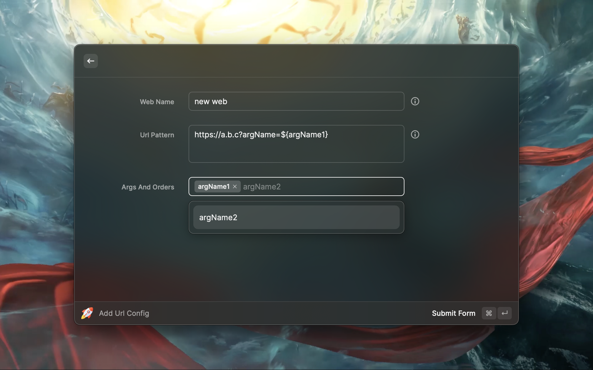
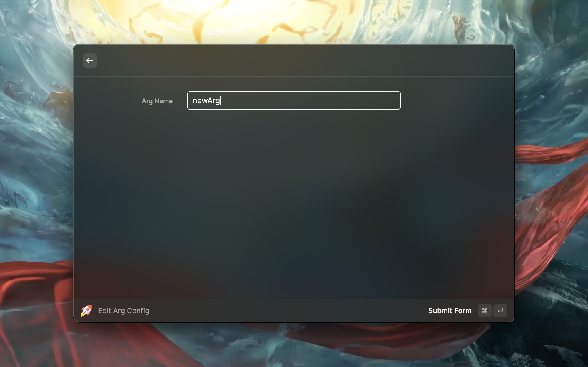
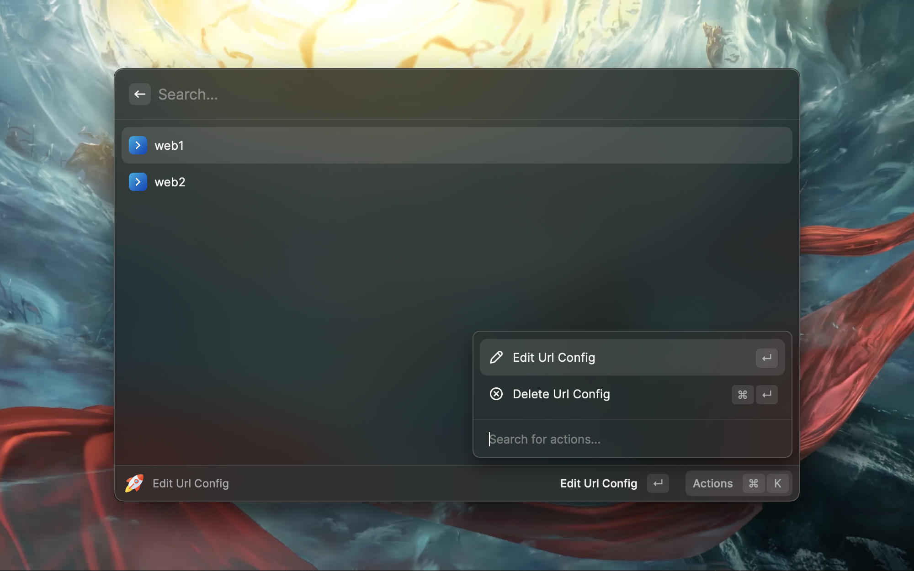
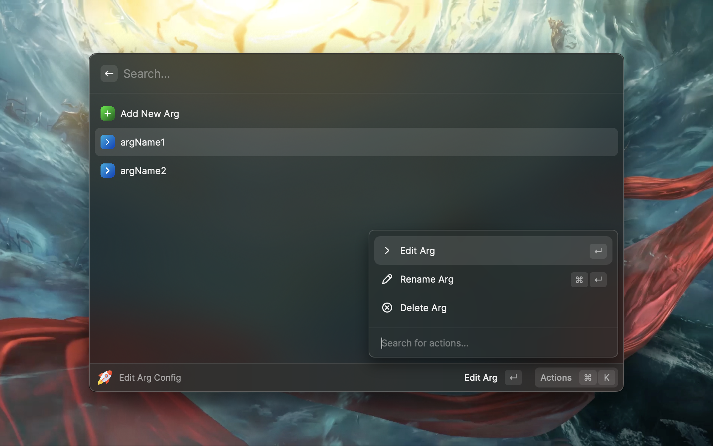
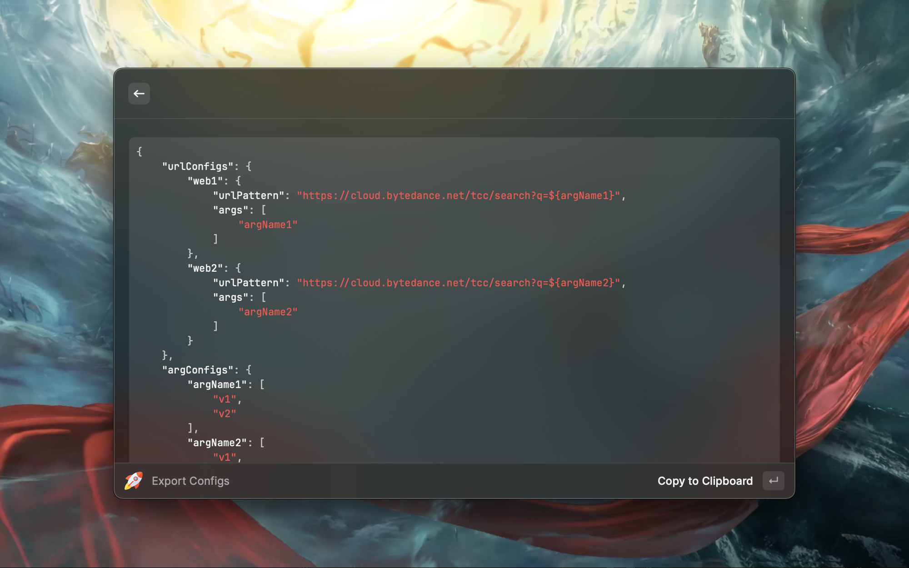
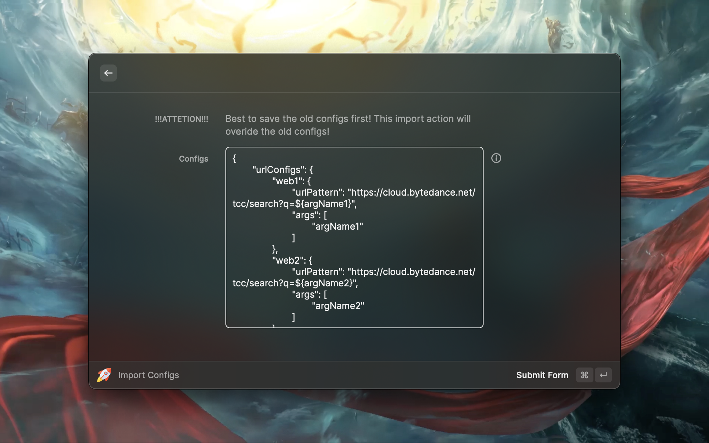

# Quick Web

Quick Web is a configurable tools that opens web with
commonly used args.

## Terminology

### Url Pattern

url pattern is the url with named args as placeholder
which will be replaced in the url process.

for example, an url pattern looks like this:

> https://a.b.c?arg1=${argName1}&arg2=&{argName2}

`argName1` and `argName2` are the named args. When declare an arg,
we need to wrap it in `${}`

We can also set a customized input placeholder: `$$`. For example:

> https://a.b.c?arg1=${argName1}&query=$$

How to set customized
input value will be shown in command chapter.

### Args

Just like its name, Args are args for url pattern, which should be
configured before use it in url pattern.

take the url pattern shown previously as example, we declared
two args in the url pattern, `argName1` and `argName2`. Both
of them should be created by `Add Arg Config` command.

### Arg Values

Arg values are the values of an Arg. For example, we have an arg named
`Fruit` and it has values `Apple`, `Banana`, `Orange`. Arg Values will be displayed
in a list for users to pick one up quickly without repeatedly and tediously typing
the full value of it, and this the reason why this tools is called **Quick Web**.

## Commands

### Index

`Index` is the entrance of build actual url with args replaced with the
chosen arg value.

#### Invoke Command

If customized input is needed, press tab to focus on the text field and
type in.

#### Choose Web

#### Choose Value For Args

### Add Url Config

use `Add Url Config` command to create an url pattern.

### Add Arg Config

use `Add Arg Config` command to create an Arg.

### Edit Url Config

use `Edit Url Config` command to show a list of Url Configs and edit them.

### Edit Arg Config

use `Edit Arg Config` command to show a list of Arg Configs and edit them.

#### Edit Args

#### Edit Arg Values

### Export Configs

use `Export Configs` command to export current configs. Users can share
configs by this command.

### Import Configs

use `Import Configs` command to import configs.

> **THIS COMMAND WILL OVERRIDE OLD CONFIGS**.

