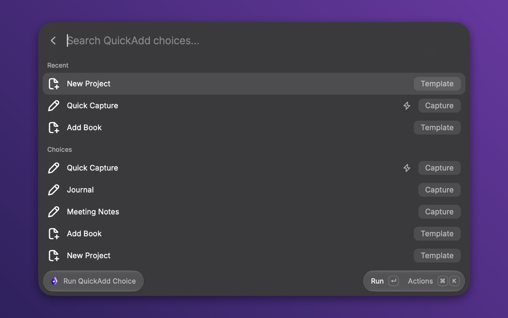
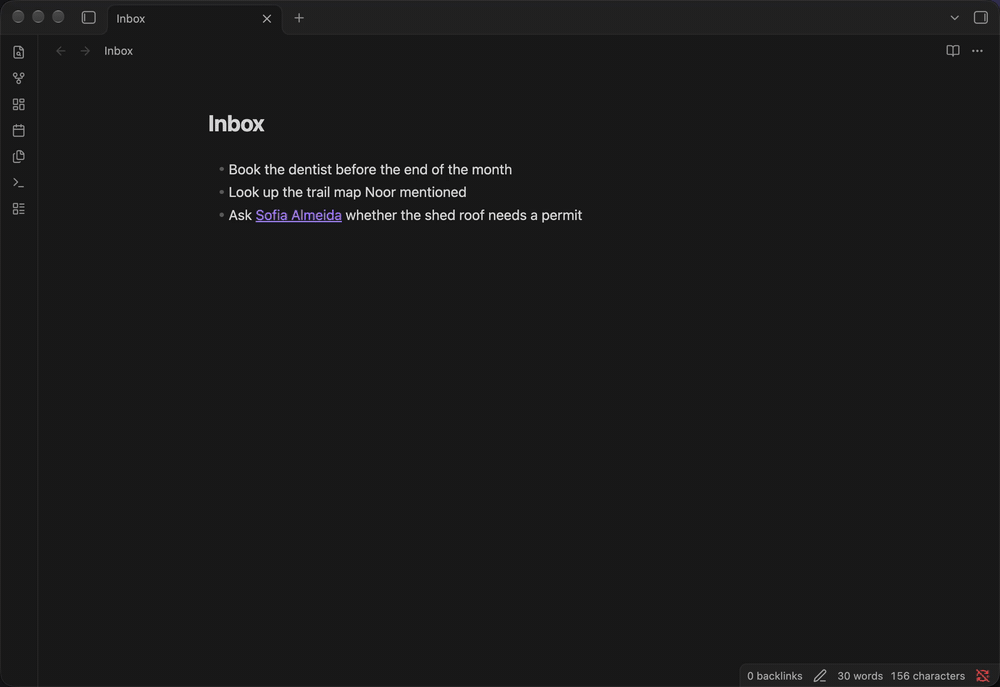
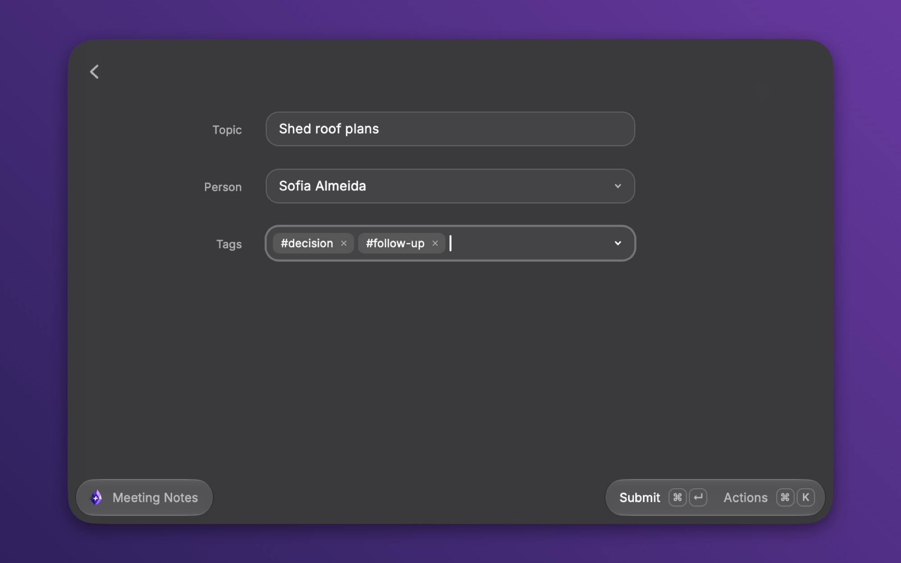
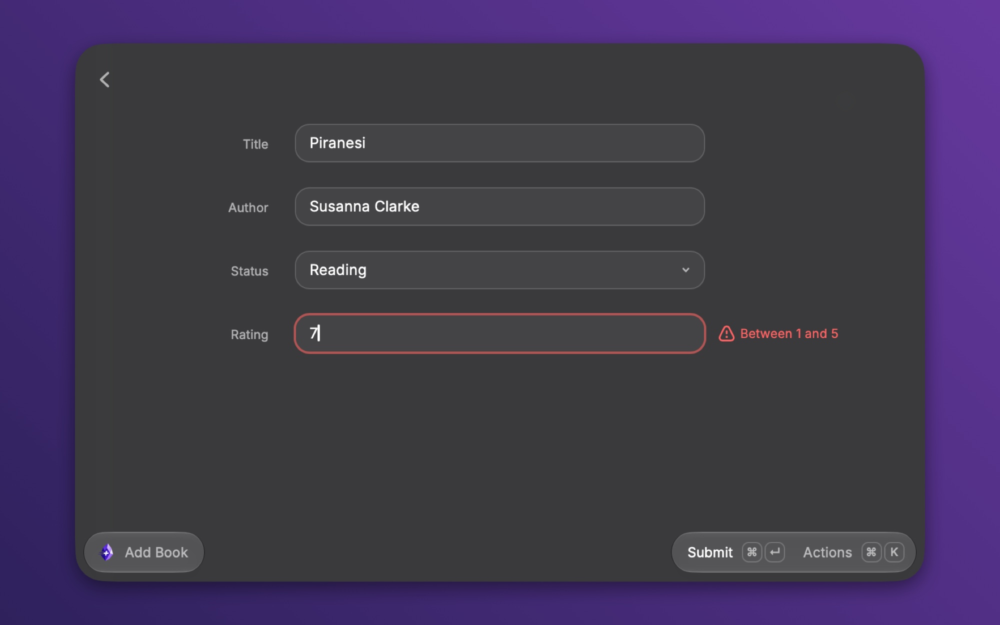
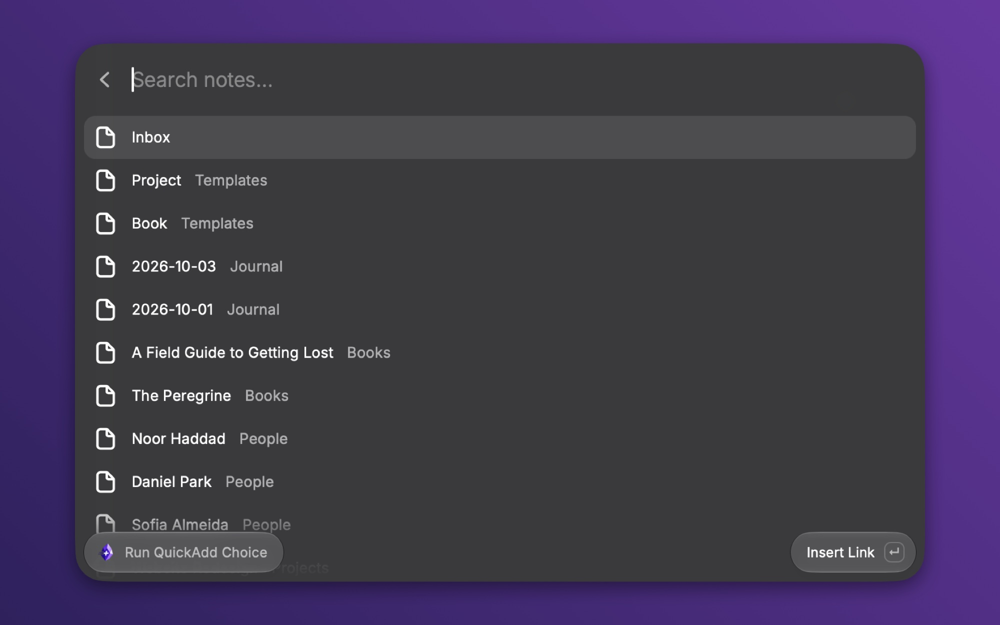
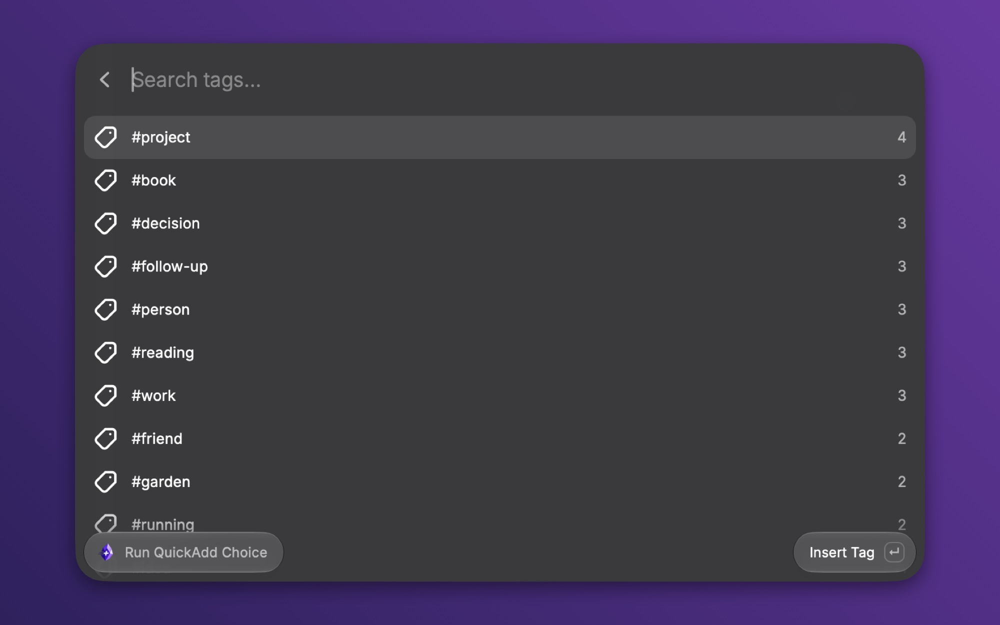
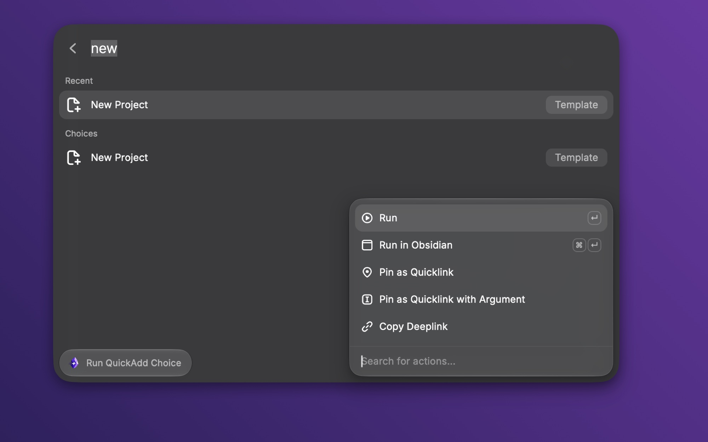
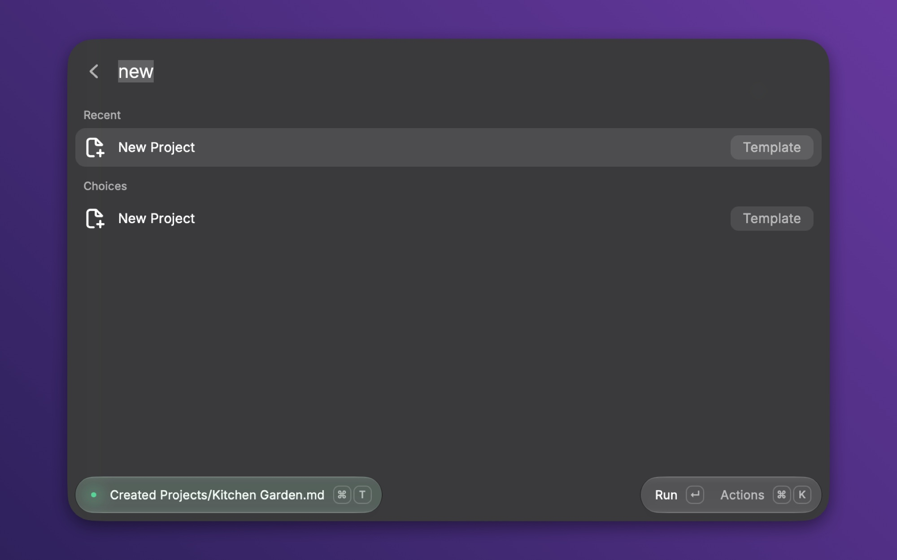
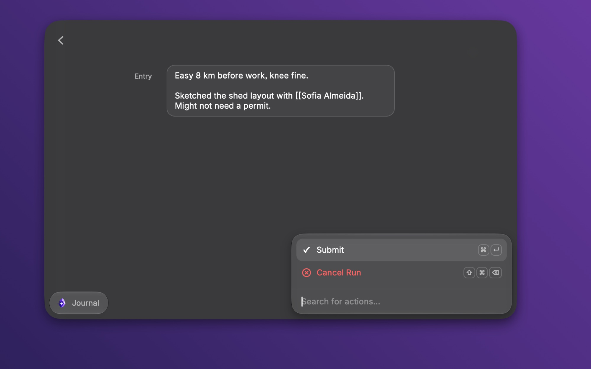
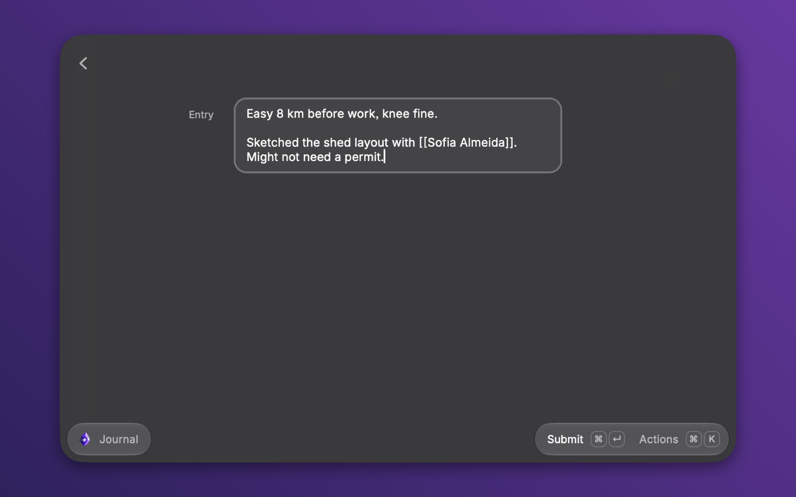

# QuickAdd for Obsidian

[](https://github.com/chhoumann/raycast-quickadd/actions/workflows/ci.yml)
[](LICENSE)
[](https://www.raycast.com/christian_bager_bach_houmann/quickadd)



Run your [QuickAdd](https://github.com/chhoumann/quickadd) choices from Raycast. The forms, the pickers, and the finish message are Raycast's. The work is QuickAdd's, running inside Obsidian through Obsidian's command-line interface. Nothing is re-implemented, so every capture, template, and macro you already have works the day you install this.

I write QuickAdd, and this is its official Raycast extension.



## What you can do

### Run any choice as a native form

Captures, templates, and macros run from one searchable list. A choice's inputs arrive together as one form: text fields, a dropdown for `{{VALUE:a,b,c}}`, a tag picker for `|multi`, a date picker for `{{VDATE}}`, and a note picker for `{{FILE:...}}` that starts empty. Prompts that a macro script raises later, such as `inputPrompt` and `suggester`, arrive one at a time.



A number field with `min` and `max` rejects values outside the range before anything reaches the vault. A required field that is empty says so on the field.



### Link and tag completion

Type `[[` in any text field and a searchable list of your notes and aliases opens. Pick one and the link lands where you typed. Type `#` at the start of a word and the same happens with your tags, most used first. Both need QuickAdd 2.31 or later.





### Capture without a form

Three commands send text to a capture choice you name in their preferences and never open a view. **Quick Capture** takes the text as an argument in Raycast's root search. **Capture Selection** takes the text selected in the frontmost app. **Capture Clipboard** takes the clipboard. Give each a hotkey and capturing is one keystroke and one line of typing.

### Pin a choice, or run it in Obsidian

Every choice has two pin actions. **Pin as Quicklink** makes the choice searchable from Raycast's root, where you can give it a hotkey. **Pin as Quicklink with Argument** makes a Quicklink that takes text inline: type its name, press Tab, type the text, press Enter, and the text runs as the choice's `{{VALUE}}`. **Run in Obsidian** (⌘↵) runs the choice with QuickAdd's own modals when you want them.



### A finish message that says what happened

When a run ends, the toast reads "Created Books/Piranesi.md" or "Added to Inbox.md", and **Open in Obsidian** is one keystroke away. A run that changed nothing reads "Ran Journal".



**Cancel Run** (⇧⌘⌫) tells QuickAdd to stop. A macro that is mid-work stops at its next prompt instead of finishing behind your back. Leaving the form does the same.



### Finds your vault and starts Obsidian

The extension reads Obsidian's vault list and uses the one vault that has QuickAdd enabled. When several vaults have it, **Run QuickAdd Choice** lists them and the capture commands ask you to set the **Vault** preference. When the vault is closed, the extension opens it, waits until QuickAdd answers, and brings Raycast back to the front.

## Install

The extension is not in the Raycast Store yet. Until it is, run it from source:

```bash
git clone https://github.com/chhoumann/raycast-quickadd
cd raycast-quickadd
npm install
npm run dev
```

`npm run dev` installs the extension into Raycast and keeps it up to date while it runs.

## Requirements

| What                                                             | Needs                                                                                                                                             |
| ---------------------------------------------------------------- | ------------------------------------------------------------------------------------------------------------------------------------------------- |
| Everything                                                       | macOS. Obsidian 1.12 or later from the installer (an in-app update is not enough), with **Settings → General → Command line interface** turned on |
| Quick Capture, Capture Selection, Capture Clipboard              | QuickAdd 2.15 or later                                                                                                                            |
| Run QuickAdd Choice, with a choice's inputs on one form          | QuickAdd 2.17.2 or later                                                                                                                          |
| Cancel Run that stops the run, "Created" and "Added to" messages | QuickAdd 2.20 or later                                                                                                                            |
| `[[` and `#` completion, note pickers that start empty           | QuickAdd 2.31 or later                                                                                                                            |

## Commands

| Command                 | What it does                                                                                                         |
| ----------------------- | -------------------------------------------------------------------------------------------------------------------- |
| **Run QuickAdd Choice** | Lists every runnable choice, grouped by Multi folder, with the five you use most at the top. Runs the one you pick. |
| **Quick Capture**       | Sends its text argument to the capture choice named in its preferences.                                              |
| **Capture Selection**   | Sends the text selected in the frontmost app to the capture choice named in its preferences.                         |
| **Capture Clipboard**   | Sends the clipboard text to the capture choice named in its preferences.                                             |

## Preferences

| Preference                               | What it does                                                                                                                                        |
| ---------------------------------------- | --------------------------------------------------------------------------------------------------------------------------------------------------- |
| **Vault**                                | The vault QuickAdd runs in. Leave it empty to use the one vault with QuickAdd enabled. Set it when several vaults have QuickAdd.                    |
| **Obsidian CLI Path**                    | Leave it empty. The extension finds the CLI at `/opt/homebrew/bin/obsidian`, `/usr/local/bin/obsidian`, or inside `Obsidian.app`.                  |
| **Capture Choice** (per capture command) | The capture choice that Quick Capture, Capture Selection, or Capture Clipboard sends text to. Pick one whose target note exists or that creates it. |

## Tips

- Give **Quick Capture**, **Capture Selection**, and your pinned Quicklinks hotkeys in Raycast. A pinned Quicklink with an argument then captures from anywhere in two keystrokes and a line of text.
- A Quicklink with an argument only fills a plain `{{VALUE}}`. Other prompts in the same choice still open in Raycast. A choice without a plain `{{VALUE}}` ignores the text.
- For a big text area, declare the value as multi-line in QuickAdd: `{{VALUE:Entry|type:multiline}}`, or a macro user script whose `quickadd.inputs` entry has `type: "textarea"`. The form renders what the vault describes.
- A lightning bolt next to a choice means you added it as a command in QuickAdd. Those are good candidates to pin.



## Limitations

- Templater's own prompts, such as `tp.system.prompt`, open in Obsidian. When a run has waited three seconds with no prompt, Raycast says QuickAdd may be asking something in Obsidian and offers **Open Obsidian** (⌘O).
- `{{selected}}` inside a choice reads the selection in Obsidian's editor, not the text selected on your Mac. Use **Capture Selection** for the Mac selection.
- Two registered vaults with the same folder name cannot be told apart, because Obsidian's CLI addresses a vault by name. The extension refuses to run in either until one folder is renamed.
- A prompt type added by a newer QuickAdd shows a screen that names the type and asks you to update the extension.

## How it works

Obsidian ships a command-line interface, and QuickAdd registers handlers on it. The extension shells out to that CLI to list choices and to start a choice, and QuickAdd sends each prompt to Raycast over a local connection instead of opening a modal. Raycast renders the prompt as a native control and sends the answer back, and QuickAdd does the rest inside Obsidian. [ARCHITECTURE.md](ARCHITECTURE.md) has the protocol, the vault lookup, and the reasons behind each choice.

## Development

```bash
npm install
npm run dev         # ray develop: installs into Raycast in watch mode
npm run lint        # ray lint: manifest, code, and store screenshots
npm test            # unit tests for field parsing, completion, and the run state machine
npm run build
npm run e2e:protocol  # drives every e2e choice through the real plugin
```

`e2e-vault/` has one QuickAdd choice per field kind and a macro script that raises every script prompt. Build QuickAdd in `~/Developer/quickadd` (or set `QUICKADD_DIR`), run `scripts/setup-e2e-vault.sh` to copy the plugin in, open the folder in Obsidian once with **Open folder as vault**, and run `npm run e2e:protocol`. The script runs every choice through `quickadd:interactive`, answers each prompt the way the extension would, and checks the notes QuickAdd writes to `e2e-vault/Output/`.

`demo-vault/` is the vault in the pictures above. `scripts/setup-demo-vault.sh` downloads the QuickAdd release it expects. To open a choice against either vault from a deeplink, URL-encode `{"vaultPath":"<repo>/demo-vault","choiceId":"quick-capture"}` and append it as `?context=` to `raycast://extensions/christian_bager_bach_houmann/quickadd/run-choice`.

## License

[MIT](LICENSE)
