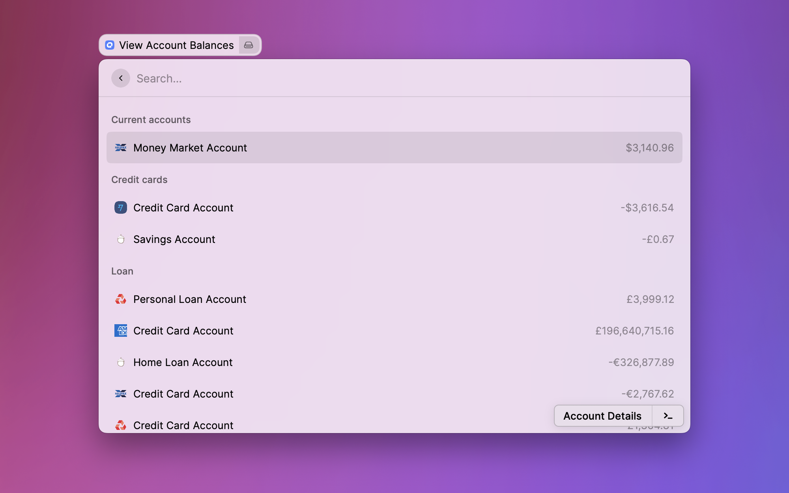

# QuickFile

**This extension is not created by, affiliated with, or supported by QuickFile.**

> Access your [QuickFile](https://quickfile.co.uk/) account balances easily.

## Getting started

Before using the command, you need to retrieve three pieces of information from QuickFile.

1. **You will need to find your QuickFile account number**. You can find it in the menu at the top right of your QuickFile dashboard.

   

2. You will need to create a new QuickFile app and get the App ID and API Key.

   - Follow the steps at https://api.quickfile.co.uk/ under **Registering your application**. You may choose to grant all account permissions, for future feature development, but the only ones required are `Invoices.Bank_GetAccounts`, `Invoices.Bank_Search`, and `Invoices.System_GetAccountDetails`.

     

   - You can find the _App ID_ and _API Key_ in your Account Settings > My Apps.

     

Once you have these three pieces of information, you may copy and paste theme into the extension's Welcome screen or in the extension's preferences.
