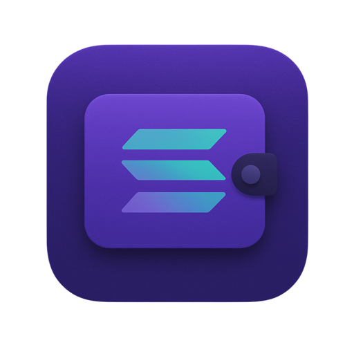

# QuikWallet

A Raycast extension that provides utility helpers for managing Solana wallets and tokens. QuikWallet allows you to quickly check your Solana balance, view SPL token balances, and generate commands for transferring SOL and SPL tokens.



## Features

- View SOL balance for any Solana wallet address
- View SPL token balances for any Solana wallet address
- Generate Solana CLI commands for transferring SOL and SPL tokens
- Save wallet addresses for quick access

## Prerequisites

- [Raycast](https://raycast.com/) installed on your macOS device
- For executing generated transfer commands:
  - [Solana CLI](https://docs.solanalabs.com/cli/install) installed
  - [SPL-Token CLI](https://spl.solana.com/token) installed

## Installation

1. Open Raycast
2. Search for "QuikWallet" in the Raycast Extensions Store
3. Click "Install"

## Usage

### Setting Up Your Wallet

1. Launch the QuikWallet extension by typing "Quik" in Raycast
2. On first launch, you'll be prompted to enter your Solana wallet address
3. Enter a valid Solana public address and click "Save Wallet Address"

### Viewing Balances

Once you've set up your wallet:

1. The extension will display your SOL balance
2. It will also show a list of SPL tokens in your wallet with their balances
3. Tokens are sorted by value, with the highest balances displayed first

### Transferring SOL or SPL Tokens

1. From the balances view, select the SOL or SPL token you want to transfer
2. Click on "Prepare Transfer Command"
3. Enter the recipient's Solana wallet address and the amount to send
4. Click "Copy Send Command"
5. Paste the command in your terminal to execute the transfer

### Changing Wallet

1. From the balances view, click on "Change Wallet" in the action panel
2. Enter a new wallet address and save

## Commands

- `solana transfer <RECIPIENT_ADDRESS> <AMOUNT> --from <YOUR_WALLET>`: Generated command for transferring SOL
- `spl-token transfer <TOKEN_MINT> <AMOUNT> <RECIPIENT_ADDRESS> --owner <YOUR_WALLET> --allow-unfunded-recipient`: Generated command for transferring SPL tokens

## Development

```bash
# Install dependencies
npm install

# Start development server
npm run dev

# Build extension
npm run build

# Lint code
npm run lint

# Fix linting issues
npm run fix-lint
```

## Author

Created by [devsargam](https://github.com/devsargam)
