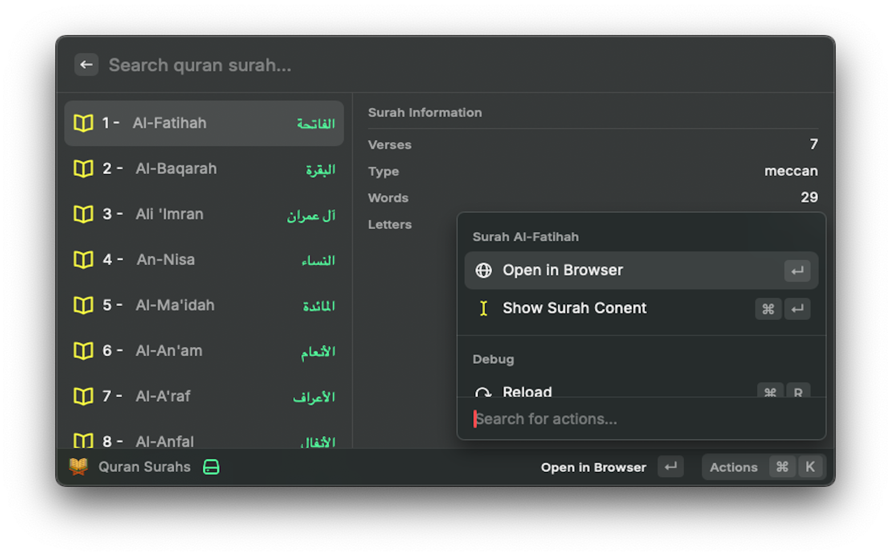

  

<h1 align="center">Quran Tajweed</h1>

<h3 align="center">
Raycast extension to quickly access to easyquran.com
</h3>

## ⚠️ Prerequisites

This extension leverages the [Dar Almaarifah Web Site](https://easyquran.com/en/), it's public and free website, so it's not required to registering an account!

## Commands

### Search Surahs

Search a surah by name or number and display all relevant stats.

### Read Surah

You can either read the Surah directly within the app or explore the Easy Quran website.