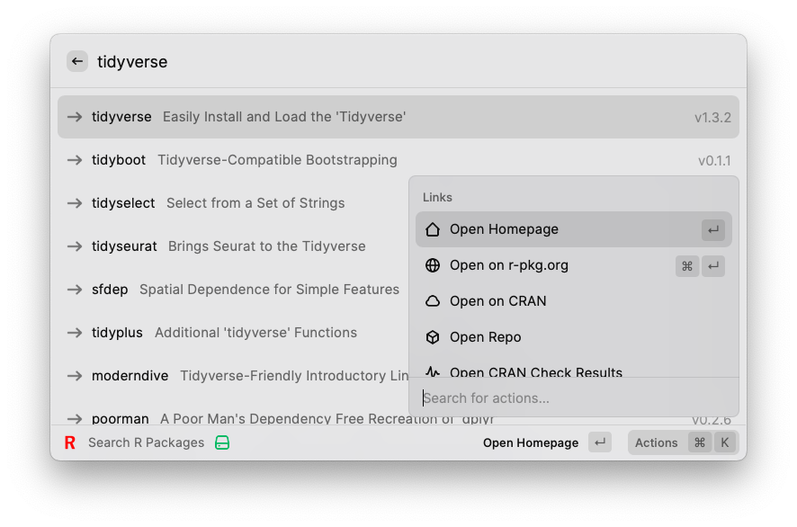
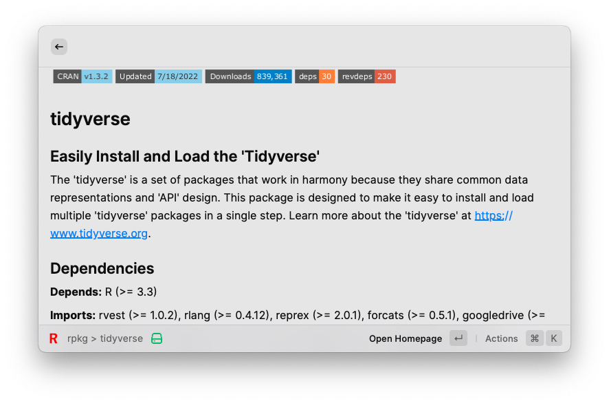

  

  <h1>
    Search r-pkg.org
  </h1>

A Raycast extension to search for R packages using [METACRAN on r-pkg.org](https://r-pkg.org).

## Search for R packages

Searches [METACRAN](htts://r-pkg.org) for R packages and provides quick access to package links and to the R code required to install the package.

## Package descriptions

View the package description, dependencies, and key stats within Raycast when you press <kbd>Cmd</kbd> + <kbd>→</kbd>.

## Shortcuts and settings

### Open package links in the browser

|         Shortcut          | Action                                                                                                                                                                                                                          |
| :-----------------------: | :------------------------------------------------------------------------------------------------------------------------------------------------------------------------------------------------------------------------------ |
|       <kbd>↵</kbd>        | Opens the default link, configurable in the extension settings. All options are available in the actions menu: <ul><li>Homepage</li><li>CRAN</li><li>Source repository</li><li>Bug Reports</li><li>CRAN check results</li></ul> |
| <kbd>⌘</kbd> <kbd>↵</kbd> | Opens the package page on [r-pkg.org](https://r-pkg.org)                                                                                                                                                                        |
| <kbd>←</kbd>/<kbd>→</kbd> | Move between package description and search results                                                                                                                                                                             |

### Copy package links

|                Shortcut                | Action                                       |
| :------------------------------------: | :------------------------------------------- |
| <kbd>⌘</kbd> <kbd>⇧</kbd> <kbd>.</kbd> | Copies the CRAN link                         |
| <kbd>⌘</kbd> <kbd>⇧</kbd> <kbd>,</kbd> | Copies the home or the repo links if present |

### Copy the installation command for the package

|                Shortcut                | Action                                                                                                                                                                                                                                                                                                                                                                                                                              |
| :------------------------------------: | :---------------------------------------------------------------------------------------------------------------------------------------------------------------------------------------------------------------------------------------------------------------------------------------------------------------------------------------------------------------------------------------------------------------------------------- |
| <kbd>⌘</kbd> <kbd>⇧</kbd> <kbd>C</kbd> | Copies the base-R `install.packages()` command                                                                                                                                                                                                                                                                                                                                                                                      |
| <kbd>⌘</kbd> <kbd>⌥</kbd> <kbd>C</kbd> | Copies the installation command of an alternate package manager (configurable in the extension settings): <ul><li><a href="https://pak.r-lib.org" rel="nofollow">pak</a> (default)</li><li><a href="https://remotes.r-lib.org" rel="nofollow">remotes</a></li><li><a href="https://devtools.r-lib.org/" rel="nofollow">devtools</a></li><li><a href="https://cran.r-project.org/package=pacman" rel="nofollow">pacman</a></li></ul> |

You can reverse the installation command shortcuts by choosing the *Default Package Installation Method* in the extension settings.
