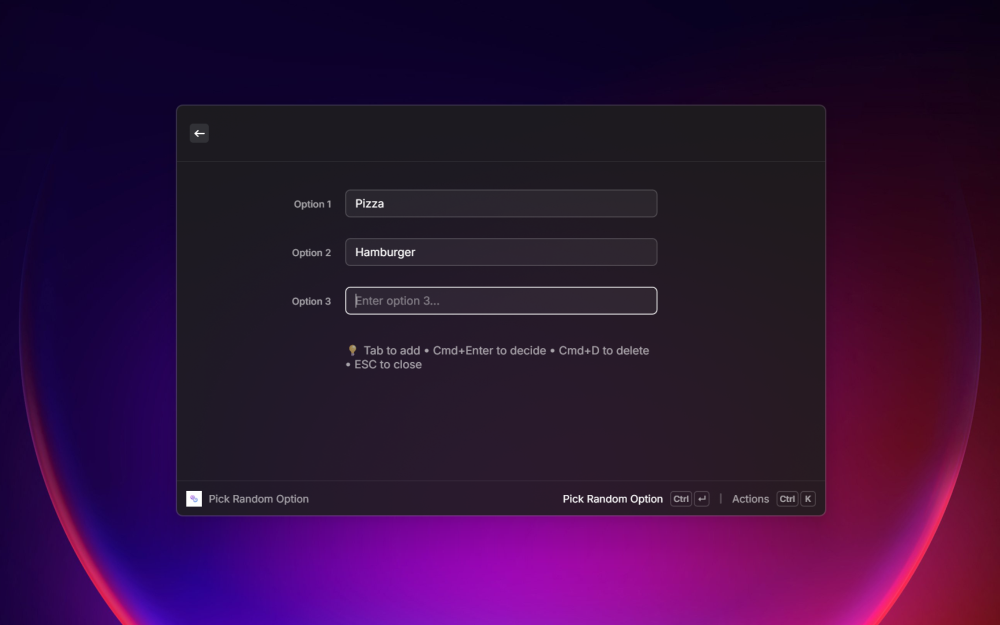

# Random Picker

**Random Picker** is a Raycast extension designed to help you make decisions effortlessly. Whether you're choosing where to eat, who goes first, or any other dilemma, simply list your options and let the extension pick a winner for you.

## Features

- **Dynamic Input Fields**: Just start typing! A new option field automatically appears when you type in the last one.
- **Smart Cleanup**: Empty option fields (except the last one) are automatically removed when you move away from them, keeping your list clean.
- **Instant Results**: Get a randomly selected winner with a single keystroke.
- **Detailed Breakdown**: View the winner, the probability of the win, and a list of all candidates in the result view.
- **Roll Again**: Not happy with the result? Roll again instantly without re-entering options.
- **Keyboard First**: Optimized for keyboard usage with intuitive shortcuts.

## Screenshots

### Input Your Options
Simply type your options. The list grows as you type.

### The Verdict
See the winner clearly displayed, along with stats.

## How to Use

1.  **Open the Command**: Search for "Pick Random Option" in Raycast.
2.  **Enter Options**: Type your first option. Press `Tab` or simply keep typing to add more.
    - *Tip*: You need at least 2 options to make a decision.
3.  **Pick**: Press `Cmd + Enter` to let fate decide.
4.  **View Result**: See the winner!
    - Press `Enter` to copy the result.
    - Press `Cmd + Enter` (or click the action) to **Roll Again**.

## Shortcuts

| Action | Shortcut |
| :--- | :--- |
| **Pick** (Submit) | `Cmd + Enter` |
| **Add New Option** | `Cmd + N` |
| **Delete Option** | `Cmd + D` |
| **Copy Result** | `Enter` (in result view) |
| **Roll Again** | `Cmd + R` or Action Menu |

## Installation

1.  Install [Raycast](https://www.raycast.com/).
2.  Search for "Random Picker" in the Raycast Store (coming soon) or install locally.

## Author

Created by **Shrp**.

