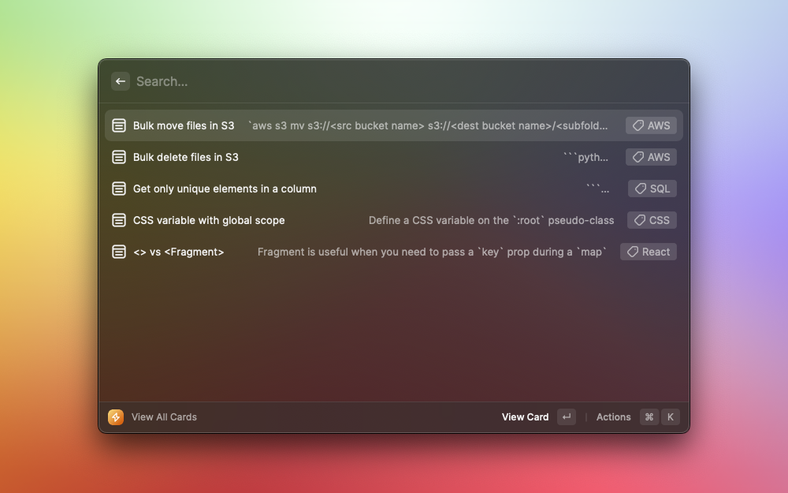
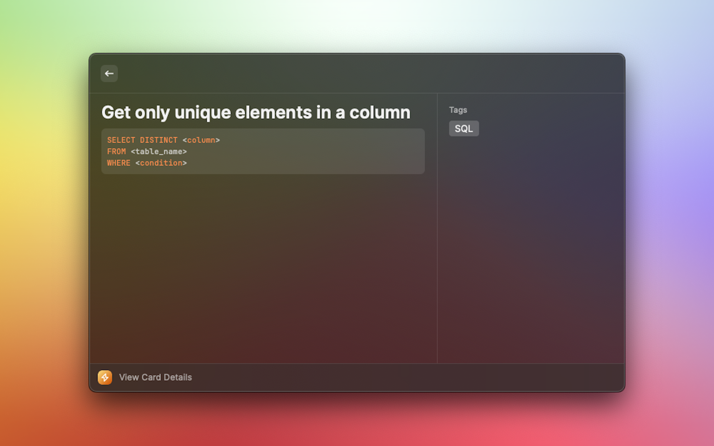
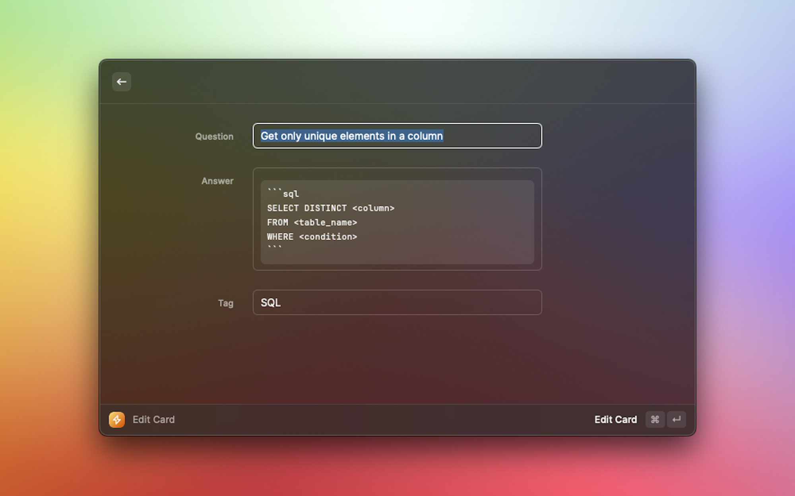

# RapidCap

Quickly save information without context switching.

## Description

An extension to help save miscellaneous information that is important but [at the time] doesn't feel large enough to make you want to open your notes app and write it down. In today's world, information is thrown around all the time but there is also a certain level of productivity that is expected. RapidCap bridges the gap between trying to remember it all and documenting every step you take.

For example:

- Someone says 80xx port is the only open port -> add it to RapidCap.
- After several hours of searching, you FINALLY figure out the specific command to solve your problem -> well you may encounter it again so you should probably save it to RapidCap.

All data is store to the JSON file specified in the extension preferences so you have complete control over it, it is not application specific, and human readable. Other possibilities with this type of storage includes syncing with iCloud across multiple devices or backing up your file to Github.

## Required Configuration

Before being able to use RapidCap, you must set the Data File Path to a JSON file in the extension preferences.
This is a one-time set up and will not be required after it is configured.

## Commands

### View All Cards

A user can view all created cards with this command. This is helpful when reviewing previously saved information or if you are looking for something... but you can't quite remember the right words to search for it.

To view all the details for a specific card, you can view that card details and it will show the "question", "answer" in markdown, and the tag.

### Create Card

Creating a card enables the user to quickly save information for retrieval at a later time.

## Feature Backlog
- [x] MVP
- [ ] Create card from `View All Cards`
- [ ] Support multiple tags
- [ ] Quick action to create card
- [ ] Quick actiont to search for card
- [ ] Better search (search for keywords in answer or tags)
- [ ] Automatic backup with git
- [ ] More efficient data mgmt 