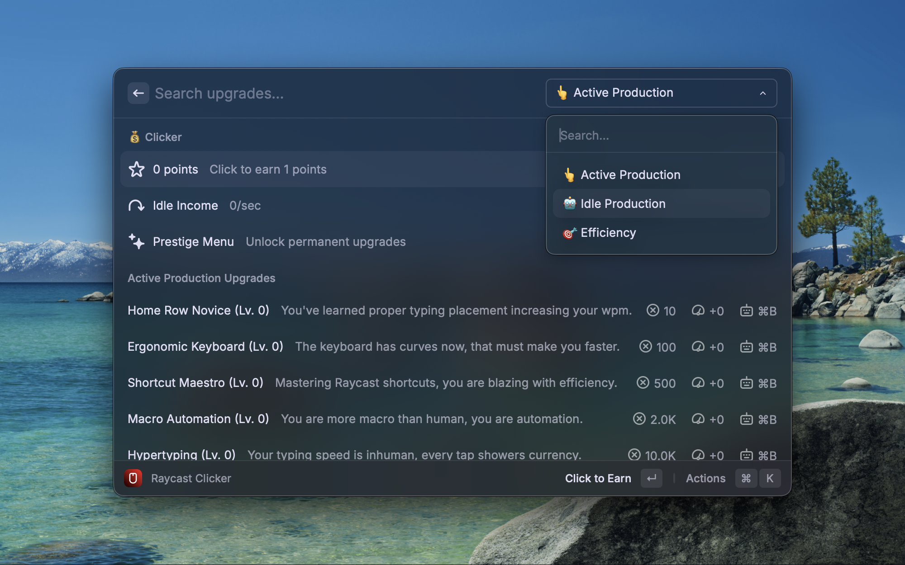

# Ray Clicker

A simple idle clicker game for Raycast with upgrade, made as a learning exercise for Raycast extensions development.

## Features

- Active, Idle, and Efficiency upgrade trees, raycast/productivty themed
- Buy max, cost reductions, milestones, and auto-clicker
- Prestige loop with permanent bonuses and UI estimate
- Golden Command random bonus with optional toast


## Requirements

- Raycast 1.37+
- Node.js 18+
- npm (with package-lock.json committed)

## Development

- Install deps: `npm ci`
- Run in dev: `npm run dev`
- Lint & fix: `npm run fix-lint`

## Distribution Build (Store Readiness)

1. Type-check & bundle optimized build:
   ```bash
   npm run build
   ```
2. Lint checks:
   ```bash
   npm run lint
   ```
3. Open in Raycast to verify the built extension works as expected.

## Store Compliance Checklist

- Author uses Raycast username: `JonathanRReed`
- License: MIT
- API: using latest @raycast/api via npx for build/lint
- Categories: `Fun`
- Icon: `assets/icon.png` (512x512 PNG). Ensure high contrast in light/dark.
- No external analytics, no keychain usage
- No opaque binaries; no background downloads
- Naming follows Apple Style Guide; Title Case actions
- Navigation uses Raycast Navigation API
- Empty states handled; no flicker
- No localization beyond US English

## Screenshots

Use Raycast Window Capture (Preferences → Advanced):

- Size: 2000×1250 (16:10), PNG
- Use a single, high-contrast background
- Showcase informative views (Upgrades, Stats, Prestige)

## Notes

- Design overview lives in `design doc.md` (truncated summary)
- CHANGELOG in root tracks version history

## License

MIT