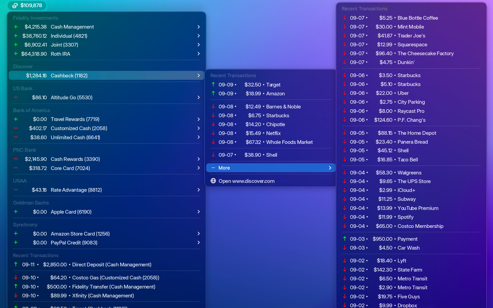
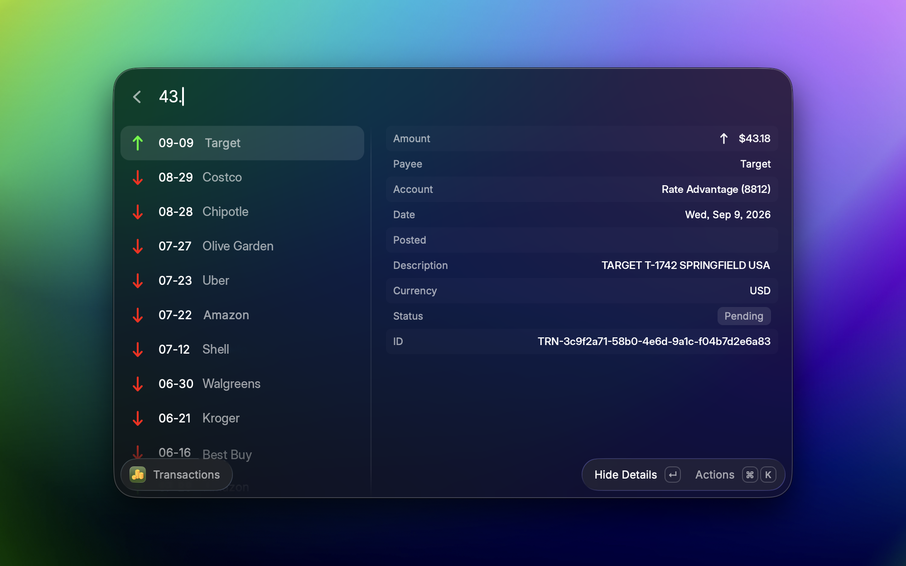

# RayCash

**All your bank balances, one click away.**

RayCash puts your net worth in your Mac's menu bar and your recent transactions one click below it — every bank, credit card, and brokerage you use, in one place. No app to open, no dashboard to log into. Glance up, see where you stand, get back to what you were doing.






## Is this safe?

Short answer: yes, by design.

- **RayCash can only *look* at your accounts — it can never move money.** It connects through [SimpleFIN](https://beta-bridge.simplefin.org/), a service built specifically to give apps read-only access to bank data. There is no "send money" capability to misuse, even in theory.
- **RayCash never sees your bank password.** You log into your bank on SimpleFIN's site, not in RayCash. All RayCash ever holds is a read-only access link, which Raycast stores encrypted on your Mac.
- **Your data stays on your Mac.** Transactions are cached locally so the menu opens instantly. Nothing is sent anywhere except to SimpleFIN to fetch your own data.

## What you get

- **Your net worth in the menu bar** — or just an icon, if you'd rather not show a number while screen-sharing.
- **Every account in one menu**, grouped by bank, each with its balance and recent activity.
- **A combined feed of recent transactions** across all your accounts, so you can spot anything unexpected in seconds.
- **Readable merchant names.** Banks report messes like `APLPAY TST* JENI'S SAUSTIN TX` — RayCash cleans that up to `Jeni's` automatically.
- **Searchable history.** Type a merchant or an amount and jump straight to the transaction, with full details alongside.
- **Your names, not the bank's.** Rename "ACCT ****4821" to "Joint Checking" and it sticks.
- **A net worth that's actually yours.** Leave out accounts that shouldn't count (a business card, a kid's account) and fix any balance your bank reports with the wrong sign.

## Before you start

RayCash needs a [SimpleFIN Bridge](https://beta-bridge.simplefin.org/) account — that's the service that connects to your banks. It costs about **$1.50/month** (paid to SimpleFIN, not to this extension) and supports thousands of institutions.

## Setup (about 5 minutes)

1. In Raycast, run **Set Up SimpleFIN**.
2. Press **⌘O** to open the SimpleFIN site. Sign in (or create an account) and link your banks — you'll log into each bank on their own secure page.
3. On the SimpleFIN site, go to **My Account → Apps → New Connection → Create Setup Token** and copy the token.
4. Paste the token into the Setup command in Raycast.

RayCash exchanges the token for your access link, copies it to your clipboard, and opens its preferences. Paste it into **SimpleFIN Access URL** — that's it. Your balances appear in the menu bar and refresh automatically every couple of hours.

> **One thing to know about setup tokens:** each token works exactly once, and whoever uses it first gets read-only access to your linked accounts. So paste it only into RayCash. If a token ever ends up somewhere it shouldn't (a chat, a note, an email), delete that connection on the SimpleFIN site and create a fresh one.

## Everyday use

You'll mostly just glance at the menu bar. When you want more:

- **Click the menu bar item** to see every account and recent transactions. Hover over a transaction for full details.
- **Transactions** — search your whole history. Typing `123` finds `$123.74` before it finds `$18.23`.
- **Accounts** — rename accounts and banks, hide the ones you don't care about, exclude any from the net total, or flip a balance that shows backwards.
- **Refresh Balances** — nudge RayCash to fetch fresh data now instead of waiting for the next automatic refresh.

## Making it yours

Everything below is optional — RayCash works fine out of the box.

**Hide the number.** Set **Menu Bar Title** to icon-only if you don't want your net worth visible on screen.

**Change the colors.** Money in and money out are green and red by default; set any colors you like in preferences.

**Group by day or keep one list.** The transaction feed can be a single flat list or fold each day into its own submenu.

**Fix a merchant name.** If a transaction still shows up with junk in its name, open **Transactions**, press **⌘⇧E**, and add the junk text to the cleanup list. RayCash strips it from every matching transaction, past and future.

<details>
<summary><strong>Change what each transaction row shows</strong></summary>

Each row is built from a simple template. The default is:

```
{date} • {amount} • {payee} ({account})
```

…which renders like `07-28 • $24.56 • Jeni's (Platinum)`. Rearrange, remove, or add pieces however you like. Available pieces: `{date}`, `{posted}`, `{amount}`, `{payee}`, `{payee_raw}`, `{description}`, `{memo}`, `{account}`, `{pending}`, `{id}`.

A few niceties:

- If a piece is empty for some transaction, its surrounding punctuation disappears too — you'll see `Costco`, not `Costco ()`.
- Dates can take a custom format: `{date:EEE MMM d}` shows `Tue Jul 28`.
- Whatever you leave out of the row still appears in the tooltip when you hover, or inline when you hold **⌥**.

</details>

<details>
<summary><strong>All preferences</strong></summary>


| Preference                           | What it does                                                                     |
| ------------------------------------ | -------------------------------------------------------------------------------- |
| **SimpleFIN Access URL**             | Your access link from setup. Stored encrypted by Raycast.                        |
| **Menu Bar Title**                   | Show your net total, or just the icon.                                           |
| **Positive / Negative Color**        | Colors for money in and money out.                                               |
| **Grouping**                         | Flat transaction list, or one submenu per day.                                   |
| **Row Template**                     | What each transaction row shows (see above).                                     |
| **Day Heading Format**               | Date format for day headings.                                                    |
| **Hide Currency Symbol / Code**      | Enter `$` or `USD` to hide it from amounts.                                      |
| **Transactions Per Account**         | How many recent transactions inside each account's submenu.                      |
| **Global Transactions Count / Days** | Size of the combined feed at the bottom of the menu.                             |
| **Local Archive Limit (Days)**       | How much history to keep on your Mac (default: a year).                          |
| **Alignment**                        | Amounts and dates line up in neat columns; turn off if you prefer them unpadded. |
| **Minimum Fetch Interval**           | How long RayCash waits between checks with SimpleFIN.                            |

</details>

## FAQ

**Why hasn't my balance updated?**
Banks share fresh data with SimpleFIN about once a day, so RayCash checks every couple of hours — more often wouldn't show anything new. It also deliberately stays well under SimpleFIN's daily request limit, because exceeding it would lock the connection and force you to set up again. If you just made a purchase and don't see it yet, that's normal; it'll show up when your bank posts it.

**A balance shows negative when it should be positive (or vice versa).**
Some banks report signs backwards. Open **Accounts** and use *invert* on that account.

**Can I keep an account out of my net worth?**
Yes — **Accounts** lets you exclude any account from the total while still showing its transactions, or hide it entirely.

**What happens if I stop paying for SimpleFIN?**
RayCash stops getting new data but keeps showing what's cached. Nothing else breaks.

**Something says my token was "already claimed."**
Setup tokens are single-use. Just create a new one on the SimpleFIN site (**My Account → Apps → New Connection → Create Setup Token**) and paste that instead.

## Learn more

- [SimpleFIN Bridge](https://beta-bridge.simplefin.org/) — the service that connects to your banks
- [SimpleFIN protocol](https://www.simplefin.org/protocol.html) — for the technically curious
