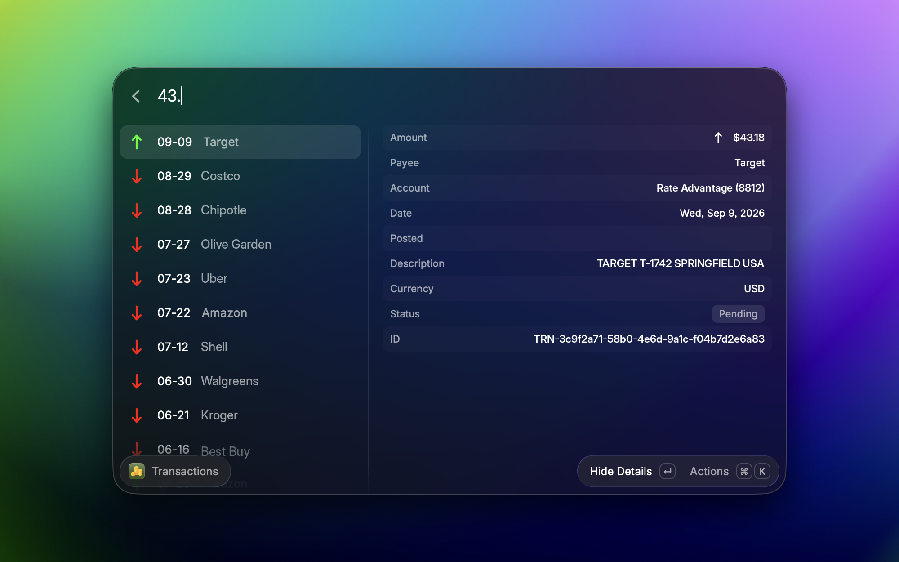
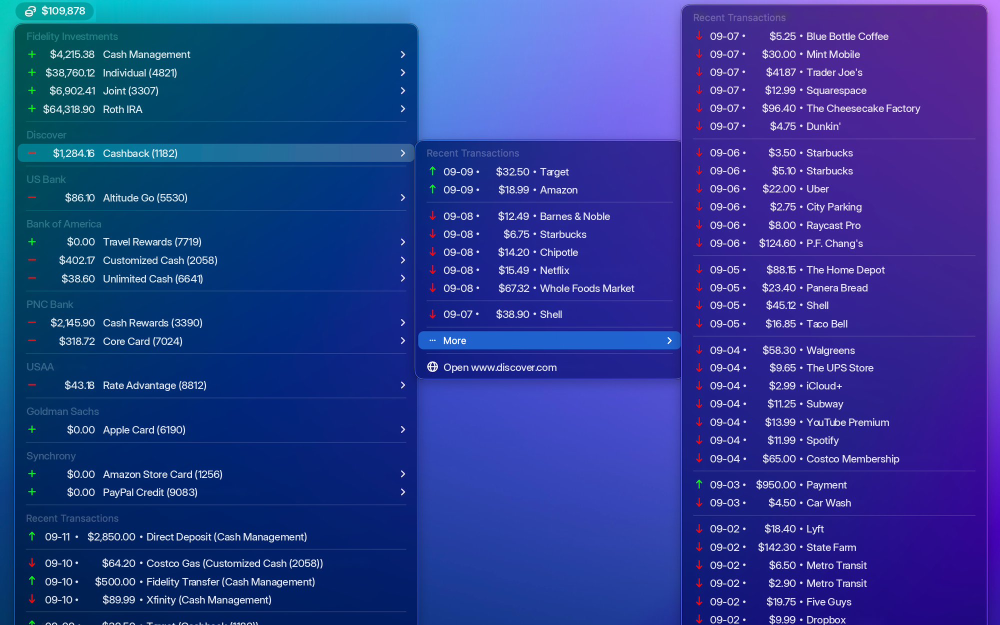

# RayCash

**All your transactions and balances, one click away.**

RayCash puts your net worth in your Mac's menu bar and your recent transactions one click below it — every bank, credit card, and brokerage you use, in one place. Data is provided by [SimpleFIN Bridge](https://beta-bridge.simplefin.org/).

It also lets you search transactions across all your accounts by payee, amount, date, or account.





## Features

- **Transaction search** — one list across every account. Type a payee, an amount, a date, or an account name; the matching transaction shows with its full details alongside.
- **Net worth in the menu bar** — or only the icon, if you'd rather not show the number.
- **Balances by institution** — every account grouped by bank, each with its balance and recent transactions.
- **Recent transactions feed** — the latest transactions across all accounts, at the bottom of the menu.
- **Cleaned-up payee names** — `APLPAY TST* JENI'S SAUSTIN TX` becomes `Jeni's`. Add your own rules for anything left over.
- **Your own account names** — rename `ACCT ****4821` to `Joint Checking`, hide accounts, or leave some out of the net total.
- **Automatic refresh** — checks every 15 minutes and fetches new data once what it has is more than 90 minutes old.

## Commands

| Command                   | Description                                                                                        |
| ------------------------- | -------------------------------------------------------------------------------------------------- |
| **Transactions**          | Search transactions across all accounts. **⌘⇧E** edits the payee cleanup list.                     |
| **Menu Bar**              | Net worth, balances by institution, and recent transactions in the menu bar.                       |
| **Accounts**              | Rename, hide, or exclude accounts from the net total; invert a balance the bank reports backwards. |
| **Refresh Balances**      | Fetch new data now instead of waiting for the next automatic refresh.                              |
| **Auto-Refresh Balances** | Background command that runs every 15 minutes.                                                     |
| **Set Up SimpleFIN**      | Exchange a SimpleFIN setup token for your Access URL.                                              |

## Privacy and safety

- RayCash has read-only access. It connects through SimpleFIN, which gives apps read access to bank data only; there is no way to move money.
- RayCash never sees your bank password. You log in to your bank on SimpleFIN's site. RayCash holds only a read-only access link, which Raycast stores encrypted.
- Your data stays on your Mac. Transactions are cached locally, and nothing is sent anywhere except to SimpleFIN to fetch your own data.

## Requirements

A [SimpleFIN Bridge](https://beta-bridge.simplefin.org/) account, the service that connects to your banks. It costs about $1.50/month, paid to SimpleFIN, and supports thousands of institutions.

## Setup

1. In Raycast, run **Set Up SimpleFIN**.
2. Press **⌘O** to open the SimpleFIN site. Sign in (or create an account) and link your banks. You log in to each bank on its own page.
3. On the SimpleFIN site, go to **My Account → Apps → New Connection → Create Setup Token** and copy the token.
4. Paste the token into the Set Up SimpleFIN command.

RayCash exchanges the token for your Access URL, copies it to your clipboard, and opens its preferences. Paste it into **SimpleFIN Access URL**. Your balances appear in the menu bar and refresh on their own.

> Setup tokens work exactly once, and whoever uses one first gets read-only access to your linked accounts, so paste it only into RayCash. If a token ends up somewhere it shouldn't, delete that connection on the SimpleFIN site and create a new one.

## Preferences

Everything below is optional.

- **Menu Bar Title** — show your net total, or only the icon.
- **Positive / Negative Color** — colors for money in and money out. Green and red by default.
- **Grouping** — one flat transaction list, or one submenu per day.
- **Payee cleanup** — if a transaction still shows junk in its name, open **Transactions**, press **⌘⇧E**, and add that text to the cleanup list. It is stripped from every matching transaction, past and future.

<details>
<summary><strong>Row template</strong></summary>

Each transaction row is built from a template. The default is:

```
{date} • {amount} • {payee} ({account})
```

which renders as `07-28 • $24.56 • Jeni's (Platinum)`. Rearrange, remove, or add pieces as you like. Available pieces: `{date}`, `{posted}`, `{amount}`, `{payee}`, `{payee_raw}`, `{description}`, `{memo}`, `{account}`, `{pending}`, `{id}`.

- If a piece is empty for a transaction, its surrounding punctuation is dropped too: `Costco`, not `Costco ()`.
- Dates take a custom format: `{date:EEE MMM d}` shows `Tue Jul 28`.
- Whatever the row leaves out still appears in the tooltip on hover, or inline while you hold **⌥**.

</details>

<details>
<summary><strong>All preferences</strong></summary>

| Preference                           | What it does                                                                |
| ------------------------------------ | --------------------------------------------------------------------------- |
| **SimpleFIN Access URL**             | Your access link from setup. Stored encrypted by Raycast.                   |
| **Menu Bar Title**                   | Show your net total, or just the icon.                                      |
| **Positive / Negative Color**        | Colors for money in and money out.                                          |
| **Grouping**                         | Flat transaction list, or one submenu per day.                              |
| **Row Template**                     | What each transaction row shows (see above).                                |
| **Day Heading Format**               | Date format for day headings.                                               |
| **Hide Currency Symbol / Code**      | Enter `$` or `USD` to hide it from amounts.                                 |
| **Transactions Per Account**         | How many recent transactions inside each account's submenu.                 |
| **Global Transactions Count / Days** | Size of the combined feed at the bottom of the menu.                        |
| **Local Archive Limit (Days)**       | How much history to keep on your Mac (default: a year).                     |
| **Alignment**                        | Amounts and dates line up in columns; turn off if you prefer them unpadded. |
| **Minimum Fetch Interval**           | How long RayCash waits between requests to SimpleFIN (default: 90 minutes). |

</details>

## FAQ

**Why hasn't my balance updated?**
Banks share new data with SimpleFIN about once a day, so RayCash fetches at most every 90 minutes and stays well under SimpleFIN's daily request limit, since exceeding it locks the connection. A purchase you just made shows up once your bank posts it.

**A balance shows negative when it should be positive, or the reverse.**
Some banks report signs backwards. Open **Accounts** and use _Invert_ on that account.

**Can I keep an account out of my net worth?**
Yes. **Accounts** can exclude an account from the total while still showing its transactions, or hide it entirely.

**What happens if I stop paying for SimpleFIN?**
RayCash stops getting new data and keeps showing what it has cached.

**The token was "already claimed."**
Setup tokens are single-use. Create a new one on the SimpleFIN site (**My Account → Apps → New Connection → Create Setup Token**) and paste that instead.

## Links

- [SimpleFIN Bridge](https://beta-bridge.simplefin.org/)
- [SimpleFIN protocol](https://www.simplefin.org/protocol.html)
