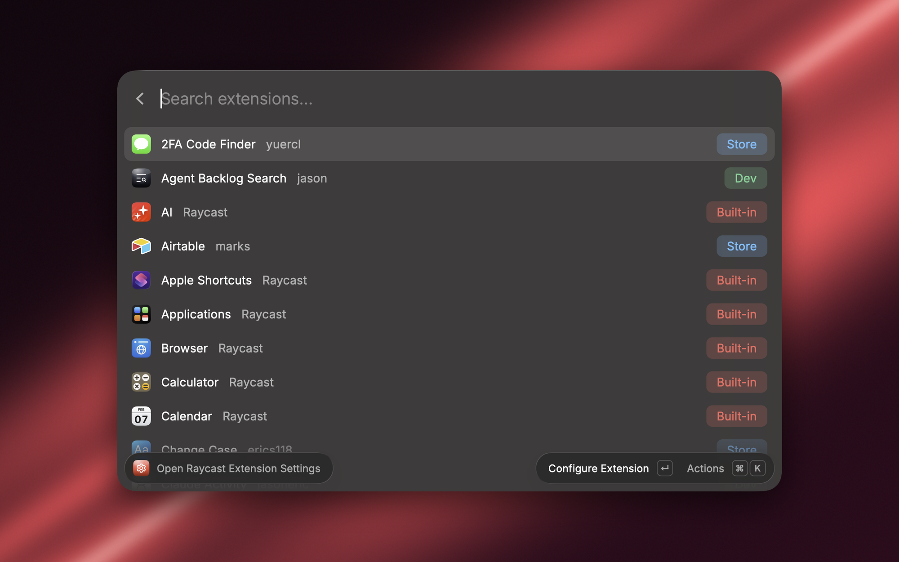

# Raycast Extension Settings

Jump straight to any extension's settings. Search every installed extension, press Enter, and Raycast Settings opens on that extension's page, ready for you to change its preferences, hotkeys, or aliases.

## Command

### Open Raycast Extension Settings

Lists every installed extension once, built-in, Store, and development, with a colored tag for each:

- **Built-in** (red): ships with Raycast, such as Calendar or Window Management.
- **Store** (blue): installed from the Raycast Store.
- **Dev** (green): one you run with `ray develop`.

Extensions you open often rise to the top. Type part of a name to filter. Then:

| Key | Action |
|---|---|
| Enter | Open the extension's page in Raycast Settings |
| ⌘ Enter | Open a Store extension's Store page |
| ⌘ C | Copy the extension's name |
| Reset Ranking (in ⌘ K) | Move the extension back to its A–Z place |

Tip: give the command a hotkey, and any extension's settings are two keys away.

## Setup

Raycast has no command that opens another extension's settings. This extension opens Raycast Settings and picks the extension for you through macOS accessibility, so Raycast needs **Accessibility** permission. If you use Raycast's Window Management, it already has it.

1. Open System Settings › Privacy & Security › Accessibility.
2. Turn on **Raycast**.
3. Run the command again.

If the permission is missing when you press Enter, the extension opens that System Settings page for you.

The extension never types keystrokes, so nothing can land in another app. It reads only Raycast's own files and sends nothing over the network.

## Preferences

| Preference | Default | What it does |
|---|---|---|
| Development extensions | On | Include extensions you run with `ray develop` |
| Authors | Off | Show each extension's author after its name. Extensions that share a name always show their author. |
| Origin tags | On | Show the Built-in, Store, or Dev tag |

## Troubleshooting

If a jump fails, a message says why:

- **"Raycast needs Accessibility permission"**: follow the setup steps above.
- **"Raycast Settings didn't open within 5 seconds"**: Raycast was busy. Try again.
- **"Raycast Settings has no extension named …"**: the extension was uninstalled or renamed since the list loaded. Reopen the command.
- **"Settings opened … instead"**: an app or another entry with the same name came up first. Settings stays open with the name searched, so pick the extension's row yourself.
- **"More than one extension is named …"**: two or more installed extensions share the name. Settings stays open with the name searched, so pick yours.
- **"Couldn't find the Settings search box"**: a Raycast update changed the Settings window. Please open an issue so the extension can be updated.

## Limits

- macOS only.
- Raycast's System Settings entry isn't listed, because Raycast builds it at runtime.

This would be simpler if Raycast let an extension open another extension's settings. If you'd like that too, add a 👍 to [the feature request](https://github.com/raycast/extensions/issues/31996).

Made by [Jason Eric Siegel](https://www.linkedin.com/in/jasonericsiegel/).
