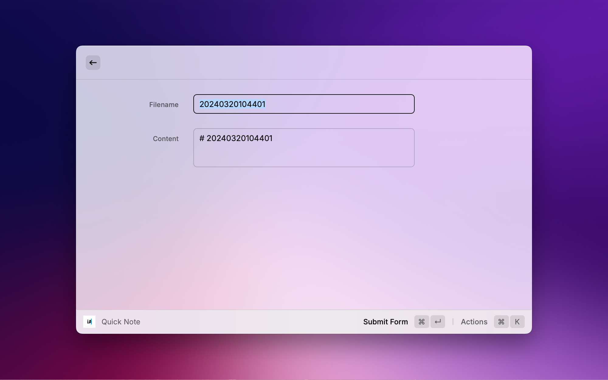
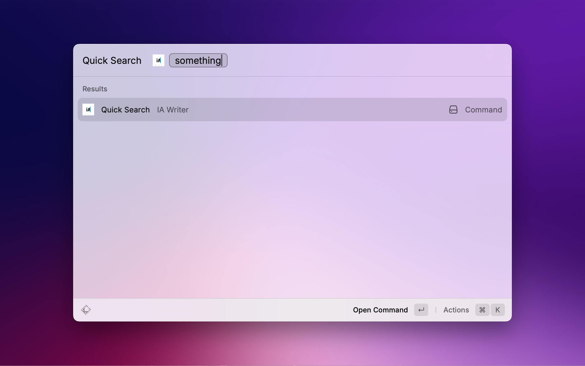

    

# Raycast iA Writer Extension

Create or search notes in iA Writer with Raycast.

## Screenshots

## Feature

- Quick Note. Create quick note in iA Writer's default location. You can create notes with time-based filenames.
- Quick Search. Open quick search panel in iA Writer with queries.

The extension is based on iA Writer's [URL Commands](https://ia.net/writer/support/help/url-commands).

## Contribute

Please feel free to commit issues or pull requests.

