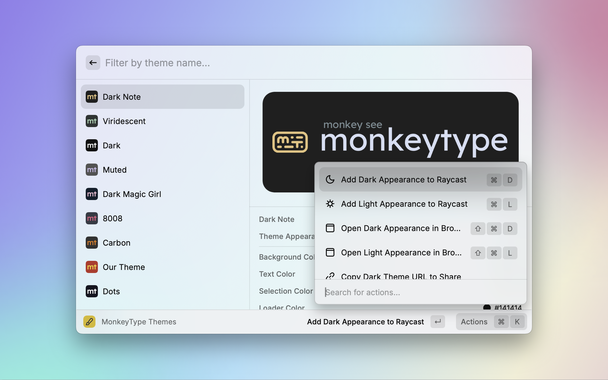

# Raycast MonkeyType Theme

The Raycast Extension for setting Raycast theme with MonkeyType Theme colors.

## How to use

1. Install the `Raycast MonkeyType Theme` Extension from the Raycast Store.
2. Locate the theme you want within the Extensions.
3. Press `↵` to set the theme or use `⌘ + k` select other option.

## Screenshot

