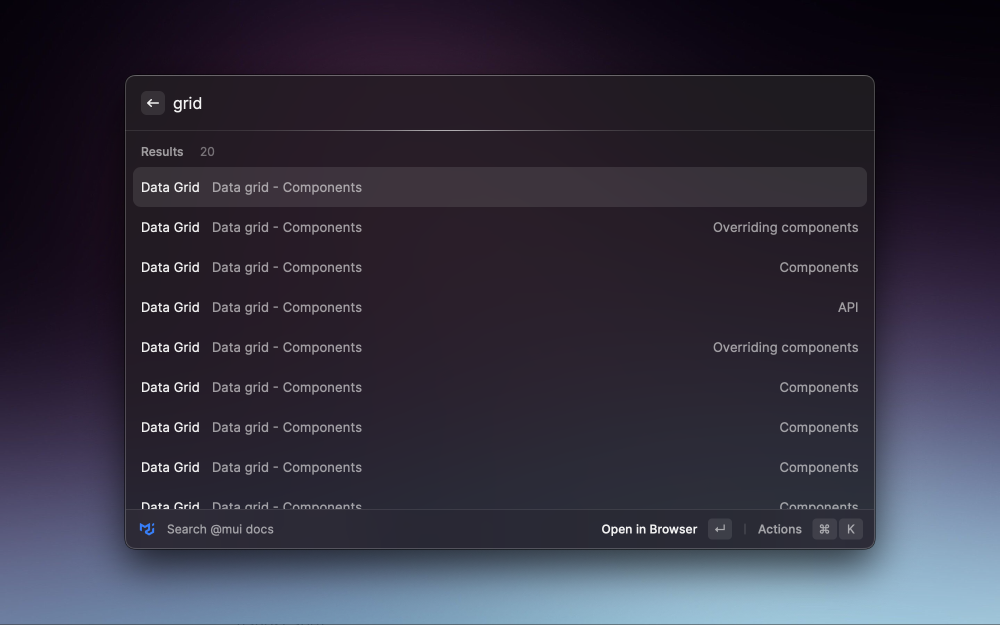

# Raycast MUI Search

A Raycast extension to search the [Material-UI documentation](https://mui.com/) quickly and access the components you need with the power of searching with [Algolia](https://www.algolia.com/).

## Features

- Search the Material-UI documentation with Algolia
- Get quick access to the components you need
- Launch the search with a single Raycast command

## Usage

1. Launch Raycast and type `mui`.
2. Type your search query and press enter.
3. Use the arrow keys to navigate the search results.
4. Press enter to copy the selected component to your clipboard.

## Credits

This extension is created by [ubeytd](https://github.com/ubeytd).
It uses the [Material-UI](https://mui.com/) documentation, powered by [Algolia](https://www.algolia.com/).

## License

This extension is [MIT licensed](LICENSE).
