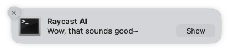
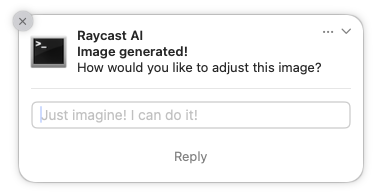

# Raycast Notification

This extension makes it easy to display system built-in Notification Center and Raycast HUD via a quicklink or cross-extension launch, making the Raycast interface accessible to other applications or scripts.

[![raycast-cross-extension-badge]][raycast-cross-extension-link]

## Raycast HUD

The HUD notifications of Raycast look super nice! Don't you wish you could use them for everything?

Well, this extension makes it easy to display Raycast notifications via a quicklink, making the beautiful Raycast interface accessible to other applications or scripts.

Use it from the terminal like:

> [!IMPORTANT]
> Make sure to url_encode the notificationtext, and of course to validate your input text before using it on the command line.
> Also, success and failure notification types are not supported in background mode.

```shell
open -g "raycast://extensions/maxnyby/raycast-notification/index?launchType=background&arguments=%7B%22title%22%3A%22Notification%20Text%22%7D"
```

```shell
open -g "raycast://extensions/maxnyby/raycast-notification/index?arguments=%7B%22title%22%3A%22Notification%20Text%22%2C%22type%22%3A%22success%22%7D"
```

## Notification Center

Even more! With this extension you can also call the system built-in Notification API!





This extension follows [Raycast Cross-Extension Conventions][raycast-cross-extension-link]. So that you can receive the reply value through its callback launch.

If you want a better async/await experience, we recommend using [raycast-notifier](https://github.com/LitoMore/raycast-notifier) directly.

### Use with `raycast-notifier`

```typescript
import { confirmAlert } from "@raycast/api";
import { findRaycastNotificationCenterPath, notificationCenter } from "raycast-notifier";

const found = await findRaycastNotificationCenterPath();
if (found) {
  await notificationCenter(
    {
      title: "AI Assitant",
      message: "Hi, what can I help you today?",
      reply: "Ask me anything!",
    },
    {
      customPath: found,
    },
  );
} else {
  const yes = await confirmAlert({
    title: "Notification Center Not Found",
    message: "Please install Raycast Notification extension. Do you want to install it right now?",
  });
  if (yes) await open("raycast://extensions/maxnyby/raycast-notification");
}
```

### Use with Cross-Extension

```typescript
import { crossLaunchCommand } from "raycast-cross-extension";

crossLaunchCommand(
  {
    name: "index",
    type: LaunchType.Background,
    extensionName: "raycast-notification",
    ownerOrAuthorName: "maxnyby",
    context: {
      notifyOptions: {
        title: "Raycast Notification",
        subtitle: "Notification Center",
        message: "Hello from Raycast",
        reply: "Send your greetings",
      },
    },
  },
  // Set `false` to disable callback launch from `raycast-cross-extension`
  false,
);
```

For full API instructions please refer to the [`notifyOptions`](https://github.com/LitoMore/raycast-notifier#notifyoptions).

#### Receive Reply Value from Cross-Extension

```typescript
import { NotifyResult } from "raycast-notifier";

type LaunchContex = {
  notifyResult?: NotifyResult;
};

export default function Command({ launchContext = {} }: { launchContext: LaunchContext }) {
  const { notifyResult } = launchContext;
  const greetigns = notifyResult?.metadata?.activationValue;
  console.log(greetings);
}
```

#### Deeplink Example

```shell
context='{"notifyOptions":{"title":"Raycast AI","subtitle":"Image generated!","message":"How would you like to adjust this image?","reply":"Just imagine! I can do it!"}}'
deeplink="raycast://extensions/maxnyby/raycast-notification/index?launchType=background&context=$(jq -rR @uri <<< $context)"
open $deeplink
```

## Contributing

```shell
cd raycast-notification

# Install dependencies
npm i

# Get latest prebuilds
npx raycast-notifier-setup

# Happy coding
npm run dev
```

## Related

- [raycast-notifier](https://github.com/LitoMore/raycast-notifier) - Send cross platform native notifications using Raycast

[raycast-cross-extension-badge]: https://shields.io/badge/Raycast-Cross--Extension-eee?labelColor=FF6363&logo=raycast&logoColor=fff&style=flat-square
[raycast-cross-extension-link]: https://github.com/LitoMore/raycast-cross-extension-conventions
