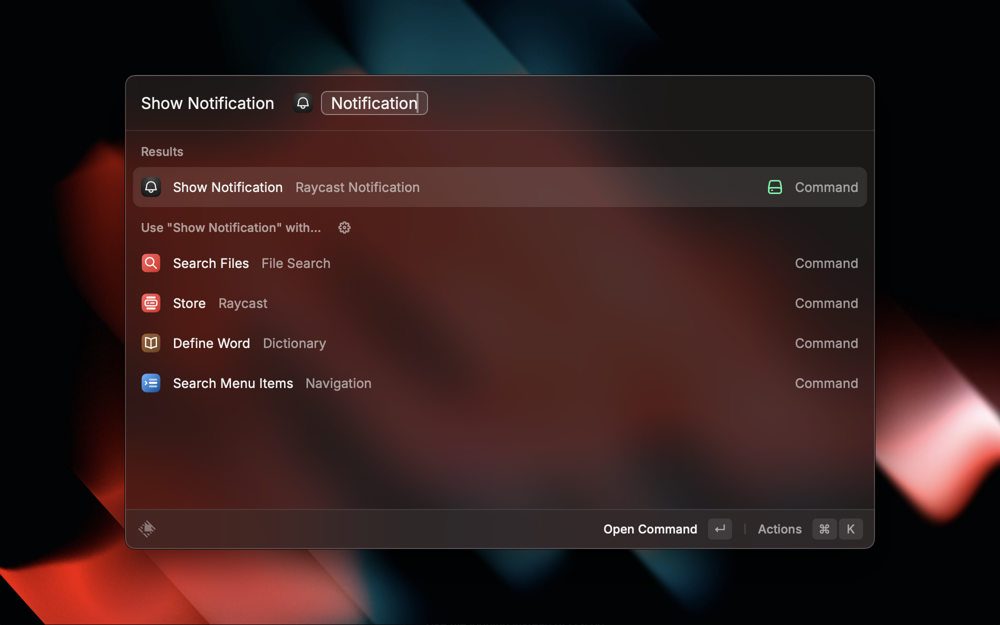
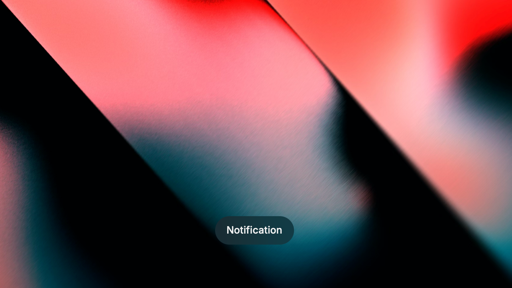

# Raycast Notification

The HUD notifications of Raycast look super nice! Don't you wish you could use them for everything?

Well, this extension makes it easy to display Raycast notifications via a quicklink, making the beautiful Raycast interface accessible to other applications or scripts.

Use it from the terminal with `open -g "raycast://extensions/maxnyby/raycast-notification/index?launchType=background&arguments=%7B%22title%22%3A%22Notification%20Text%22%7D"`.
Make sure to url_encode the notificationtext, and of course to validate your input text before using it on the command line.

