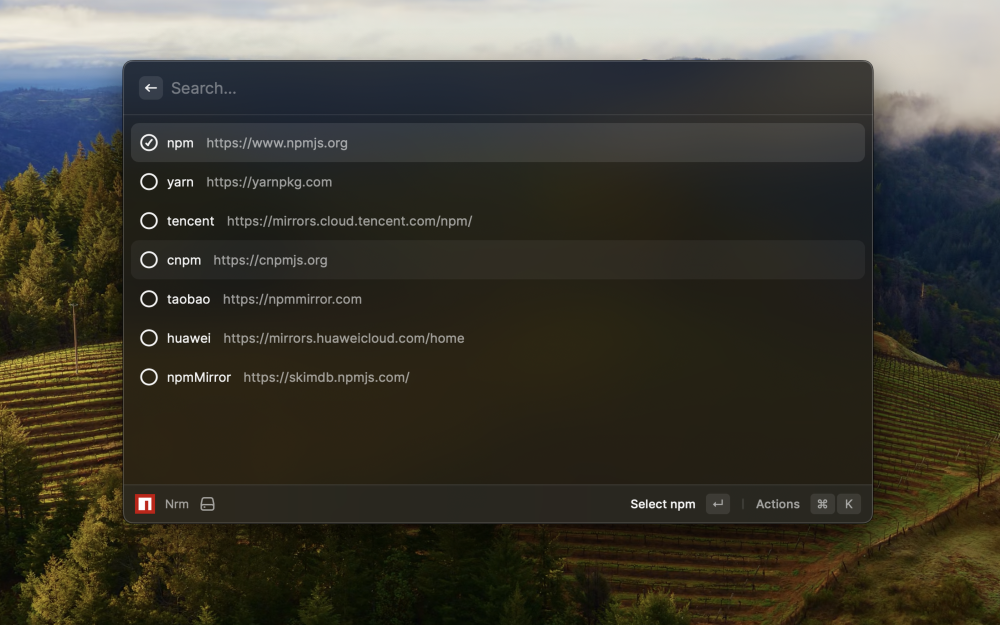
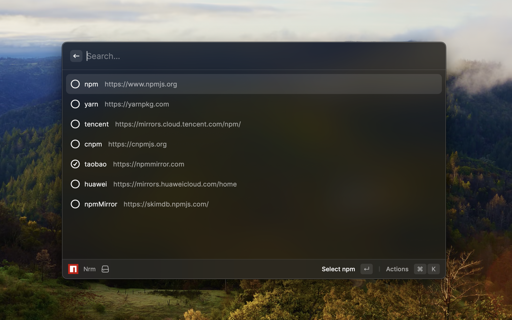
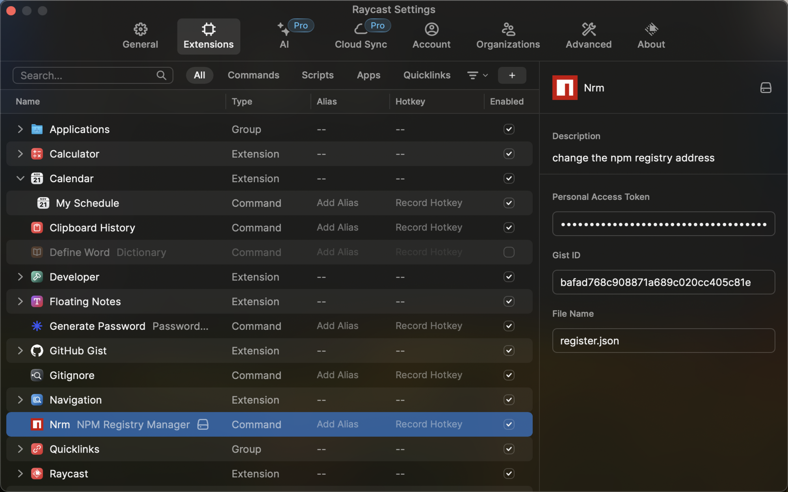

# raycast-nrm

**raycast-nrm** can help you easy and fast switch between different npm registries, now include: **npm**, **yarn**, **tencent**, **cnpm**, **taobao**, **npmMirror**.

## install

Go to [raycast store](https://www.raycast.com/store) and search for "*nrm*".
