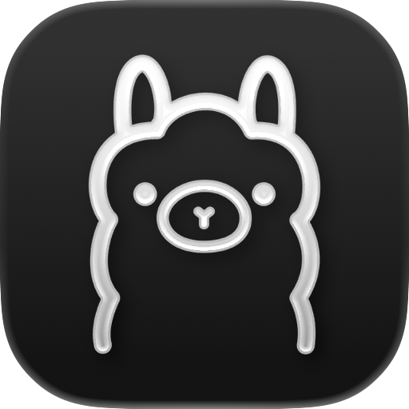

<div align="center">
  <picture>
    
  </picture>
  <h1>Ollama AI for Raycast</h1>
</div>

Use [Ollama](https://ollama.com) models from Raycast for local and remote inference, chat, writing assistance, image understanding, model management, and tool calling.

This extension is not affiliated with Ollama.

## Requirements

- [Raycast](https://www.raycast.com) on macOS or Windows
- [Ollama](https://ollama.com/download) running locally, or access to a remote Ollama server
- At least one installed model

You can install a model with the Ollama CLI or pull one directly from the **Manage Models** command. Browse available models in the [Ollama library](https://ollama.com/library).

## Getting Started

1. Start Ollama or make sure your remote Ollama server is reachable.
2. Open **Manage Models** in Raycast.
3. Pull a model, or use **Add Server** to configure a remote server.
4. Run **Chat with Ollama** or any of the one-shot commands and select the model you want to use.

Remote servers can be configured without authentication, with basic authentication, or with a bearer token.

## Chat with Ollama

Use **Chat with Ollama** for saved, multi-turn conversations. You can choose separate models for general chat, vision, and tool use, as well as configure thinking effort and how long each model stays loaded in memory.

The action menu lets you:

- Change models with `⌘ M` on macOS or `Ctrl M` on Windows.
- Add selected or clipboard text with `⌘ T` on macOS or `Ctrl T` on Windows.
- Add the current browser tab with `⌘ B` on macOS or `Ctrl B` on Windows. This requires the [Raycast browser extension](https://www.raycast.com/browser-extension).
- Add a JPEG or PNG image with `⌘ I` on macOS or `Ctrl I` on Windows. This requires a vision-capable model.
- Enable or disable the Ollama web search and web fetch tools.
- Copy an answer or an entire conversation, create and rename chats, and inspect inference metadata.

The **Chat Memory Messages** preference controls how many recent messages are sent back to the model. The default is 20.

## Quick Commands

The extension includes focused commands for common tasks:

- Summarize the current website.
- Explain code step by step or explain text in simple terms.
- Fix spelling and grammar, improve writing, make text shorter or longer, and rephrase text as a post.
- Change the tone to casual, confident, friendly, or professional.
- Translate between the languages selected when launching the command.
- Describe an image or extract text from an image using a vision-capable model.

Most text commands use the input source selected in the extension preferences: **Selected Text** or **Clipboard**. You can also enable fallback to the other source when the preferred source is empty. After a one-shot command finishes, use **Continue as Chat** to keep the conversation going.

## Manage Models and Servers

Use **Manage Models** to:

- Pull, update, and delete models.
- Load a model into memory or unload it.
- Inspect model capabilities, parameters, size, quantization, and other metadata.
- Add, edit, and remove remote Ollama servers.
- Browse models from every configured server in one list.

Use **Loaded Models** to see the models currently held in memory and unload them when they are no longer needed.

## Create Custom Commands

Use **Create Custom Command** to create a Raycast Quicklink backed by your own prompt, model, and Ollama parameters. Prompts follow the [Raycast Prompt Explorer](https://prompts.ray.so) format and support these tags:

- `{selection}` inserts selected or clipboard text.
- `{browser-tab}` inserts the current browser tab as Markdown. Use `{browser-tab format="html"}` or `{browser-tab format="text"}` to request another format.
- `{image}` attaches a JPEG or PNG image from Finder or the clipboard. This requires a vision-capable model.

## Web Search and Web Fetch

The extension exposes **Web Search** and **Web Fetch** tools to Raycast AI and can also use them inside **Chat with Ollama** when internet search is enabled.

These tools require an Ollama API key. Create one in your [Ollama account settings](https://ollama.com/settings/keys), then add it to the extension's **Ollama API Key** preference. An API key is not required for local inference.

## MCP Servers

Use **Manage MCP Server** to add, edit, and remove stdio-based MCP servers for **Chat with Ollama**. Paste a standard JSON configuration such as:

```json
{
  "mcpServers": {
    "example": {
      "command": "npx",
      "args": ["-y", "<mcp-server-package>"]
    }
  }
}
```

Select the configured servers in the chat model settings. Only MCP tools are currently supported, and the selected Ollama model must support tool calling.

## Preferences

- **Input Source** chooses between selected text and clipboard text.
- **Enable Input Source Fallback** checks the other source when the preferred source is empty.
- **Chat Memory Messages** sets how many recent messages are included as context.
- **Certificate Validation Enabled** controls TLS certificate validation for Ollama server requests.
- **Ollama API Key** enables the hosted web search and web fetch tools.
