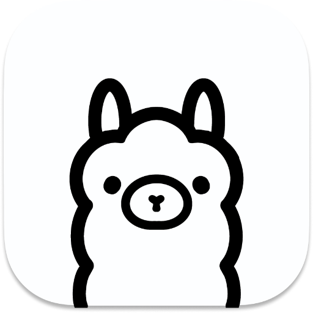

  <picture>
    <source media="(prefers-color-scheme: dark)" height="128px" srcset="assets/icon@dark.png">
    
  </picture>
  <h1 align="center">Raycast Ollama</h1>

Use [Ollama](https://ollama.ai) for local llama inference on Raycast. This application is not directly affiliated with Ollama.ai.

## Requirements

[Ollama](https://ollama.ai) installed and running on your mac. At least one model need to be installed throw Ollama cli tools or with 'Manage Models' Command. You can find all available model [here](https://ollama.ai/library).

## How to Use

### Command: Chat With Ollama

Chat with your preferred model from Raycast, with the following features:

- Save conversation with `CMD+S` keyboard shortcut. You can access your saved conversation with `CMD+P` keyboard shortcut.
- Change model with `CMD+M` keyboard shortcuts. For embedding is recommended to use a lower parameters model for better performance.
- Copy your Question, Answer or even the entire Chat to the clipboard.
- Chose how many messages use as memory with extention setting "Chat Memory Messages". By default it use the last 20 messages.

#### Tags

With tags you can add more data on the prompt. You can use one of the following tags on the prompt:

- `/image`: Add the image on the clipboard or selected on the finder to the prompt. At least Ollama v0.1.15 and one multimodal model installed are required. Only PNG or JPG image are supported.
- `/file`: Add information of one or more files on the prompt as knowledge. Select the files to use with `CMD+F` shortcuts (text based files and PDF are supported). By default it use 'Stuff' Chain, you can change Chain type from 'Document Loader' submenu. This feature is currently experimental.

### Command: Create Custom Commands

With '**_Create Custom Command_**' you can create your own custom Command using whatever model you want.
