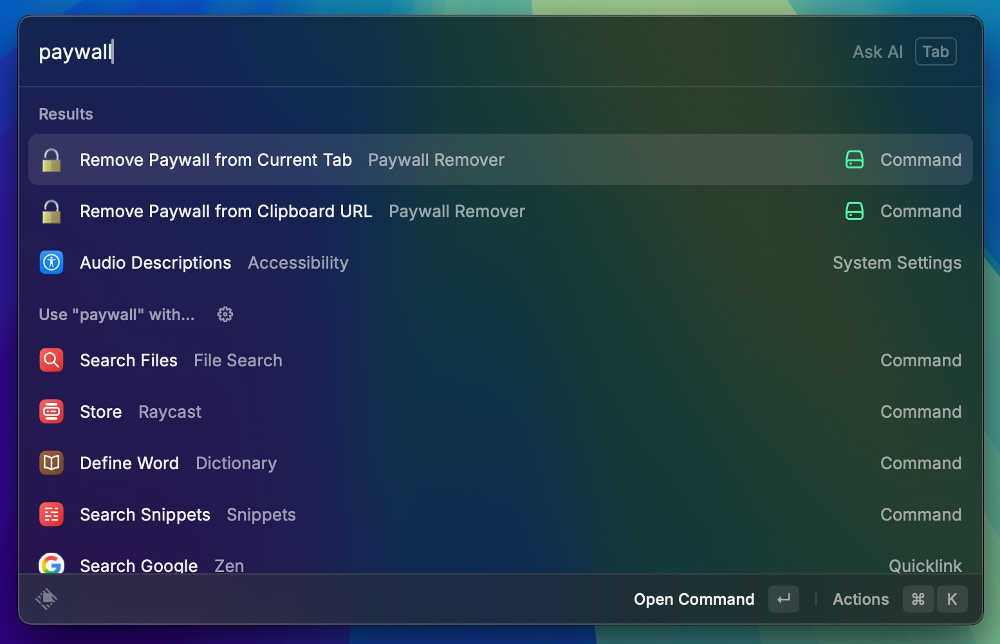
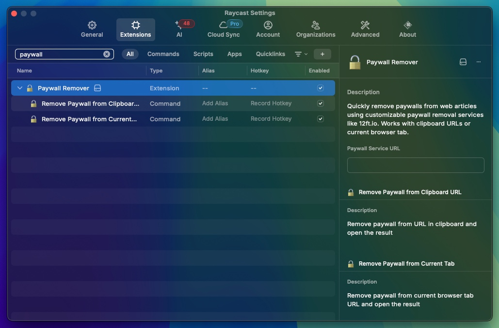
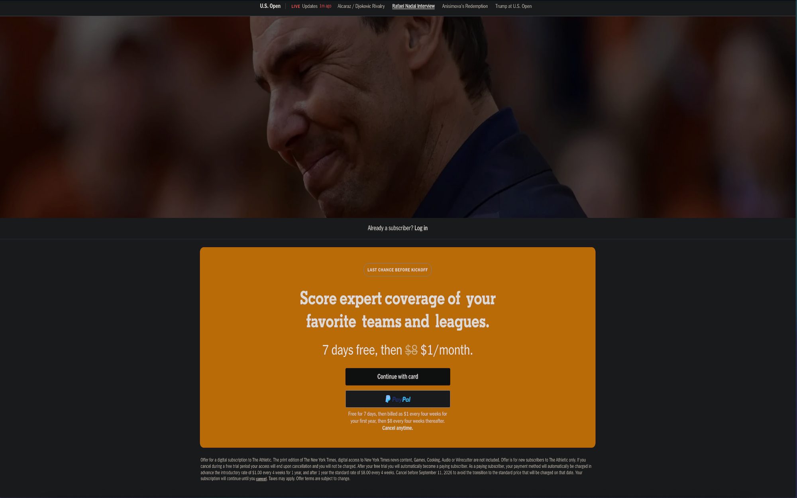
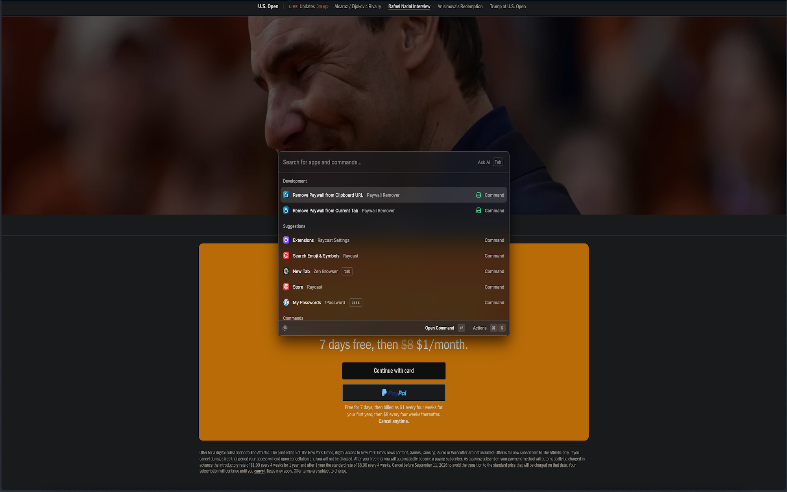
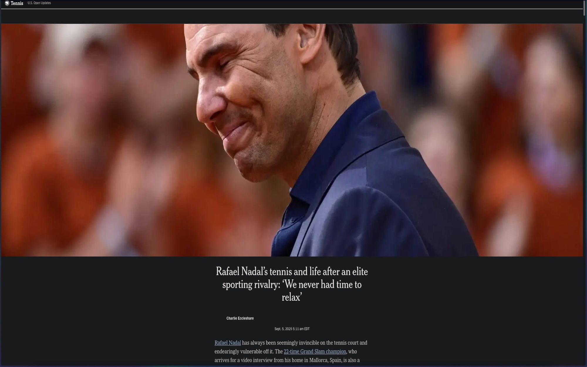

# Raycast Paywall Remover 🔓

A powerful Raycast extension that instantly removes paywalls from web articles. **What makes this extension unique?** You can configure your own paywall removal service, giving you complete control over how articles are processed.

## ✨ Key Features

### 🎯 **Customizable Paywall Service** 
**Unlike other extensions**, you're not locked into a single service. Configure any paywall removal service you prefer:
- **Default**: `https://open.bolha.tools`
- **Popular alternatives**: `12ft.io`, `13ft.io`, or your own self-hosted solution
- **Complete flexibility**: Use any service that accepts URL parameters

### 🚀 **Two Convenient Methods**

**1. Clipboard URL Processing**
Copy any paywalled article URL and instantly process it through your configured service.

**2. Current Browser Tab**  
Process the article you're currently reading with a single command. Works with:
- ✅ **Chrome** - Full support
- ✅ **Safari** - Full support  
- ✅ **Firefox** - Full support
- ✅ **Edge** - Full support
- ✅ **Zen Browser** - Clipboard method recommended

## 🛠 How It Works

1. **Choose your method**: Use clipboard or current tab command
2. **Automatic processing**: Your URL is sent to your configured paywall service
3. **Instant access**: The processed article opens automatically in your browser

## ⚙️ Configuration

### Setting Up Your Preferred Service

1. Open Raycast → Extensions → Paywall Remover → Configure Extension
2. Set your preferred **Paywall Service URL**
3. Popular options:
   - `https://open.bolha.tools` (default)
   - `https://12ft.io`  
   - `https://13ft.io`
   - `https://your-custom-service.com`

### Browser Compatibility

| Browser | Current Tab Support | Clipboard Support | Notes |
|---------|:------------------:|:-----------------:|-------|
| Chrome  | ✅ | ✅ | Full AppleScript support |
| Safari  | ✅ | ✅ | Native integration |
| Firefox | ✅ | ✅ | Standard support |
| Edge    | ✅ | ✅ | Standard support |
| Zen     | ℹ️ | ✅ | Clipboard method recommended |

*For Zen browser users: Use Cmd+L → Cmd+C → Run clipboard command for best results*

## 🎮 Usage

### Quick Start
1. **Install** the extension from Raycast Store
2. **Copy** a paywalled article URL or **navigate** to the article
3. **Run** the appropriate command in Raycast
4. **Enjoy** instant access to the article!

### Commands

- **`Remove Paywall from Clipboard URL`** - Process URL from clipboard
- **`Remove Paywall from Current Tab`** - Process current browser tab URL

## 🔒 Privacy & Control

- **No data collection**: Your URLs are processed directly by your chosen service
- **No tracking**: Extension doesn't store or log your browsing activity  
- **Full control**: Choose and change your paywall service anytime
- **Local processing**: All URL handling happens on your device

## 🚀 Why Choose This Extension?

### **vs. Other Paywall Extensions:**

| Feature | This Extension | Others |
|---------|:--------------:|:------:|
| **Customizable Service** | ✅ | ❌ |
| **Multiple Browsers** | ✅ | Limited |
| **Clipboard Support** | ✅ | ✅ |
| **Self-hosted Services** | ✅ | ❌ |
| **No Vendor Lock-in** | ✅ | ❌ |

## 📋 Requirements

- **Raycast** (latest version recommended)
- **macOS** 10.15 or later
- **Internet connection** for paywall service access

## 📸 Screenshots

### Extension Interface

### Extension Settings

### Before & After Example
**Before:** Paywall blocking article access

**During:** Processing with extension

**After:** Full article access

## 🤝 Contributing

Found a bug or want to add a feature? Contributions are welcome!

1. Fork the repository
2. Create a feature branch
3. Make your changes  
4. Submit a pull request

## 📄 License

MIT License - feel free to use, modify, and distribute.

---

**Made with ❤️ for the Raycast community**

*Enjoy unrestricted access to quality journalism and content!* 📰