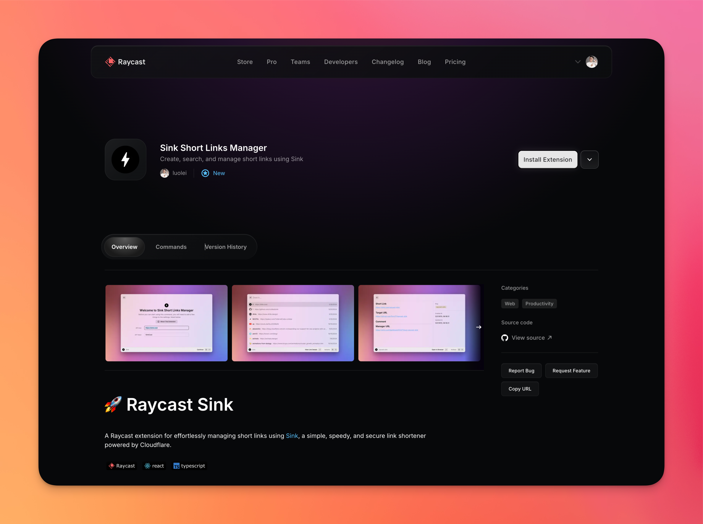

# 🚀 Raycast Sink

A Raycast extension for effortlessly managing short links using [Sink](https://github.com/ccbikai/sink), a simple, speedy, and secure link shortener powered by Cloudflare.


## 📥 Installation

### Option 1: Raycast Store (Recommended)

Install directly from [Raycast Store: Sink Short Links Manager](https://www.raycast.com/luolei/raycast-sink)



### Option 2: Manual Installation

```bash
git clone https://github.com/foru17/raycast-sink.git
cd raycast-sink
npm install && npm run dev
# Enjoy it
```

## ✨ Features

- **View, Create, Search, and Query** short links directly within Raycast
- **Quick Access**: Open short links in your default browser with a single click
- **Clipboard Integration**: Copy short links to your clipboard instantly
- **Seamless Sink Integration**: Leverage the power of Sink's Cloudflare-based link shortening

## 📑 Prerequisites

Before you begin, ensure you have the following:

- A deployed Sink instance (follow the [Sink deployment instructions](https://github.com/ccbikai/sink#%EF%B8%8F-deployment))
- Sink API credentials (obtain these from your Sink instance)

## 🚦 Configuration

After installation, you'll need to set up the extension with your Sink instance details:

1. Open Raycast Preferences
2. Navigate to the Extensions tab
3. Find "Sink" in the list of installed extensions
4. Enter your Sink API URL and API Key in the provided fields

## 🎯 Usage

Here's how to make the most of the Raycast Sink extension:

- **Create a Short Link**: Use the "Create Short Link" command to quickly shorten a URL
- **View All Links**: Access the "View Short Links" command to see a list of all your shortened URLs
- **Search Links**: Utilize Raycast's built-in search to find specific short links
- **Open Link**: Select a short link and use the "Open in Browser" action to visit the destination URL
- **Copy Link**: Quickly copy a short link to your clipboard for sharing

## 🔧 Troubleshooting

If you encounter any issues:

1. Verify your Sink API credentials are correct in the extension settings
2. Ensure your Sink instance is running and accessible
3. Check the Raycast console for any error messages

If problems persist, please [open an issue](https://github.com/foru17/raycast-sink/issues) on the GitHub repository.

## 👥 Contributing

Contributions are welcome and appreciated! Here's how you can contribute:

1. Fork the repository
2. Create your feature branch: `git checkout -b my-new-feature`
3. Commit your changes: `git commit -am 'Add some feature'`
4. Push to the branch: `git push origin my-new-feature`
5. Submit a pull request

Please read [CONTRIBUTING.md](CONTRIBUTING.md) for details on our code of conduct and the process for submitting pull requests.

## 🙏 Credits

This extension is built on top of the [Sink](https://github.com/ccbikai/sink) project by [ccbikai](https://github.com/ccbikai). We're grateful for their work in creating such a robust and efficient link shortener.

## 📄 License

This project is licensed under the MIT License - see the [LICENSE](LICENSE) file for details.

## ⭐ Support

If you find this extension helpful, consider:

- Starring the [GitHub repository](https://github.com/foru17/raycast-sink)
- Sharing it with others who might find it useful

Your support helps keep this project active and improving!
