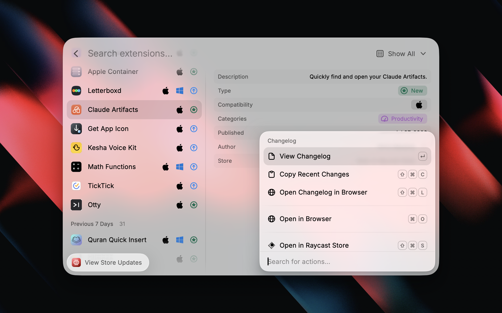
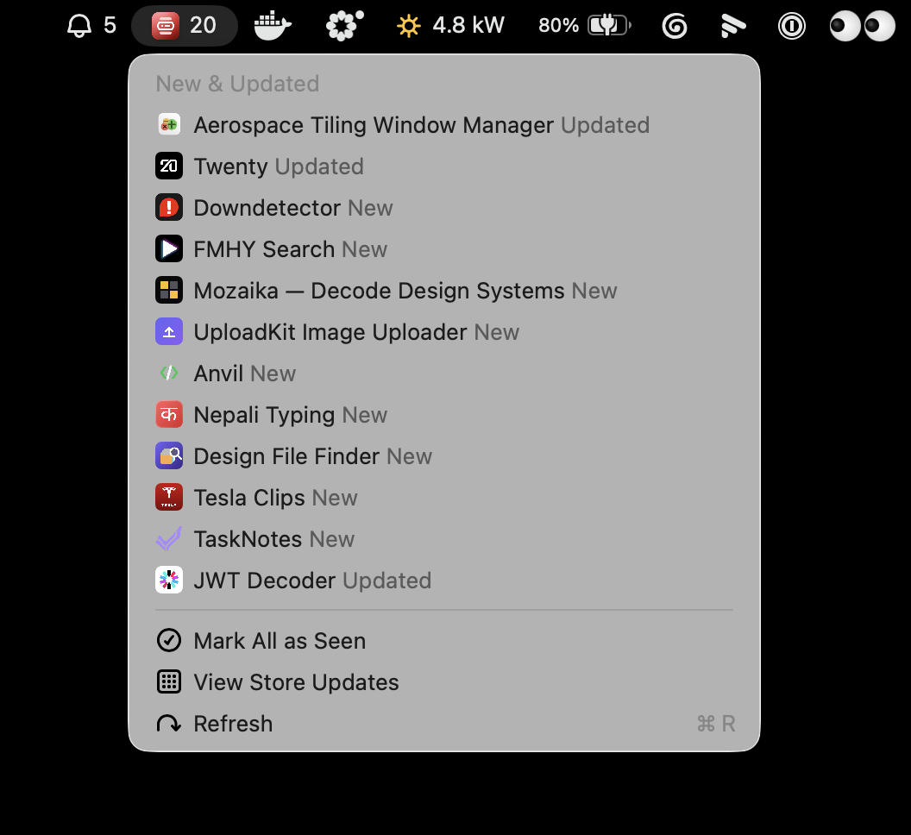

# Raycast Store Updates

  
  
  

## Never miss new extensions or extension updates ever again

### Features

- **New Extensions Feed** — See the latest extensions published to the Raycast Store via the official JSON feed
- **Extension Updates** — Track recently updated extensions via merged GitHub PRs in the [raycast/extensions](https://github.com/raycast/extensions) repo
- **Detailed Metadata** — View extension type, platforms, categories, version, publish/update date, author, and PR link in a rich detail panel
- **Changelog Viewer** — Read an extension's changelog inline, copy recent changes, or open it on GitHub
- **Platform Filter Toggles** — Show or hide macOS-only and Windows-only extensions directly from the action panel (cross-platform extensions are always shown)
- **My Updates Filter** — Filter the dropdown to show only updates for extensions you have installed locally
- **Category & Author Filters** — Narrow the list to a single category, or show only a specific author's extensions, on top of the type and platform filters
- **Read/Unread Tracking** — Optionally mark items as read to keep your list tidy, with "Mark All as Read" and undo (⌘Z) support
- **Filter Dropdown** — Quickly switch between Show All, New, Updates, and My Updates views
- **Time Grouping** — Items are grouped into Today / Yesterday / Previous 7 Days / Previous 30 Days / Earlier for easier scanning

## Store Updates Menu Bar

An optional menu-bar command shows a badge with the number of new and updated extensions since you last checked, refreshing in the background

**Tip:** Hold ⌥ (Option) and click an item in the menu bar to open its changelog instead of the Store page!

