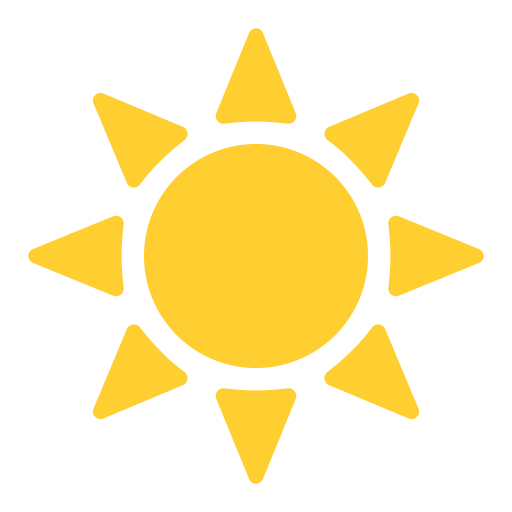
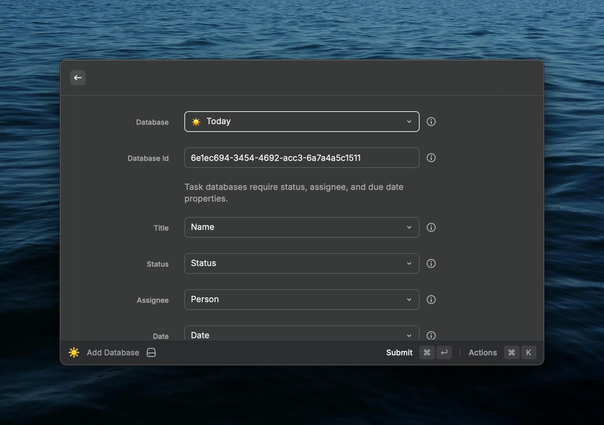
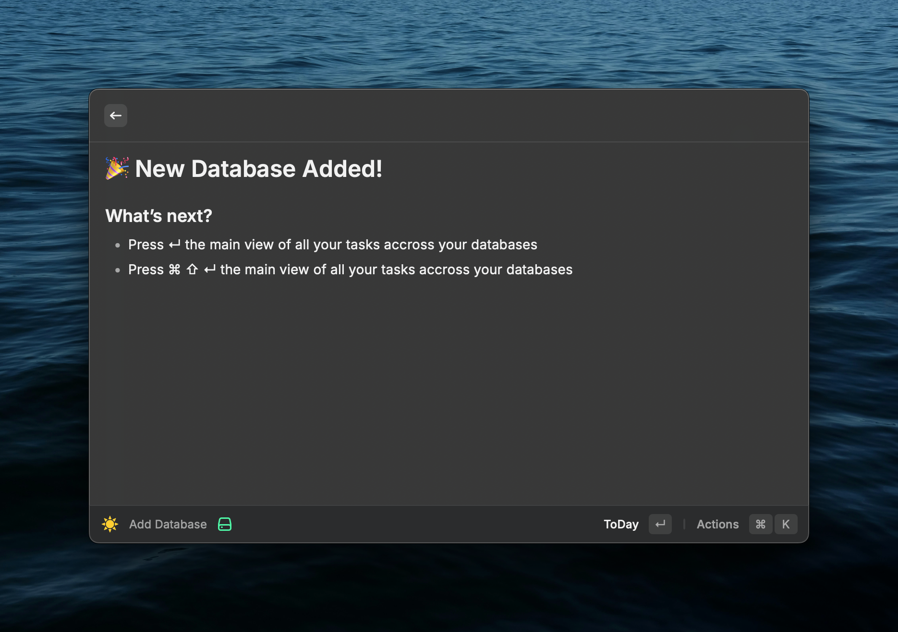
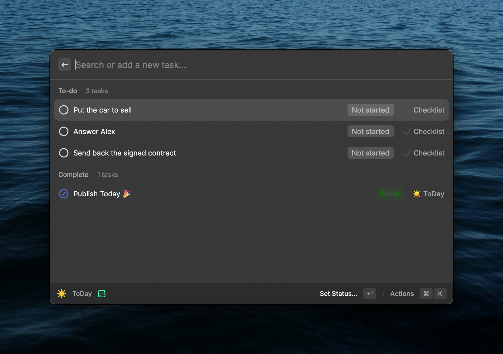
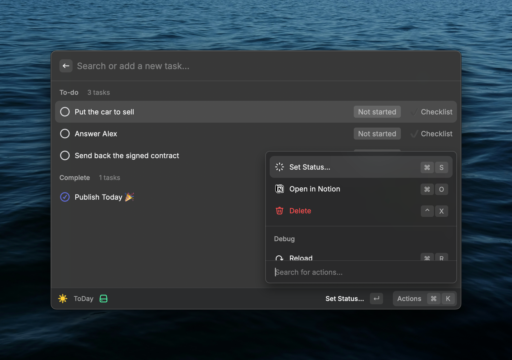
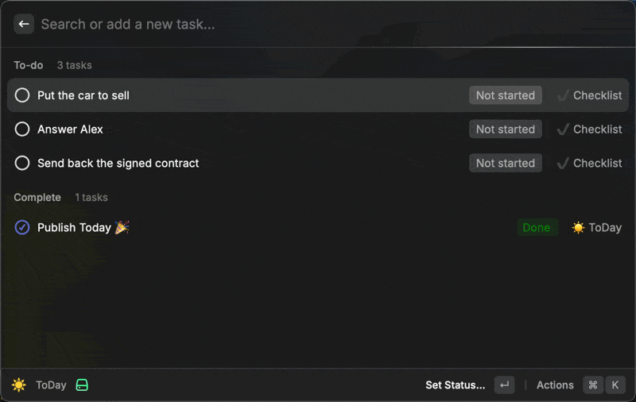

<h1 align="center">ToDay</h1>

<h4 align="center">
Manage multiple Notion databases right from Raycast
</h4>

## Introduction

Notion recently introduce the long awaited feature `Home`, and more specifically `My Tasks`, grouping multiple databases under one single view, giving an overview of all you current task accross your workspace.

ToDay aims a bringing the same experience right into Raycast. It gives the possibility to selected multiple databases, and offers a grouped view of all the tasks accross the selected databases.

## Features

### 🔌 Connect multiple Notion databases

After signing into your Notion, you'll be able to start connecting multiple databases.

To stay close to Notion logic, a selected database is expected to have the following properties: title, person, status, date. We detect and select automatically the right properties in your databases, although you can still adjust it.

| ➕ Add                                       | 👏 Success                         | 🎉 Enjoy                               |
| -------------------------------------------- | ---------------------------------- | -------------------------------------- |
|  |  |  |

### 🍱 Manage you tasks

From your tasks overview, you'll be able to easily manage a task, e.g. changing its status, deleting or open it...

### 🚀 Add new task on the fly

The search bar quickly transforms into a smart way to add a new task very fast. You can use `#` to quickly select the database you want to add the task to, or `~` to select the status.

### List of commands

- Press `↵` or `⌘ + S` to set the status.
- Press `⌘ + O` to open in Notion.
- Press `^ + X` to delete a task.

### Thanks

A huge thanks to [Hypersonic](https://github.com/raycast/extensions/tree/main/extensions/hypersonic) for their extension giving me inspiration to create this one.
