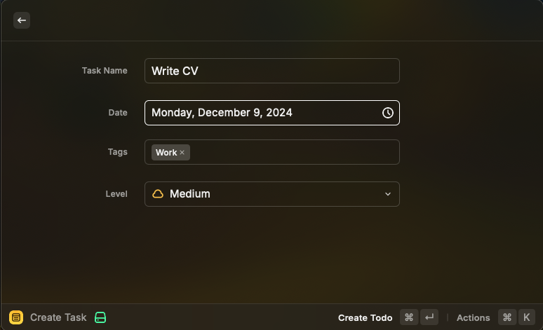

# Todo Buddy

**Supercharge Your Productivity with Lightning-Fast Task Management in Raycast**

Todo Buddy brings a powerful, blazing-fast todo list directly into your Raycast app, seamlessly integrating task management into your workflow without missing a beat.

## 🚀 Why Todo Buddy?

- **Ultra-Fast Task Creation**: Add tasks in seconds without ever leaving your keyboard.
- **Powerful Search & Filtering**: Quickly find tasks by name, tags, due dates, or priority levels.
- **Intuitive Sorting**: Organize tasks by due date or priority level to stay on top of your schedule.
- **Automatic Tag Coloring**: Visually distinguish tags with automatic, consistent color-coding.
- **Data Portability**: Easily export and import your tasks and tags in JSON format.

## 🛠 Features

### ⚡ Quick Task Creation

Create new tasks effortlessly with the `Create Task` command. Fill in details like task name, due date, tags, and priority level (Trivial, Medium, Hard) to keep your tasks organized from the get-go.

### 🔍 Advanced Search & Filtering

Filter your tasks in real-time by typing keywords related to task names, tags, due dates, or priority levels. Refine your task list to focus on what's important right now.

### 📅 Intelligent Sorting

Sort your tasks by due date to prioritize upcoming deadlines or by priority level to tackle the most challenging tasks first.

### 🏷️ Automatic Tag Coloring

Tags are automatically assigned unique colors based on their names, making it easier to visually parse your task list.

### 🔄 Easy Data Export/Import

Backup your tasks or migrate to another machine effortlessly using the `Export Data` and `Import Data` commands. Your data is saved in a readable JSON format.

## 📖 List of Commands

- **Create Task** (`create-task`): Create a new task with optional due date, tags, and priority level.
- **List Tasks** (`list-tasks`): View all your tasks, filter, and sort them as needed.
- **Create Tag** (`create-tag`): Add a new tag to categorize your tasks.
- **List Tags** (`list-tags`): View all existing tags.
- **Export Data** (`export-data`): Export all your tasks and tags to a JSON file.
- **Import Data** (`import-data`): Import tasks and tags from a JSON file.

## 🔧 Installation

1. **Prerequisites**: Ensure you have [Raycast](https://www.raycast.com/) installed on your Mac.
2. **Install Extension**: Download or clone the Todo Buddy extension [from GitHub](https://github.com/yuichkun/raycast-todo-buddy).
3. **Add to Raycast**: Open Raycast, go to Extensions, and add the Todo Buddy extension.
4. **Start Using**: Trigger Raycast and type any of the commands to start managing your tasks!

## 📝 Usage Tips

- **Quickly Add Tasks**: Use the `Create Task` command and fill in the details. Utilize keyboard shortcuts to speed up the process.
- **Efficient Navigation**: Leverage Raycast's natural language processing in the `List Tasks` command to filter tasks on the fly.
- **Customize Tags**: Create tags that fit your workflow, and enjoy automatic color-coding for visual clarity.
- **Stay Organized**: Regularly check due dates and priority levels to manage your time effectively.
- **Backup Your Data**: Use `Export Data` regularly to backup your tasks.

## 💡 Contributing

Contributions are welcome! If you have ideas for improvements or new features, feel free to open an issue or submit a pull request.

## 📄 License

This project is licensed under the MIT License - see the [LICENSE](LICENSE) file for details.

---

Boost your productivity and keep your tasks at your fingertips with Todo Buddy!