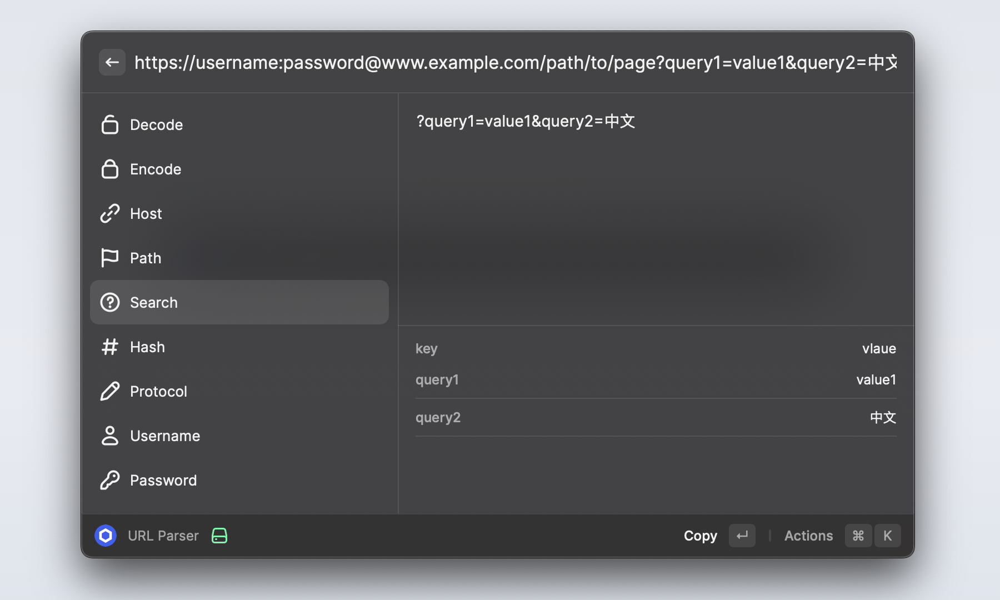

<p align="center">

</p>

<h1 align="center">URL Parser</sup></h1>

<p align="center">
A Raycast extension that Decode, Encode and parse URLs.
</p>



## Why?

I often come across very long URLs that need to look at some parameters, which are difficult to find and sometimes Decode, Encode the URLs, So this plugin was developed.

## Installation

1. install Raycast;
2. clone this reposotory;
3. open Raycast and import this extension.

```bash
git clone <repo url>

pnpm install

pnpm run dev
```

## License

MIT License