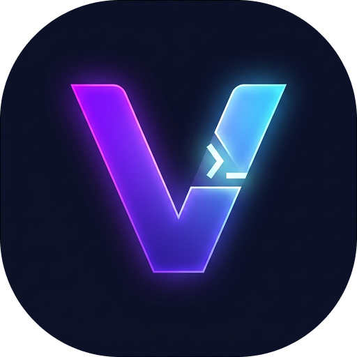
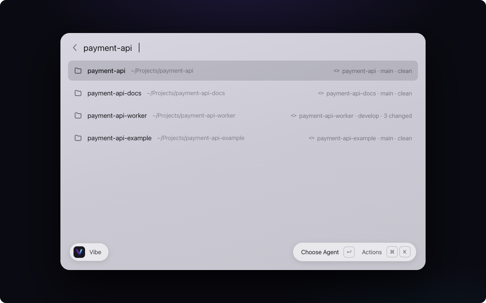
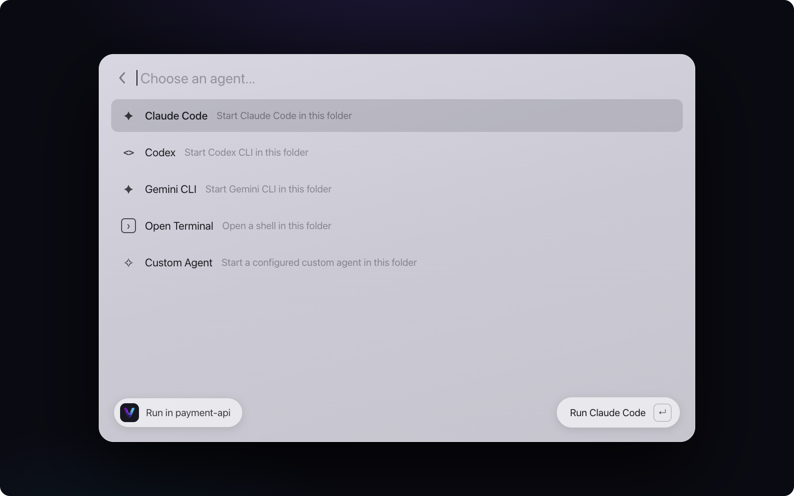
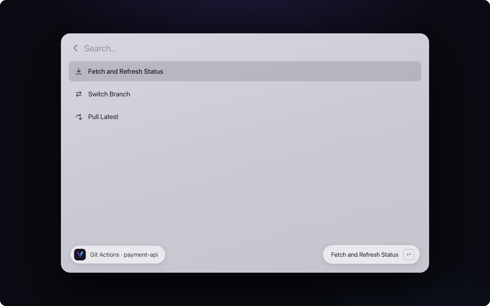
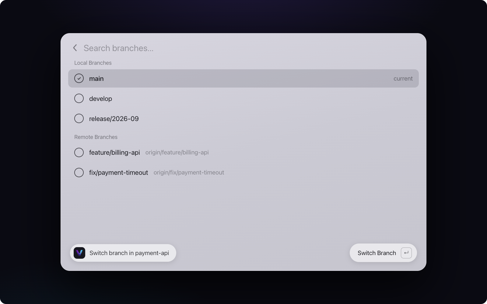

# Vibe — Projects & Coding Agents

<p align="center">
  
</p>

<p align="center"><strong>Search projects. Launch agents. Stay in flow.</strong></p>

Vibe is a Raycast extension for developers who want to find projects, launch coding agents, open their favorite tools, and manage Git workflows from one keyboard-first workspace.

## See Vibe in action

### Find any project instantly

Search local projects by name, path, repository, or remote and see useful Git context at a glance.



### Launch your preferred coding agent

Start Claude Code, Codex, Gemini CLI, a custom agent, or a regular terminal session in the selected project.



### Manage Git safely from Raycast

Fetch updates, switch branches, and pull the latest fast-forwardable changes without leaving your workflow.



### Switch branches without leaving your workflow

Browse local and remote branches in a searchable list, with the current branch clearly marked.



## Why Vibe?

Daily development often means switching between project folders, Finder, Terminal, code editors, Git clients, and AI coding tools. Vibe brings those entry points together in one fast, keyboard-first Raycast command.

With Vibe, you can search for a project, choose how you want to work, and start building immediately.

## Features

### Find projects quickly

- Search local folders by project name or full path.
- Search by Git repository name or remote URL.
- Detect repository roots when a selected folder is nested inside a project.
- Display branches, remotes, changed files, untracked files, and ahead/behind status.
- Keep a list of recently used projects.
- Pin frequently used projects for quick access.

### Launch coding agents

Launch a coding agent directly in the selected project directory:

- Claude Code.
- Codex.
- Gemini CLI.
- Up to three configurable custom agents.
- A regular terminal session.

Each agent can be configured with:

- Enabled or disabled state.
- Executable name or absolute path.
- Optional startup arguments.
- Optional environment variables.

Vibe remembers the last agent used for each project and provides a **Run Again** action for quickly restarting it.

### Open your preferred tools

Open a project directly in:

- Visual Studio Code.
- Cursor.
- macOS Terminal, Windows Terminal.
- Ghostty.
- iTerm.
- Finder.

Vibe also opens the detected GitHub repository when a GitHub remote is available.

### Safe Git workflows

The **Git Actions** menu provides common repository operations without adding risky destructive commands:

- Fetch and refresh status with `git fetch --all --prune`.
- Search and switch local branches.
- View local and remote branches separately.
- Create a local tracking branch from a remote branch after confirmation.
- Pull changes with `git pull --ff-only`.
- Refresh project metadata after successful operations.

Vibe never automatically resets, discards, stashes, merges, rebases, deletes branches, or force-pushes changes.

## Requirements

- macOS or Windows.
- Raycast.
- A local project directory accessible to the operating system search/index.
- Git for repository actions.
- Any coding-agent CLI you want to use, such as Claude Code, Codex, or Gemini CLI.

Vibe does not require API keys, a cloud account, or a separate backend.

## Installation

### From the Raycast Store

Once published, search for **Vibe** in the Raycast Store and install it.

### Development installation

Clone the repository, install the locked dependencies, and start Raycast development mode:

```bash
npm ci
npm run dev
```

To validate the extension:

```bash
npm run build
npm run lint
```

To publish from your local machine, first authenticate with Raycast using `npx ray login`, then run `npm run publish`. Store publishing creates a pull request in the Raycast extensions repository for review.

## Configuration

Open Raycast Extension Preferences for Vibe and configure the terminal, coding agents, and custom commands.

### Terminal

Choose where Vibe opens projects:

- macOS Terminal, Windows Terminal.
- Ghostty.
- iTerm.

### Coding agents

Claude Code, Codex, and Gemini CLI are enabled by default. For each agent, configure:

- Enabled or disabled state.
- Executable name or absolute path.
- Optional startup arguments.
- Optional environment variables, one `KEY=value` entry per line.

You can also configure up to three custom agents. If an agent command is not installed or cannot be found, provide its absolute executable path in preferences.

## Usage

1. Open Raycast and search for **Vibe**.
2. Search for a project by folder name, path, repository name, or remote URL.
3. Select a project.
4. Use **Choose Agent** to launch an agent in the project directory, or use the direct editor and terminal actions.
5. Use **Git Actions** for repository operations.

Vibe opens coding agents from the repository root when the selected folder is inside a Git repository. Otherwise, it uses the selected folder itself.

## Git safety

Vibe intentionally provides a conservative Git workflow:

- Fetch uses `git fetch --all --prune`.
- Pull uses `git pull --ff-only`.
- Dirty working trees require confirmation before branch switching or pulling.
- Remote branches require confirmation before creating a local tracking branch.
- Diverged branches are not automatically merged or rebased.
- Vibe does not reset, discard, stash, merge, rebase, delete branches, or force-push.

If a pull cannot be completed as a fast-forward, Vibe reports the problem and leaves manual resolution to the user.

## Privacy

Vibe operates locally. It searches folders using the platform's local indexing/search facilities and executes configured local commands. It does not send project names, paths, source code, Git data, or credentials to a Vibe server.

When you choose to open a GitHub repository, Vibe opens the detected remote URL in your browser. Git itself may communicate with configured Git remotes when you use fetch or pull.

## Support and feedback

Please open an issue in the [project repository](https://github.com/abgaryanharutyun/raycast-vibe) with:

- A short description of the problem.
- Steps to reproduce it.
- The relevant Raycast and macOS versions.
- Any non-sensitive error message shown by Vibe.

Do not include API keys, access tokens, private repository URLs, or source code from private projects.

## License

MIT
