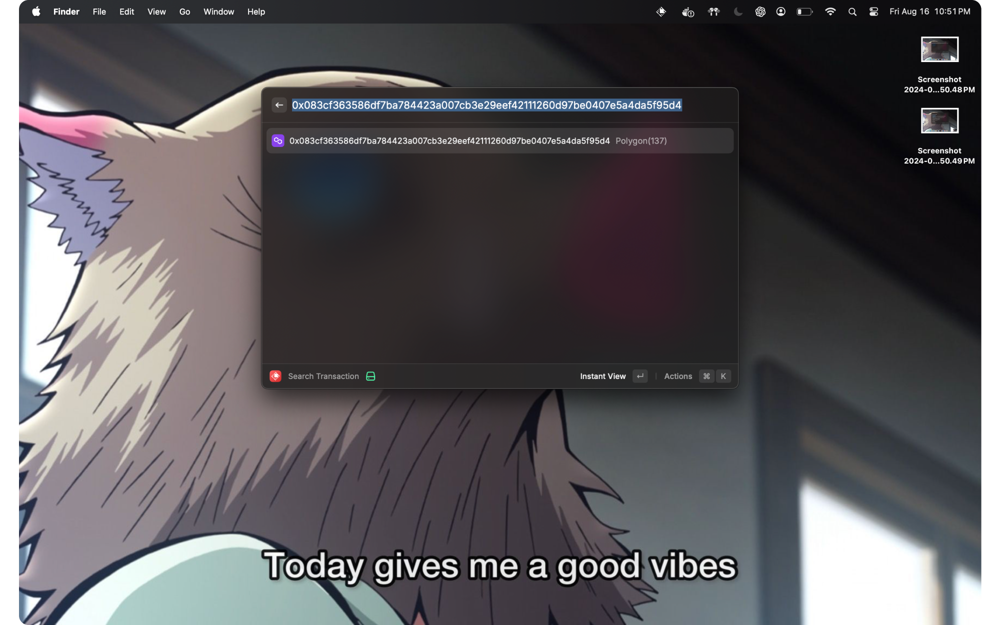
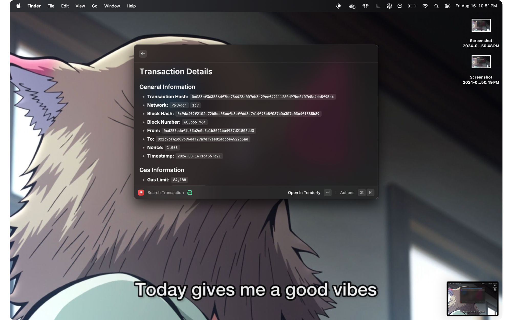

# Rayscan

Rayscan brings blockchain data to your fingertips. It is a simple, easy-to-use tool that allows you to search for and view information about transactions, blocks, and addresses on the Ethereum blockchain.

### Search for transactions



### View block details




### Installation and Run

```bash
$ git clone https://github.com/Jds-23/rayscan.git
$ cd rayscan
$ npm install
$ npm run build  # or `npm run dev` if you want to change it
```