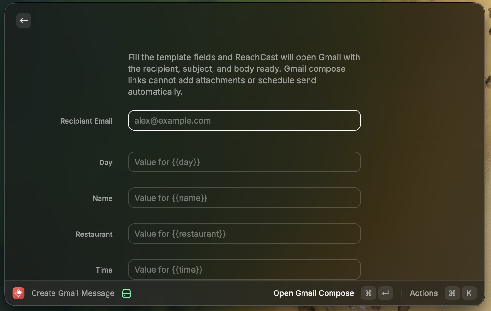
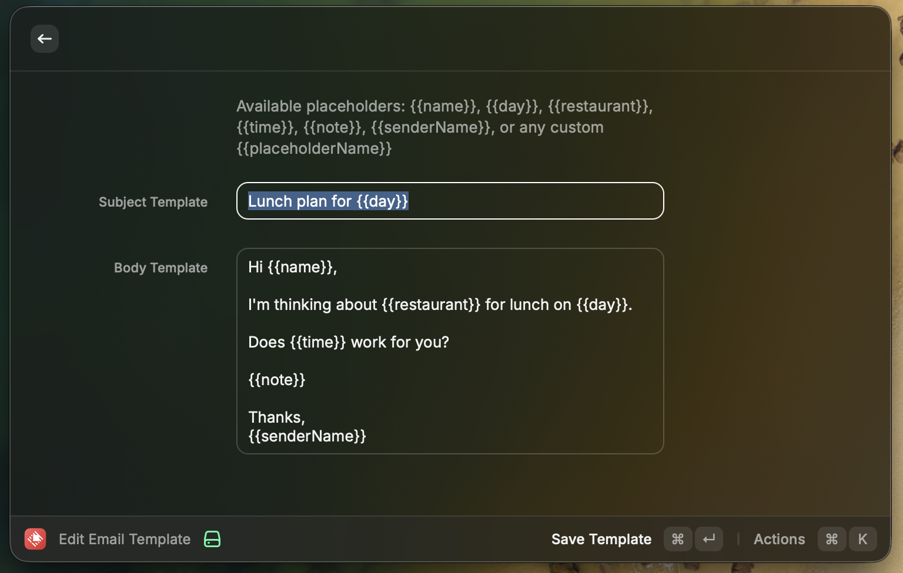

# ReachCast

A Raycast extension that turns reusable templates into Gmail-ready messages in seconds.

## Commands

- `Create Gmail Message`: Fill the fields from your saved template and open Gmail with the recipient, subject, and body prefilled.
- `Edit Email Template`: Edit the subject and body template with support for custom `{{placeholders}}`.

Gmail compose links cannot add attachments or schedule send automatically, so ReachCast keeps those as manual Gmail steps.

## Screenshots

### Create Gmail Message

### Edit Email Template

