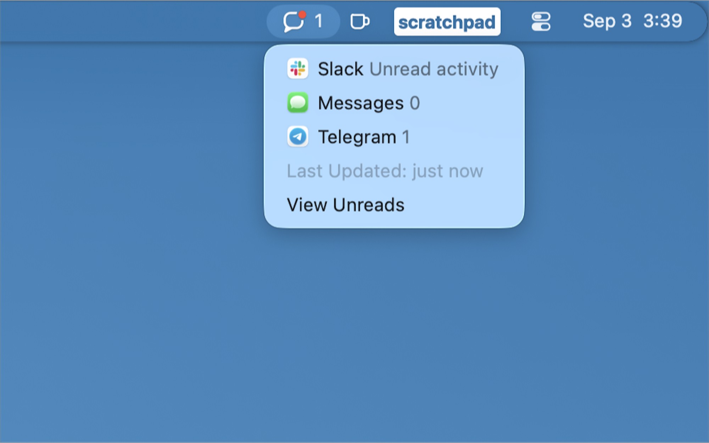
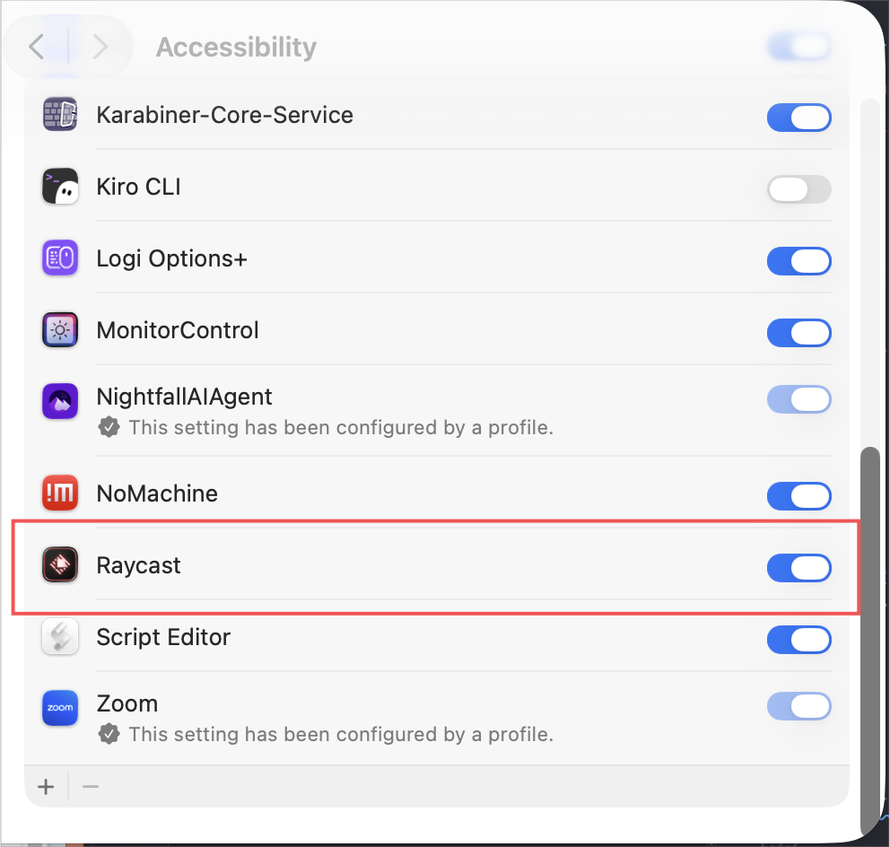

# Read Me Maybe

> Time to ditch the dock and reclaim that extra screen real estate for your favorite apps.

**Read Me Maybe** is an extension that displays and consolidates application badges from across your macOS Dock. Check the aggregated status in your menu bar for a quick overview, or use the **View Unreads** command to see the breakdown by source.

## Setup

1. Open the **Read Me Maybe** menu-bar command and select **Check Access**.
2. Allow Raycast under **System Settings > Privacy & Security > Accessibility**. If macOS prompts you to allow System Events automation, approve that request as well.
3. Open the **View Unreads** command and configure as many sources as you like. Each source includes an **Open** command, which defaults to `open` with the application’s installed path. You can customize this command if needed.
4. The **Read Me Maybe** menu-bar command refreshes approximately every 15 seconds. Refreshes may be delayed by Raycast or macOS energy-management settings.

## Keyboard Shortcuts

| Shortcut | Action                                  |
| -------- | --------------------------------------- |
| `↵`      | Open source application                 |
| `tab`    | Enable / disable the highlighted source |
| `⌘N`     | Add a new source                        |
| `⌘E`     | Edit source                             |
| `⌃E`     | Remove source                           |
| `⌥⇧↑`    | Move the source up in its section       |
| `⌥⇧↓`    | Move the source down in its section     |
