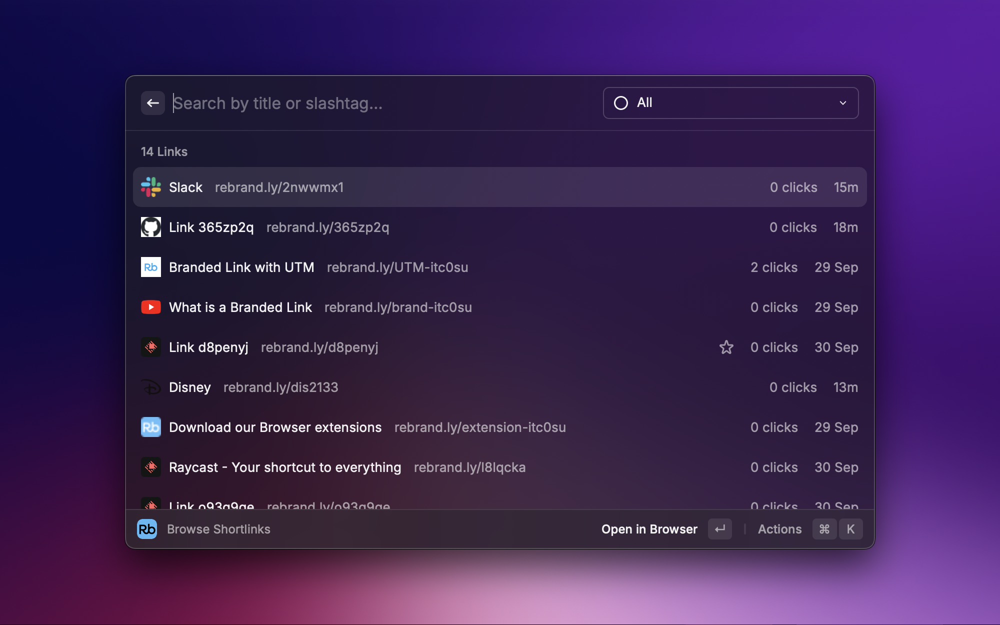

# Rebrandly Raycast Extension

Browse [Rebrandly](https://rebrandly.com/) shortlinks on [Raycast](https://www.raycast.com/).

## Requirements

- [Rebrandly account](https://rebrandly.com/)

## Usage

- [Create an API key on your Rebrandly dashboard](https://app.rebrandly.com/account/api)
- Enter the API key on first starting the extension
- <kbd>Enter</kbd> to open link, <kbd>Ctrl/Cmd</kbd> + <kbd>Enter</kbd> to copy link to clipboard

## Author

- Griko Nibras ([@grikomsn](https://www.raycast.com/grikomsn))

## Contributor

- xmok ([@xmok](https://www.raycast.com/xmok))

## License

[MIT License, Copyright (c) 2021 Raycast](https://github.com/raycast/extensions/blob/main/LICENSE)
