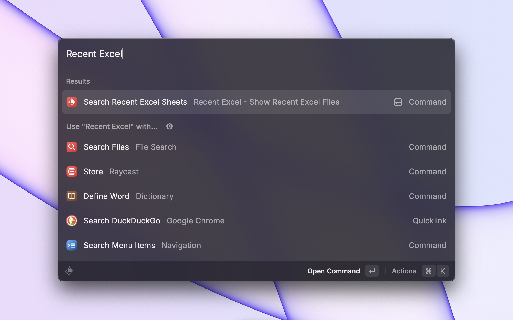
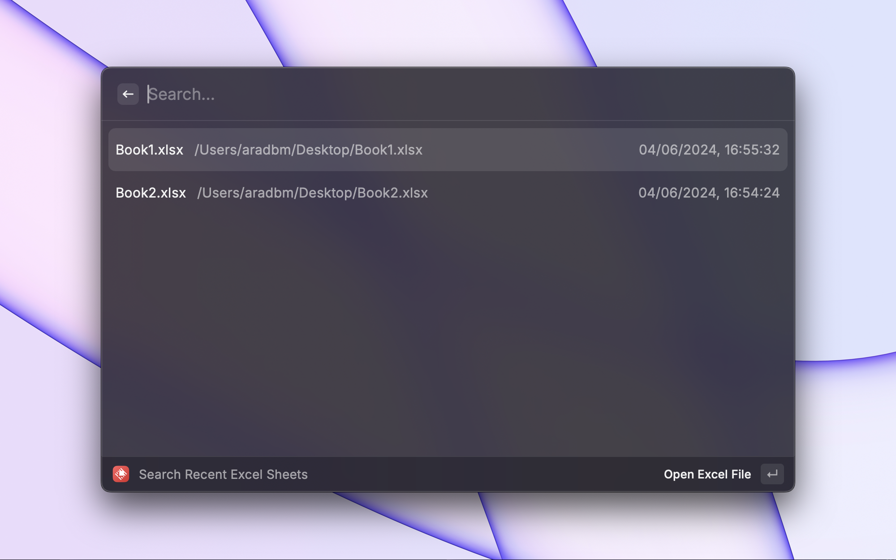

# Recent Excel Sheets

Finds your recent Excel sheets in your chosen folders for easy access.

 

## Configuring Directories

To specify the directories for searching Excel files, follow these steps:

1. Open Raycast and go to the Extensions tab.
2. Find the Excel File Finder extension and click on the gear icon to open its preferences.
3. In the "Directories" field, enter a comma-separated list of folder paths where you want to search for Excel files.

Example configuration:
/Users/username/Documents, /Users/username/Desktop, /Users/username/Projects

Make sure to provide the full path for each directory, separated by commas. You can include multiple directories to expand the search scope.

## Supported File Types

The Excel File Finder extension supports the following Excel file types:

- .xls
- .xlsx
- .xlsm
