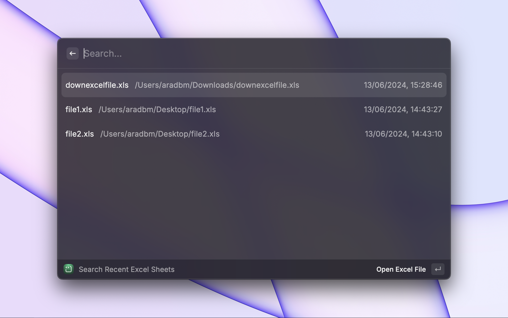

# Recent Excel Sheets

Finds your recent Excel sheets in your chosen folders for easy access.

## Configuring Directories

The extension runs with a specific directory. You have two options to configure the directories to search for Excel files:

1. Using Command Arguments (Optional):

- When running the command, you can provide a `folderPath` argument to specify a specific folder to search for Excel files.
- The `folderPath` argument is optional. If not provided, the extension will use the directories specified in the preferences.

2. Using Extension Preferences:

- Open Raycast and go to the Extensions tab.
- Find the Excel File Finder extension and click on the gear icon to open its preferences.
- In the "Directories" field, enter a comma-separated list of folder paths where you want to search for Excel files.

You can use the tilde (`~`) character as a shorthand for the user's home directory. For example, `~/Documents` will be resolved to the user's Documents folder.

Example configuration:
`/Users/username/Documents, ~/Desktop, /Users/username/Projects`

## Supported File Types

The Excel File Finder extension supports the following Excel file types:

- .xls
- .xlsx
- .xlsm
