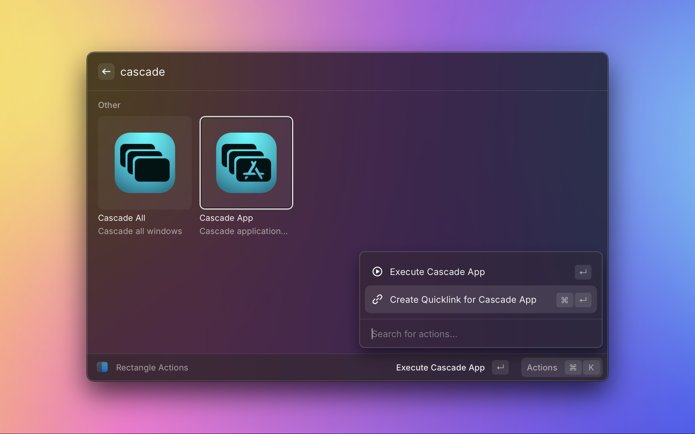

# Rectangle Changelog

## [Update dependencies] - 2025-02-12

## [Add Cascade Actions] - 2025-01-10

Support for two new actions has been added: Cascade All & Cascade App

### ⚠️ Configuration Note

As the internal identifier for Cascade App varies between Rectangle & Rectangle Pro, it is not exposed as a Raycast command by default.

To add it as a top-level command, run the `Rectangle Actions` command, select Cascade App and create a new quicklink:

## [Rectangle Pro Support] - 2024-07-31

- Rectangle Pro is now supported 🎉
- Action groups in grid view have been reworked based on Rectangle defaults

## [Initial Version] - 2024-06-14
