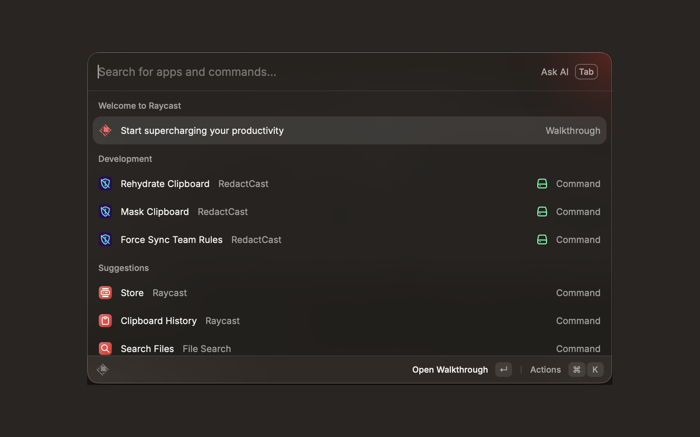
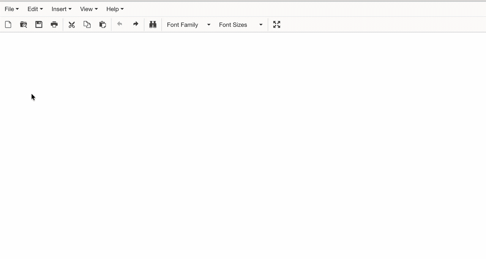
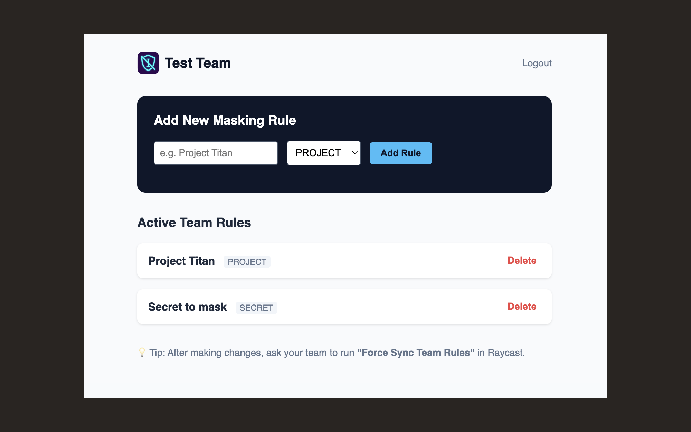

# RedactCast

  

A lightning-fast, zero-trust PII masker for developers and power users using AI tools (ChatGPT, Claude, Cursor). 

RedactCast instantly sanitizes sensitive data (emails, IPs, internal project names) in your clipboard before you paste it into an LLM. When the AI responds, hit the reverse hotkey to magically restore your original data.

  

### Why RedactCast?
Standard "scrubbing" tools destroy your data (e.g., replacing names with "XXX"), making the AI's response unusable in your codebase or emails. RedactCast uses a deterministic, **reversible mapping** (\`[EMAIL_1]\`, \`[PROJECT_A]\`). 

**Security Guarantee:** The mapping table is stored **100% locally** in Raycast's sandboxed storage. Your original, unredacted data never leaves your Mac. (Our extension code is entirely open-source).

  

### Core Commands (Free)
*   **Mask Clipboard**: Scans your clipboard, replaces PII with tokens, and copies the sanitized text.
*   **Rehydrate Clipboard**: Reverses the process, swapping the AI's tokens back to your real data.

### For Teams (RedactCast Pro)
Do you need to prevent your entire engineering team from pasting "Project Titan" or your AWS hostnames into ChatGPT? 
With a **RedactCast Pro API Key**, you can define custom dictionary rules centrally. Your team members simply enter the API Key in their Raycast preferences, and their local RedactCast extension will automatically sync and enforce your organization's custom redaction policies.

👉 [Get a Team API Key ($15/mo)](https://buy.stripe.com/6oUfZhgtE1nI82lcxu5sA00)
