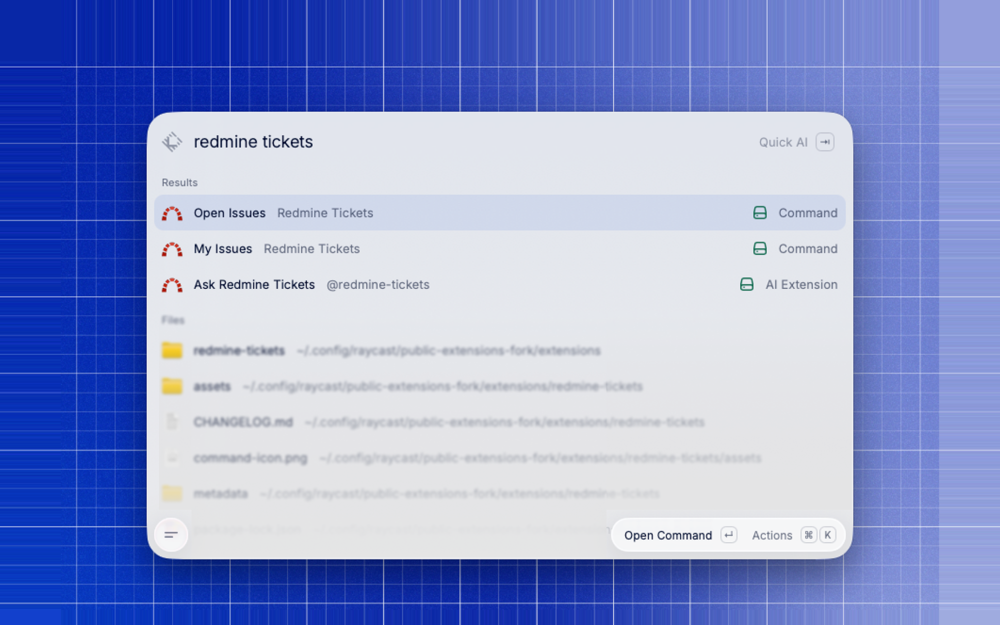
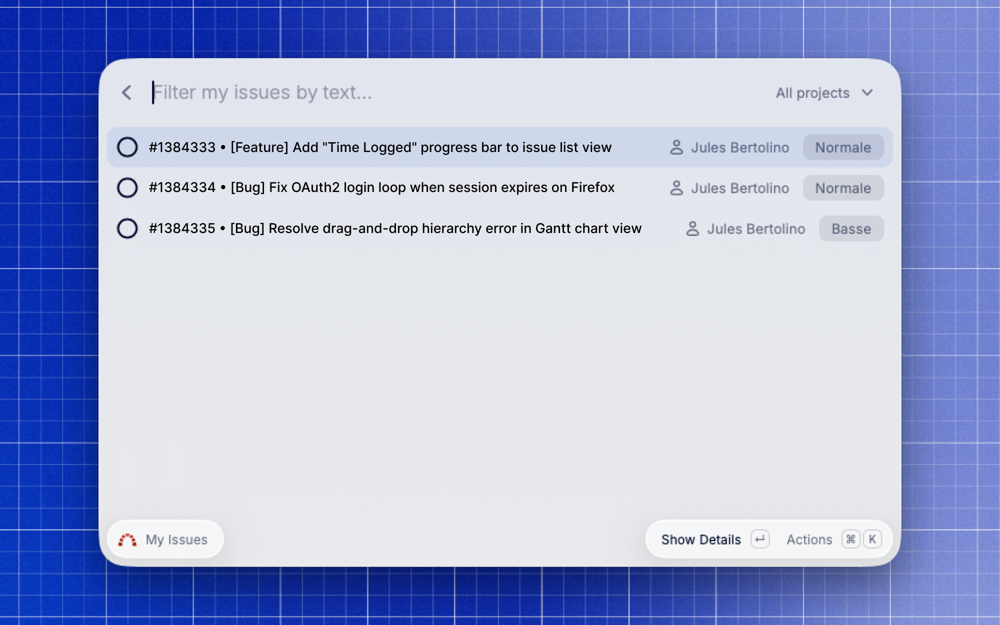
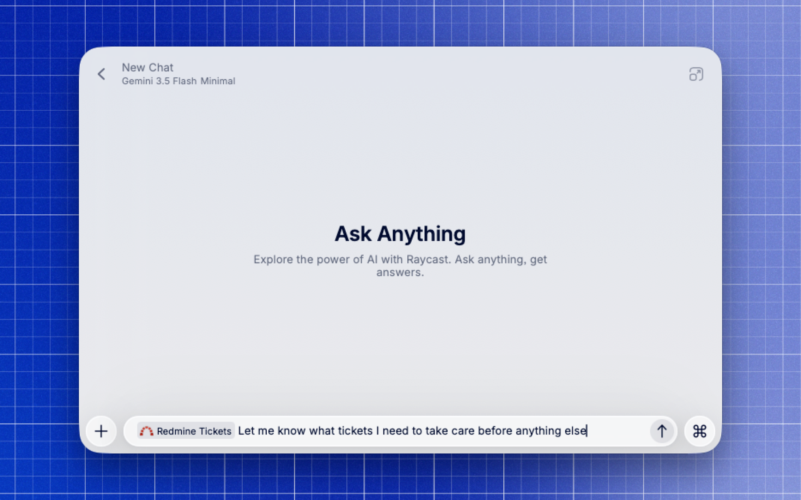

# Redmine tickets

---

This [Raycast](https://raycast.com) extension lets you browse, search, edit and ask AI\* about your [Redmine](https://www.redmine.org) tickets.

This is a fork of the original [Redmine extension](https://www.raycast.com/jwickers/redmine) by **jwickers**, which I edited and extended with new commands like "Open Issues" and the ability to connect with AI\*.

## Features

---

### Open Issues

See every open ticket across all your Redmine projects in one list, sorted with the most recently updated ones first — just like Redmine's own default view. Start typing to full-text search subject and description, or use the project dropdown in the search bar to narrow the list to a single project. Press ⏎ on any ticket to open a detail view with its description, metadata and comments, and edit it right from the keyboard: add a comment, or change its status, assignee, or priority.



### Created by Me

The same view as Open Issues, scoped to only the tickets you created — handy for following up on things you reported.

### Assigned to Me

The same view as Open Issues, scoped to only the tickets currently assigned to you — the fastest way to check what's on your plate.



### @ask "Redmine tickets"\*

Type `@` in Raycast AI Chat and search for **Redmine Tickets** to let the AI query your tracker directly. It can full-text search issues by keyword across open or closed tickets, filter by status, assignee, or creator, and answer questions like "what are my open tickets about the login page?" or "summarize the highest-priority open bugs." This is read-only — editing tickets always happens through the commands above.



## Setup

---

### Redmine domain & API token

To connect the extension to your Redmine instance, open its preferences and fill in:

- **Redmine Domain** — your instance's domain or base URL, e.g. `mycompany.redmine.org` or `http://mycompany.redmine.org:8080/redmine`.
- **API Token** — your personal API key, found under *My account → API access key* in Redmine ([how to get it](https://www.redmine.org/boards/2/topics/53956/)).

### Raycast Store

🚧 Submission pending — track it on [PR #29458](https://github.com/raycast/extensions/pull/29458). This section will be updated with the Store link once it's merged.

### Development

```bash
npm install
npm run dev      # ray develop — hot reload into Raycast
npm run lint     # ray lint
```

Requires Node 22.14+ per Raycast's current requirements (see `.nvmrc`).

---

\*Requires [Raycast Pro](https://www.raycast.com/pro) (or your own AI provider API key).

If this extension is useful to you, consider [buying me a coffee ☕](https://buymeacoffee.com/julesbertolino).
