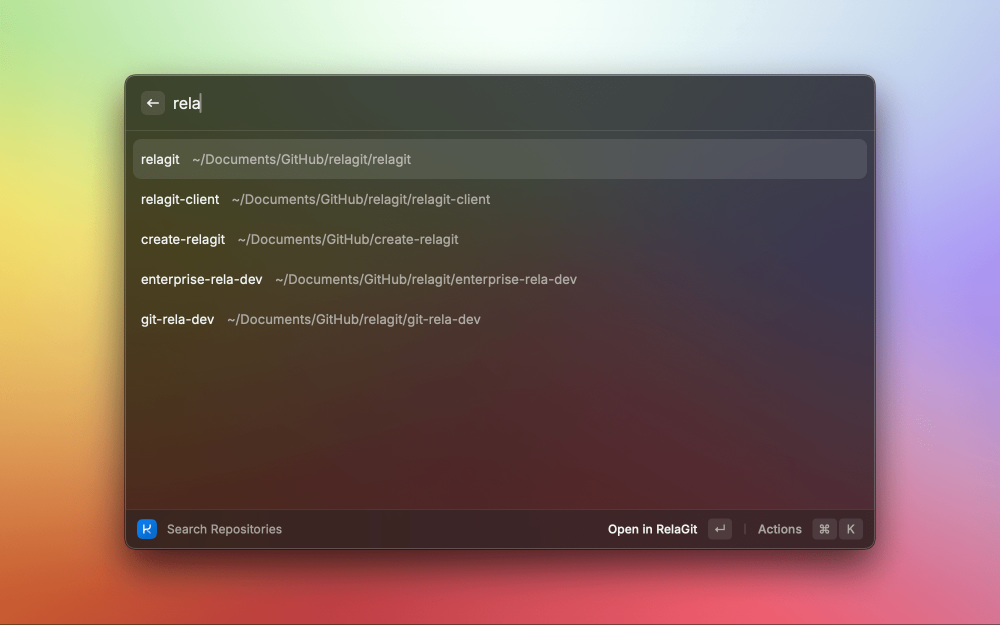
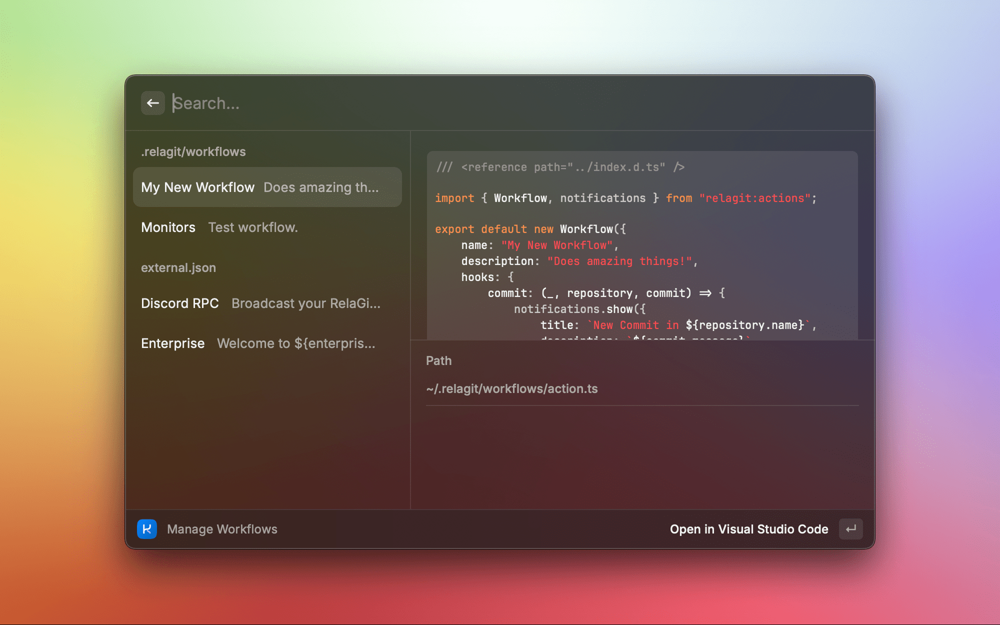

	

# RelaGit for Raycast

The [RelaGit](https://rela.dev) extension for raycast allows you to view and search your RelaGit repositories, and manage your RelaGit workflows.

You can perform basic operations on your repositories, such as push/pulling changes, and viewing the status of your repositories.

## Screenshots

