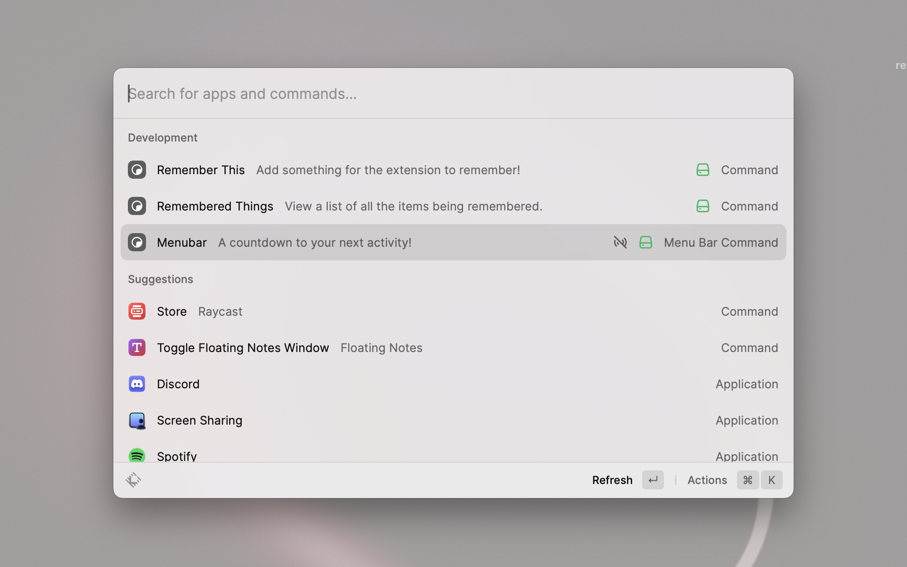

    
<h1>Remember This </h1>

Motivate yourself to stay on top of your deadlines

 

## How to use

- To use Remember This, simply open Raycast and type `Remember This` in the Raycast bar. This will open the Remember This interface, where you can enter any information you want to remember, along with a due date. After the due date passes, the information will be automatically deleted from the app, creating a sense of urgency to complete the task before it's lost forever.

- You can also view Remembered Items by typing `Remembered Things` in the Raycast bar. From here, you can view items being remembered, their expirey and also delete them using `⌘+delete`!

## Commands

- Menubar: A countdown to your next activity!
- Remember This: Add something for the extension to remember!
- Remembered Things: View a list of all the items being remembered.

## Notifications:

- Discord Webhook Notifications\n\nYou can easily receive reminder notifications through Discord using webhooks. Here's how to set it up:\n\n1. Open your Discord server and navigate to the channel where you want to receive the notifications.\n2. Click on the settings icon (the gear icon) to the right of your channels name and select `Integrations`.\n3. Click on the `Webhooks` button before clicking the `New Webhook` button. \n4. Copy the webhook URL and paste it into the `DiscordWebhookURL` field in the extensions prefrences `(click ⏎ to go there now!)`.\n\nThat's it! Now, upcoming reminders will be sent to your Discord channel through the webhook.\n\nIf you encounter any issues, please contact me on slack `@EliasK`\n\n

- Suggest a service! 💡\n\nWe're working on adding notifications to Remember This for a variety of services! 📝🔔\n\nIn the meantime, you can still receive reminders through other channels like Discord. 📧📱\n\nIf you have a suggestion for another messaging or collaboration service that you'd like to see added to Remember This, please let us know! Mention me on Slack `@EliasK` with your suggestion. We're always looking for ways to improve our service and would love to hear your ideas! 💬🙌

## What makes Remember This so special?

- Remember This is an app designed to help you stay motivated and focused on completing your work by its due date. After the due date of an item passes, the app automatically forgets the information, creating a sense of urgency to complete the task before it's lost forever. This unique feature inspires you to work efficiently and stay on top of your deadlines.

## Support

- If you encounter any issues with Remember This, you can [submit an issue](https://github.com/raycast/extensions/issues/new?assignees=&labels=extension,bug&projects=&template=extension_bug_report.yml&title=[Remember%20This]) on the GitHub repository for this project.

